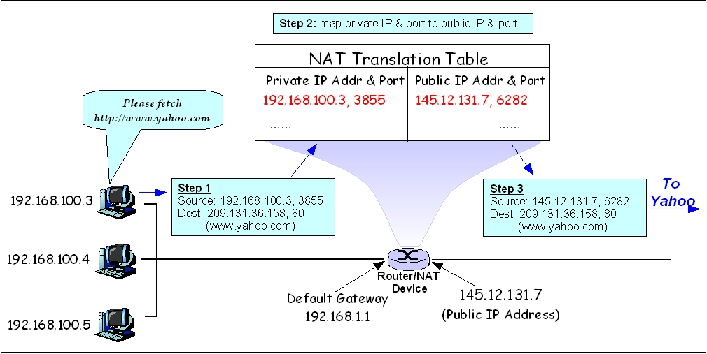
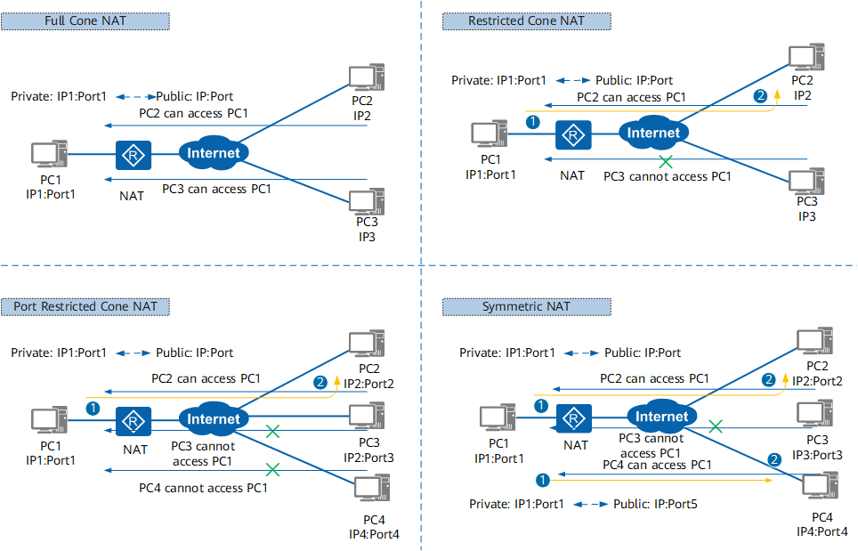

# NAT
 
# MỤC LỤC

# 1. NAT là gì?
\- **NAT (Network address translation)** là một quá trình thay đổi địa chỉ và cổng IP nguồn và đích. NAT giúp giảm nhu cầu về địa chỉ công cộng IPv4 và ẩn phạm vi địa chỉ mạng riêng. Quá trình này thường được thực hiện bởi router hoặc tường lửa. 

\- Một quá trình trong đó một hoặc nhiều địa chỉ IP cục bộ được dịch thành một hoặc nhiều địa chỉ IP toàn cầu và ngược lại để cung cấp quyền truy cập Internet cho các máy chủ cục bộ. Ngoài ra, nó còn dịch số cổng, tức là che số cổng của máy chủ bằng một số cổng khác, trong gói sẽ được định tuyến đến đích. Sau đó, nó tạo các mục tương ứng về địa chỉ IP và số cổng trong bảng NAT.

\- NAT là hình thức Network Translation phổ biến nhất liên quan đến một private network sử dụng các địa chỉ trong range private (10.0.0.0 đến 10.255.255.255, 172.16.0.0 đến 172.31.255.255 hoặc 192.168.0 0 đến 192.168.255.255). Địa chỉ private hoạt động tốt cho các máy tính chỉ phải truy cập tài nguyên trong mạng.

# 2. Cách hoạt động của NAT
\- Trong một hệ thống, NAT có nhiệm vụ thực hiện truyền gói tin từ lớp mạng này sang lớp mạng khác. Ở đó, NAT sẽ thực hiện việc thay đổi địa chỉ IP bên trong gói tin và sau đó chuyển qua router và các thiết bị mạng khác. Trong quá trình gói tin được truyền từ mạng internet về NAT thì NAT sẽ thực hiện thay đổi địa chỉ IP đích thành địa chỉ IP mạng cục bộ (Private) trong hệ thống rồi mới chuyển đi. 

> Nói cách khác chỉ với 1 mạng public của ISP cung cấp cho, các thiết bị trong mạng private có thể tham gia kết nối tới internet.

# 3. Basic NAT
\- Loại NAT cơ bản nhất là **NAT 1-1** - NAT dịch map 1 hoặc nhiều địa chỉ private với 1 hoặc nhiều địa chỉ 

> NAT 1-1 chỉ nên thực hiện khi có nhiều IP public, tuyện đối không nên dùng cho 1 private IP duy nhất. Tham khảo: https://www.watchguard.com/help/docs/help-center/en-US/Content/en-US/Fireware/nat/one_to_one_nat_c.html?tocpath=Fireware%7CConfigure%20Network%20Settings%7CNetwork%20Address%20Translation%20(NAT)%7CAbout%201-to-1%20NAT%7C_____0

# 4. One-to-many NAT
\- Phần lớn các private address từ các host trong network kết nối tới 1 public address

\- Mạng cục bộ sử dụng một trong các mạng con địa chỉ IP riêng được chỉ định (RFC 1918[4]).

\- Mạng có một bộ định tuyến có cả địa chỉ riêng và địa chỉ công cộng. Địa chỉ riêng được bộ định tuyến sử dụng để liên lạc với các thiết bị khác trong mạng cục bộ riêng. Địa chỉ công cộng (thường do nhà cung cấp dịch vụ Internet chỉ định) được bộ định tuyến sử dụng để liên lạc với phần còn lại của Internet.

\- Mạng cục bộ sử dụng một trong các mạng con địa chỉ IP riêng được chỉ định (RFC 1918[4]).
Mạng có một bộ định tuyến có cả địa chỉ riêng và địa chỉ công cộng. Địa chỉ riêng được bộ định tuyến sử dụng để liên lạc với các thiết bị khác trong mạng cục bộ riêng. Địa chỉ công cộng (thường do nhà cung cấp dịch vụ Internet chỉ định) được bộ định tuyến sử dụng để liên lạc với phần còn lại của Internet.
Khi lưu lượng truy cập đi từ mạng tới Internet, bộ định tuyến sẽ dịch địa chỉ nguồn trong mỗi gói từ địa chỉ riêng sang địa chỉ công cộng của chính bộ định tuyến. Bộ định tuyến theo dõi dữ liệu cơ bản về từng kết nối đang hoạt động (đặc biệt là địa chỉ đích và cổng). Khi bộ định tuyến nhận được lưu lượng truy cập vào từ Internet, nó sẽ sử dụng dữ liệu theo dõi kết nối được lưu trữ trong giai đoạn.

\- Tất cả các gói IP đều có địa chỉ IP nguồn và địa chỉ IP đích. Thông thường, các gói truyền từ mạng riêng sang mạng công cộng sẽ bị sửa đổi địa chỉ nguồn, trong khi các gói truyền từ mạng công cộng trở lại mạng riêng sẽ bị sửa đổi địa chỉ đích

# 5. Các loại NAT trong STUN
\- Trong Session Traversal Utilities for NAT (STUN), NAT được phân thành bốn loại dựa trên chế độ ánh xạ từ địa chỉ IP private và số cổng đến địa chỉ và số IP public:

\- **Full-cone**: Tất cả các yêu cầu từ cùng một địa chỉ IP và cổng riêng (ví dụ: IP1:Port1) đều được ánh xạ tới cùng một địa chỉ IP và cổng công cộng (ví dụ: IP:Port). Ngoài ra, bất kỳ máy chủ nào trên Internet đều có thể liên lạc với máy chủ trên mạng nội bộ bằng cách gửi các gói đến địa chỉ và cổng IP công cộng được ánh xạ. Một chính sách NAT tương đối lỏng lẻo và không secure.

\- **(Address)-Restricted-cone NAT**: Tất cả các yêu cầu từ cùng một địa chỉ IP và cổng riêng (ví dụ: IP1:Port1) đều được ánh xạ tới cùng một địa chỉ IP và cổng công cộng (ví dụ: IP:Port). Máy chủ trên Internet chỉ có thể gửi gói đến máy chủ trên mạng nội bộ nếu máy chủ trên mạng nội bộ trước đó đã gửi gói đến máy chủ trên Internet.

\- **Port-restricted-cone NAT**: NAT hình nón bị hạn chế cổng tương tự như NAT hình nón bị hạn chế, nhưng hạn chế bao gồm số cổng. Nghĩa là, một máy chủ trên Internet (ví dụ: IP2:Port2) chỉ có thể gửi các gói đến một máy chủ trên mạng nội bộ nếu máy chủ trên mạng nội bộ trước đó đã gửi một gói đến máy chủ trên Internet.

\- **Symmetric NAT**: Tất cả các yêu cầu được gửi từ cùng một địa chỉ IP riêng và cổng đến một địa chỉ và cổng IP đích cụ thể sẽ được ánh xạ tới cùng một địa chỉ IP và cổng. Nếu máy chủ gửi gói có cùng địa chỉ IP nguồn và số cổng đến một đích khác thì ánh xạ NAT khác sẽ được sử dụng. Ngoài ra, chỉ có máy chủ trên Internet nhận gói từ máy chủ trên mạng nội bộ mới có thể gửi lại gói.

# 6. NAT type
\- Dựa trên việc địa chỉ IP source hay destination của gói được dịch thì ta phân loại là **NAT source , NAT destonation và biodirect NAT**

\- **NAT source**: dùng trong trường hợp mà user nội bộ truy cập internet. Khi có gói tin chứa IP private truy cập internet, NAT sẽ chuyển IP private sang IP public để người trong mạng nội bộ có thể truy cập internet.
- **Nat-no-PAT**: chỉ truyền qua Ip mà không động đến port. NAT no NAT chỉ được sử dụng trong mạng doanh nghiệp nhỏ
- **NAPT (PAT)**: NAPT dịch cả địa chỉ IP và số cổng để cho phép nhiều địa chỉ IP riêng được dịch thành một hoặc nhiều địa chỉ IP công cộng. NAPT sử dụng nhóm địa chỉ có nhiều địa chỉ IP công cộng để có thể dịch địa chỉ IP riêng. NAPT cần thiết trong trường hợp có số lượng ít địa chỉ IP public và nhiều địa chỉ IP private từ intranet muốn truy cập internet.
- **Easy IP**: Easy IP là loại đặc biệt của NAPT, sử dụng các public IP trên interface như là post-NAT IP address. Easy IP được sử dụng trong trường hợp có 1 IP pucblic hoặc là IP public trên outbound interface.

\- **NAT destination**: NAT đích chỉ dịch địa chỉ IP đích và số cổng đích của gói, đồng thời áp dụng cho các tình huống mà người dùng Internet yêu cầu truy cập dịch vụ mạng nội bộ. Khi một gói được gửi từ người dùng Internet để truy cập dịch vụ mạng nội bộ đến thiết bị NAT, thiết bị NAT sẽ chuyển địa chỉ IPv4 công khai của gói thành địa chỉ IPv4 riêng. Bằng cách này, người dùng Internet có thể truy cập các dịch vụ mạng nội bộ.
- **Stastic destination NAT**: dịch địa chỉ IP đích, trong đó có cố định mapping pre-NAT và post-NAT. Trong một số trường hợp đặc biệt, các internet user có thể sử dụng được intranet trong khi làm việc từ xa hoặc khi muồn cho khách hàng tham gia vào mạng intranet.
- **Dynamic destination NAT**: dịch địa chỉ IP đích linh hoạt, trong đó không có cố định mapping pre-NAT và post-NAT. Hoạt động gần tương tự static destination NAT, có thể phục vụ trong trường hợp cần NAT qua wireless network.
- **NAT server**: là một loại đặc biệt của static destination NAT, dịch các địa chỉ đích gửi đến intranet server vào các địa chỉ IP private mapping. 

\- **Bidirectional NAT**: NAT hai chiều dịch cả địa chỉ IP nguồn và đích của gói. NAT hai chiều không phải là một chức năng độc lập. Thay vào đó, nó là sự kết hợp giữa NAT nguồn và NAT đích. NAT hai chiều áp dụng cho cùng một luồng. Khi nhận được gói, thiết bị NAT sẽ dịch cả địa chỉ IP nguồn và đích của gói. NAT hai chiều áp dụng cho các tình huống trong đó cả người dùng Internet và mạng nội bộ đều yêu cầu truy cập máy chủ mạng nội bộ.

# THAM KHẢO
- https://blog.davidvarghese.dev/posts/nat-explained/
- https://vietnix.vn/nat-la-gi/
- https://www.geeksforgeeks.org/network-address-translation-nat/