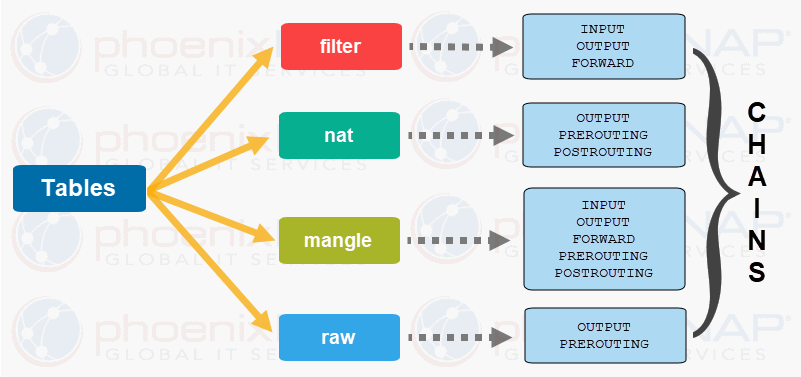

# HƯỚNG DẪN SỬ DỤNG IPTABLE

# MỤC LỤC

# 1. Sơ qua về IP table
\- iptable được sử dụng để quản lý lưu lượng mạng, quản lý các table cho netfilter firewall cho IPv4

\- Lưu ý:
- Tables là nơi chứa các action thực hiện với packet, trong bảng có gồm 1 số chuỗi
- Chain là tập hợp các rules
- Rule là điều kiện để match với các packet
- Target là hành động được thực hiện khi có rule thích hợp (1 vài target như ACCEPT, DROP, QUEUE)
- Policy là hành động default khi không có rule thích hợp (ACCEPT và DROP là 2 default)

\- Trong **table** có:
- **filter**: default table được sử dụng cho packet filtering. Bao gồm 1 vài chain như INPUT, OUTPUT và FORWARD.
- **nat**: Liên quan đến network address translation. Nó bao gồm PREROUTING và POSTROUTING chain
- **mangle**: dành cho các packet chuyên dụng. Các chain có sẵn bao gồm PREROUTING và OUTPUT
- **raw**: Định cấu hình miễn trừ khỏi theo dõi kết nối. Các chain có sẵn bao gồm PREROUTING và OUTPUT
- **security**: được dùng cho control các access bắt buộc.

\- Trong chain có:
- **INPUT**: tập hợp các quy tắc cho các packet được gửi đến localhost socket.
- **FORWARD**: dành cho các packet được định tuyến qua thiết bị.
- **OUTPUT**: dành cho các packet được tạo cục bộ, có nghĩa là được truyền ra bên ngoài.
- **PREROUTING**: để sửa đổi các gói khi chúng đến.
- **POSTROUTING**: để sửa đổi các gói khi chúng rời đi.

\- Trong linux gồm 4 default tables:
- **Filter**: bảng được sử dụng thường xuyên nhất. Nó hoạt động như một người bảo vệ, quyết định ai vào và ra khỏi mạng của bạn
- **Network address translation (NAT)**: để điều chỉnh các packet khi chúng không thể truy cập trực tiếp, khi địa chỉ đích hoặc nguồn thay đổi thì bảng NAT phải được sử dụng
- **Mangle**: bảng này được sử dụng để điều chỉnh IP header của packet
- **Raw**: bảng này được sử dụng để miễn các gói khỏi theo dõi kết nối
- Bên cạnh đó còn có bảng **security** dùng để quản lý các special rule




# 2. Cơ bản về syntax quản lý iptable
\- Syntax cơ bản:
```
iptables --table TABLE -A/-C/-D... CHAIN rule --jump Target
```

# 3. Iptables track
\- 

# THAM KHẢO
- https://phoenixnap.com/kb/iptables-tutorial-linux-firewall
- https://sysu.wdfiles.com/local--files/lecture-notes/Lec11_Firewall_lab.pdf