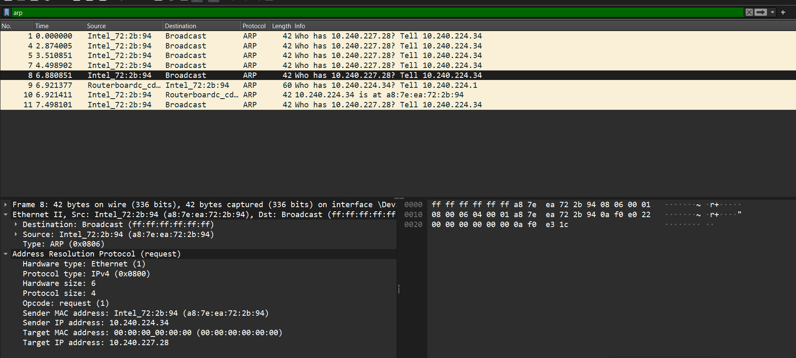

# ARP protocol

# Mục lục
- [1.ARP là gì?](#1)
- [2.Cách hoạt động](#2)
- [3.Cấu trúc packet của ARP](#3)
- [4.Phân tích Scenario cụ thể về ARP](#4)
- [5.Bắt message với wireshark](#5)
- [6.Dùng wireshark + thực hiện bắt ARP trên 2 VMs](#6)
- [Tham khảo](#7)

<a name="1"></a>
# 1. ARP là gì?
\- **ARP (Address resolution protocol)** là protocol giải địa chỉ IPv4 thành địa chỉ MAC
\- ARP hoạt động giữa layer datalink và network


<a name="2"></a>
# 2.Cách hoạt động
\- ARP dịch địa chỉ IPv4 đã biết của máy B từ máy A. Scenario đơn giản: máy A dùng địa chỉ IPv4 đã biết (lúc này máy A không biết IPv4 này của máy nào trong mạng) gửi gói tin broadcast bao gồm: IPv4 của máy B và địa chỉ MAC của máy A. Bất cứ máy nào trong mạng cũng sẽ nhận được gói tin broadcast từ máy A, tuy nhiên chỉ máy nào có chứa địa chỉ IPv4 trùng khớp với gói tin máy A đã gửi thì mới gửi lại địa chỉ MAC của nó lại cho máy A.
\- Gói tin từ máy A sang máy B được gọi là **ARP request**, ngược lại máy B trả lời máy A là **ARP reply**


<a name="3"></a>
# 3.Cấu trúc packet của ARP


\- Cấu trúc của packet ARP bao gồm
- **Hardware type**: trường này nêu loại hardware được dùng trong network, ví dụ ethernet là 1
- **Protocol type**: xác định protocol được sử dụng trên network layer, nếu IPv4 protocol thì là 0x800
- **Hardware address length**: độ dài của hardware address (dưới dạng octet) của địa chỉ MAC, với ethernet là 6.
- **Protocol address length**: độ dài của protocol address (IP), với IPv4 thì là 4
- **Operation code**: loại ARP message, với ARP request=1 và ARP reply=2
- **Sender hardware address**: chứa địa chỉ MAC address của sender
- **Sender protocol address**: chứa địa chỉ IP của sender
- **Target hardware address**: chứa địa chỉ MAC của target (địa chỉ cần tìm) - để gửi broadcast, trường này sẽ là ff:ff:ff:ff:ff:ff
- **Target protocol address**: chứa địa chỉ IPv4 của target (địa chỉ đã biết)

\- Dưới đây là một vài ví dụ về ARP protocol message:


<a name="4"></a>
# 4.Phân tích Scenario cụ thể về ARP

```
 0: ffff ffff ffff  0040 0556 4c00 0806 0001
16: 0800 0604 0001 0040 0556 4c00 898c 3206
32: 0000 0000 0000 898c 3207 2020 2020 2020
48: 2020 2020 2020 2020 2020 2020
```


<a name="5"></a>
# 5.Bắt message với wireshark


\- Với ARP request:



\- Với ARP reply:


<a name="6"></a>
# 6.Dùng wireshark + thực hiện bắt ARP trên 2 VMs

<a name="7"></a>

\- Cài đặt wireshark trên 1 VM với command:
```
sudo apt install wireshark
```

\- Bật wireshark với sudo để nhìn thấy đầy đủ những network interfaces (trong đó có cả ens33):
```
sudo wireshark
```

\- Chọn `ens33` để bắt đầu capture, ping từ VM thứ 2 để bắt đầu kết nối (VM trong VMware workstation không có gateway,cả 2 VM đều sử dụng NAT để kết nối external. Lúc này 2 VMs sử dụng host như gateway. Vì vậy, default, 2 VMs đã kết nối được với nhau. Giờ chỉ cần vào VM để ping và capture trong wireshark):


# 7.Switch học MAC address sau ARP như thế nào và cách kiểm tra
\- Từ các switch port mà swithc có thể học được các địa chỉ MAC. Các address đi kèm trong các packet đi qua switch.

\- Switch học các MAC address khi đi qua các ethernet interface trên switch (hay nói cách khác là port trên switch)

\- Switch có thể học MAC address theo 2 cách:
- **Static**: Bảng CAM sẽ được thêm các MAC address vào theo cách thủ công
- **Dynamic**: Switch tự động thêm MAC vào CAM table

# Tham khảo
- https://github.com/hocchudong/thuctap012017/blob/master/XuanSon/Netowork%20Protocol/ARP%20Protocol.md
- https://cs.newpaltz.edu/~easwarac/CCN/Week13/ARP.pdf
- https://www.tutorialspoint.com/arp-packet-format#:~:text=Hardware%20type%20%E2%88%92%20This%20field%20specifies,the%20hardware%20address%2C%20in%20bytes.
- https://dbaleanh.wordpress.com/2017/05/26/huong-dan-network-in-vmware-workstation/ - Tham khảo thêm cấu trúc network trong VMware workstation
- https://youtu.be/sdYDLip2ANI?si=39haA3JtArRqgB4G