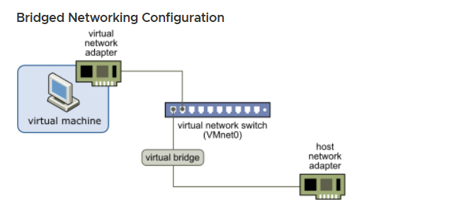

# Hiểu về network configuration trong VMware

# Mục lục

# 1.Hiểu về các virtual networking components trong VMware
\- Trong virtual networking components trong VMware bao gồm các thành phần sau:

- **virtual network adapters**: Network adapter như trên máy vật lý gán vào máy ảo
- **virtual DHCP server**: DHCP ảo để gán IP tự động cho các VM hoặc NAT device
- **Virtual NAT device**: NAT device ảo để NAT ra máy host nhằm kết nối mạng cho VM (VMware default tạo sẵn là vmnet8)
- **Virtual bridge**: bridge ảo để kết nối trực tiếp cùng lớp mạng với máy host (VMware default tạo sẵn là vmnet1)
- Và cuối cùng là **Host-only**: lựa chọn này để cô lập mạng của máy ảo với các thiết bị khác, DHCP server ảo vẫn thực hiện gán IP cho VM này tự động như bình thường.

\- Bridge được coi là một cách đơn giản để giúp VM kết nối được với network:
- Bridge sử dụng trực tiếp network adapter trên máy host để giúp VM kết nối được mạng, VM kết nối được đến network adapter của host và nằm chung LAN với host đang sử dụng 
- Bridge có thể hoạt động được với wireless và wired connection

# Tham khảo
- https://docs.vmware.com/en/VMware-Workstation-Pro/17/com.vmware.ws.using.doc/GUID-8FDE7881-C31F-487F-BEF3-B2107A21D0CE.html
