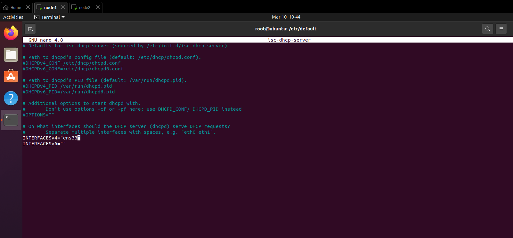

# DHCP protocol

# Mục lục

# 1.DHCP là gì?
\- **DHCP(Dynamic Host Configuration Protocol)** là giao thức hoạt động trên layer 7 theo OSI model, được dùng để gán địa chỉ IP tự động cho các host tham gia vào network.

\- DHCP góp phần tránh cấu hình thủ công có khả năng gây ra lỗi kết nối mạng của các thiết bị. Trong định tuyến mạng thường thấy thì IP do ISP cung cấp, còn IP private được DHCP chỉ định tự động.

\- DHCP hoạt động dựa trên mô hình client-server.

# 2.Cách hoạt động cơ bản của DHCP
\- Khi một máy tính mới kết nối tới network mới:
- **DHCP client** nằm trong máy tính đó sẽ gửi gói tin broadcast, trong gói tin đó yêu cầu cấp phát các thông tin cần thiết cho thiết bị.
- **DHCP server** - có thể có nhiều DHCP - quản lý nhóm địa chỉ các IP và thông tin về tham số cấu hình trên máy tính như: **default gateway, domain, name server và time server**. Khi nhận được **DHCP request**, DHCP server phản hồi lại với những **lease info** có sẵn trong DHCP server. **lease time** là khoảng thời gian máy tính mới khi tham gia vào một mạng được sử dụng các thông tin cấu hình tạm thời của máy tính.
- Các thông tin do DHCP server cung cấp bị hết hạn sẽ trả về DHCP server, các thông tin này sẽ được máy tính truy vấn lại cho DHCP server khi **booting hoặc khi hết hạn**.

\- Có 3 phương pháp quy hoạch IP của DHCP:
- **Dynamic allocation**: Network admin dự trữ một range của IP address cho DHCP, mỗi DHCP client trong LAN được cấu hình yêu cầu IP address từ DHCP server trong quá trình khởi động. Quá trình request and grant sử dụng khái niệm “lease” với một khoảng time, cho phép DHCP server lấy lại IP address không được gia hạn.
- **Automatic allocation**: DHCP server gán vĩnh viễn IP address cho client yêu cầu từ range được định nghĩa bởi admin. Giống như dynamic allocation, nhưng DHCP server giữa một table của phân công IP address trong quá khứ, để nó có thể ưu tiên assign IP address giống IP address đã đươc assign trước đó.
- **Manual allocation** ( thường gọi là static allocation ) DHCP server assign IP addres phụ thuộc vào MAC address của từng client. Tính năng này thường gọi là static DHCP assignment .

\- Trong trường hợp DHCP ở khác subnet với máy yêu cầu cấp phát thông tin, có **DHCP relay agent** để chuyển tiếp thông tin, không cần thiết phải cài đặt DHCP server trên những subnet


# 3.Cách DHCP vận hành
\- DHCP sử dụng ****connectionless, tức UDP** để truyền gói tin. DHCP server trên port 67 và client hoạt động trên port 68

\- DHCP hoạt động trong 4 bước : **server discovery , IP lease offer , IP lease request , IP lease acknowledgement** . Các giai đoạn này thường được biết tắt là DORA <=> discovery , offer , request ,và acknowledgement 
- **DHCP Discover**  
Client gửi message broacast on the network subnet sử dụng destination address `255.255.255.255` hoặc subnet broacast address chỉ định .  
Broadcast message này của client để yêu cầu DHCP server cấp phát IP address cho mình .  
- **DHCP Offer**  
Khi DHCP server nhận được DHCPDISCOVER message từ client , 1 IP address là được yêu cầu thuê , server dành 1 IP address cho client bằng cách gửi DHCPOFFER message đến client (đây là message unicast ) .  
Message chứa MAC address của client , IP address mà server dành cho client , subnet mask , IP address ,DNS domain, gateway của DHCP server gửi DHCPOFFER message .  
- **DHCP Request**  
DHCP client sau khi lựa chọn một bản tin DHCPOffer. Bản tin này chứa địa chỉ IP từ bản tin DHCPOffer đã chọn, xác nhận thông tin IP đã nhận từ server để các DHCP server khác không gửi bản tin Offer cho client đó nữa.  
- **DHCP Ack**  
Khi DHCP server nhận DHCPREQUEST message từ client , DHCP server gửi DHCPACK packet đến client , message mang tất cả thông tin cấu hình IP . Sau đó ,kết thúc quá trình cấp phát IP .

\- Ngoài ra còn có 1 số bản tin khác nữa:
- **DHCP Nack**  
Broadcast bởi DHCP server tới DHCP client thông báo từ chối bản tin DHCPRequest vì nó không còn giá trị nữa hoặc được sử dụng hiện tại bởi một máy tính khác .  
- **DHCP Decline**  
Nếu DHCP Client quyết định tham số thông tin được đề nghị nào không có giá trị, nó gửi gói DHCP Decline đến các Server và Client phải bắt đầu tiến trình thuê bao lại.  
- **DHCP Release**  
Unicast từ DHCP client tới DHCP server rằng nó bỏ địa chỉ IP và thời gian sử dụng còn lại.  
- **DHCPInform**  
Một DHCP Client gửi một gói DHCP Release đến một server để giải phóng địa chỉ IP và xoá bất cứ thuê bao nào đang tồn tại. 


# 4.Phân tích DHCP message
\- **BOOTP và DHCP có cùng chức năng là phân phối địa chỉ IP**, dựa trên BOOTP, DHCP là phiên bản mở rộng và có sử dụng 1 chút cấu trúc header từ BOOTP:


| Trường | Dung lượng | Mô tả|
|------- |-------|------|
| Opcode | 8 bits | Xác định loại message . Giá trị “1” là request message , “2” là reply message|
| Hardware type | 8 bits | Quy định cụ thể loại hardware.   |
| Hardware length | 8 bits | Quy định chiều dài của hardware address |
|Hop counts |8 bits|Set bằng “0” bởi client trước khi truyền request và được sử dụng bởi relay agent để control forwarding của BOOTP và DHCP messages .|
|Transaction Identifier	|32 bits|Được tạo bởi client, dùng để liên kết giữa request và replies của client và server.|
|Number of seconds |16 bits|được định nghĩa là số giây trôi qua kể từ khi client bắt đầu cố gắng để có được 1 IP hoặc thuê 1 IP mới . Điều này có thể được sử dụng khi DHCP Server bận , để sắp xếp thứ tự ưu tiên khi có nhiều request từ client chưa được giải quyết .|
|Flags |16 bits| |
|Client IP address |32 bits|Client sẽ đặt IP của mình trong field này nếu và chỉ nếu nó đang có IP hay đang xin cấp lại IP, không thì mặc định = 0|
|Your IP address |32 bits|IP address được server cấp cho client|
|Server IP address |32 bits|IP address của Sever|
|Gateway IP address	|32 bits|Sử dụng trong relay agent|
|Client hardware address |16 bytes|Địa chỉ lớp 2 của client, dùng để định danh|
|Server host name |64 bytes|Khi DHCP server gửi DHCPOFFER hay DHCPACK thì sẽ đặt tên của nó vào trường này, nó có thể là “nickname” hoặc tên DNS domain|
|Boot filename |128 bytes|Option được sử dụng bởi client khi request 1 loại boot file trong DHCPDISCOVER message.  Được sử dụng bởi server trong DHCPOFFER để chỉ định path đến boot file directory và filename .|
|Options |Variable||

# 5.Capture DHCP protocol với wireshark
\- Các gói tin sẽ có thêm nhiều các header của các protocol khác đi kèm như IPv4, DHCP và UDP đi kèm nhau như

\- Nhớ sử dụng command để release IP cũ và request IP mới từ DHCP server:


\- Ví dụ gói Discover:


# 6.Tạo DHCP server trên ubuntu
## 6.1.Mô hình lab


## 6.2.Cài đặt và cấu hình
\- Cài đặt isc-dhcp-server theo command sau (chỉ cần cài trên 1 VM):
```
apt-get install isc-dhcp-server
```

\- Dùng command sau để copy file config ra một file mới để tránh bị lỗi config
```
cp dhcpd.conf dhcpd.conf.bak
```

\- Dùng nano hoặc vim để vào sửa file config
```
nano dhcpd.conf
```

\- Lưu ý và chỉnh sửa các thông tin trong file config như sau:
```
# subnet 192.168.111.0/24

ddns-update-style none

default-lease-time 600;

max-lease-time 86400;

authoriative;

subnet 192.168.111.0 netmask 255.255.255.0{
option subnet-mask 255.255.255.0;
range 192.168.111.50 192.168.111.100;
option routers 192.168.111.2
option domain-name-servers 8.8.8.8;
option domain-name "net_dhcp_1";
option broadcast-address 192.168.111.255;
}
```

\- Tiếp theo dùng cd để ra file default và config tiếp file isc-dhcp-server:
```
cd /etc/default/isc-dhcp-server
```

và sửa file (nếu không có thì tạo) và config ở đây ens33 là network card thuộc mạng LAN cài cho dhcp server
```
INTERFACES="ens33"
```



> Trong trường hợp để `INTERFACES=""`, dhcp sẽ lắng nghe trên tất cả các IP

- Sau khi config xong, restart và status để check trạng thái hoạt động của dhcp server:
```
systemctl restart isc-dhcp-server
systemctl status isc-dhcp-server
```

> Nếu có bất kỳ lỗi xảy ra check tên file config, nội dung file, dùng journalctl để check kỹ log
```
journalctl _PID=<ID_process_generate_error_log>
```

\- Bật VM2 lên, dùng ifconfig để check xem ip đã thay đổi như mong muốn chưa, nếu chưa thì sử dụng **dhclient -r để realease ip cũ** và **dhclient** để request tới dhcp server để nhận ip mới
```
sudo dhclient -r
sudo dhclient
```


\- Sử dụng **dhcp-lease-list** để check các máy đang dùng IP
```
dhcp-lease-list
```


\- Nếu đặt địa chỉ router sai thì sẽ không kết nối được internet, để biết được cần đặt địa chỉ router chính xác, cần tìm hiểu thêm về **VMware network**, cụ thể các bước:
- 1. Vào phần `View`, chọn `Virtual network editor`
- 2. Chọn mục `NAT`, chọn vào `NAT setting`
- 3. Ta có thể thấy VMware đã chọn sẵn gateway 192.168.111.2 để NAT ra ngoài máy host để thông mạng. Vậy nên ta chọn 192.168.111.2 để config cho dhcpd.config


# Tham khảo
- https://github.com/hocchudong/thuctap012017/blob/master/XuanSon/Netowork%20Protocol/DHCP%20Protocol.md
- https://en.wikipedia.org/wiki/Dynamic_Host_Configuration_Protocol
- http://www.tcpipguide.com/free/t_DHCPMessageFormat.htm
- https://youtu.be/yjYALqMcNhw?si=YyOA_21VfcOp5UYi
- https://youtu.be/Q7v4pzQReuo?si=bGFXf7NiDxmQs3AS - có thể bỏ qua bước config trong netplan yaml