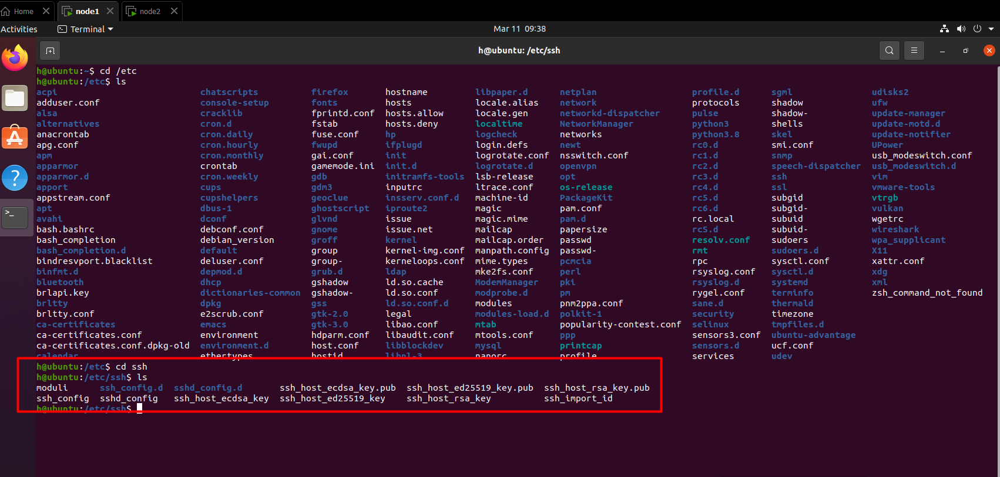

# SSH protocol

# Mục lục

# 1.SSH protocol và chức năng
\- **SSH(Secure shell)** là protocol dùng để kết nối secure remote tới máy chủ khác, dùng máy tính từ xa dưới dạng remote shell. Nói cách khác, user sẽ tương tác với máy chủ khác chỉ dưới dạng CLI - tương tác bằng **command line interface**.

\- SSH hoạt động ở lớp application của model TCP/IP. SSH lắng nghe trên port 22 của TCP

\- SSH dùng để thay thế Telnet - một giao thức cũ tương tự nhưng kém bảo mật hơn SSH

# 2.Đặc điểm của SSH
\- Các đặc điểm chính của giao thức SSH là:  
- Tính bí mật (Privacy) của dữ liệu thông qua việc mã hoá mạnh mẽ
- Tính toàn vẹn (integrity) của thông tin truyền, đảm bảo chúng không bị biến đổi.
- Chứng minh xác thực (authentication) nghĩa là bằng chứng để nhận dạng bên gửi và bên nhận
- Giấy phép (authorization) :dùng để điều khiển truy cập đến tài khoản.
- Chuyển tiếp (forwarding) hoặc tạo đường hầm (tunneling) để mã hoá những phiên khác dựa trên giao thức TCP/IP .SSH hỗ trợ 3 kiểu chuyển tiếp:
  - TCP port forwarding 
  - X forwarding
  - Agent forwarding

# 3.Cách hoạt động của SSH
## 3.1.Giới thiệu
\- SSH bao gồm: **symmetrical enencryption, asymmetrical encryption, hashing** để đảm bảo tính secure trong truyền dữ liệu trong ssh
- **Symmetrical encryption**: 1 key sẽ được gửi cho bên nhận để encrypt message từ bên gửi đến. Loại encryption này thường được gọi là “shared secret” encryption , hoặc “secret key” encryption. Thường chỉ có một key được sử dụng cho tất cả các hoạt động ,hoặc một key pair , nơi mối quan hệ giữa chúng dễ dàng để phát hiện và dễ dàng lấy được key còn lại từ key đã có. Symetric keys được sử dụng bởi SSH để encrypt toàn bộ connection. SSH được cấu hình để sử dụng một loạt các hệ thống mật mã symetric key khác nhau , bao gồm : AES , Blowfish,3DEC,CAST128 và Arcfour.

- **Asymmetrical encryption**: Asymmetrical Encryption khác symmetrical encryption trong đó data được gửi theo một hướng duy nhất. Một key gọi là private key, khóa kia gọi là public key. Public key có thể được shared tự do với bất kỳ bên nào. Data sẽ được encrypt bằng public key và chỉ được decrypt bằng private key. Đây là một chiều, có nghĩa là public không có khả năng decrypt message nó viết. Private key được giữ bí mật và không bao giờ được share. SSH sử dụng asymmetrical encryption trong một vài trường hợp khác nhau. Trong quá trình trao đổi key ban đầu để thiết lập symmetrical (được sử dụng encrypt session), asymmetrical encryption là được sử dụng.  
Trong giai đoạn này, server sẽ key pair và gửi public key cho client, client sẽ tạo symmetrical encryption và được encrypt bằng public key, sau đó gửi lại cho server, server dùng private key để decrypt. Vậy là quá trình thỏa thuận encryption key để encrypt session đã xong. Asymmetrical Encryption cũng có thể được sử dụng để authenticate client kết nối đến server. Client tạo key pair và upload public key lên remote server mà nó truy cập.

- **Hashing**: Là phương pháp tạo ra chữ ký ngắn gọn, tóm tắt tập hợp 1 thông tin. Các thông tin ban đầu được phân tách và decrypt theo cách không thể đoán trước được và là unique. User không thể lấy thông tin gốc đã được decrypt từ hash (đây là decrypt 1 chiều). Với các thuộc tính này, hash chủ yếu được sử dụng cho mục đích toàn vẹn dữ liệu và để xác minh tính xác thực của giao tiếp. Công dụng chính của SSH là với HMAC hoặc mã xác thực tin nhắn dựa trên hash. Chúng được sử dụng để đảm bảo văn bản tin nhắn nhận được còn nguyên vẹn và không bị sửa đổi. Là một phần của quá trình đàm phán mã hóa đối xứng đã nêu trước đó, thuật toán mã xác thực tin nhắn (MAC) được chọn. Mỗi tin nhắn được gửi sau khi mã hóa được thỏa thuận phải chứa MAC để bên kia có thể xác minh tính toàn vẹn của gói. MAC được tính toán từ symmetrical secret được chia sẻ, số thứ tự gói của tin nhắn và nội dung tin nhắn thực tế. Bản thân MAC được gửi ra ngoài vùng được mã hóa đối xứng như là phần cuối cùng của gói.

## 3.2.Các bước làm việc của SSH
\- SSH protocol sử dụng model client-server để authenticate và encrypt data giữa chúng .  
\- Một session của SSH được thành lập qua 2 bước.  
- **Bước 1** : **Đầu tiên là thỏa thuận và thiết lập encryption để bảo vệ thông tin liên lạc trong tương lai**. Khi TCP connection được thực hiện bởi client, server đáp ứng với protocol mà nó hỗ trợ. Server cung cấp một public host key. Sau đó, cả 2 bên thương lượng một session key sử dụng thuật toán Diffie-Hellman. Session key sẽ được sử dụng để encrypt toàn bộ session. Public và private key pair được sử dụng như một phần của quy trình và hoàn toàn không liên quan đến quá trình làm việc sau này của người dùng với remote machine.
  - Đầu tiên, client gửi yêu cầu kết nối đến SSH server
  - SSH server đồng ý yêu cầu và tạo ra một key pair gồm public key và private key, sau đó gửi lại client public key.
  - Client nhận được public key, sau đó client sinh một session key ngẫu nhiên (là symmetrical encryption, thường là AES) và mã hóa session key bằng public key rồi gửi lại server.
  - Server nhận được session key đã mã hóa bởi public key, sau đó encrypt bằng private key.
  - Vậy là client và server đã thỏa thuận với nhau session key , key này được sử dụng encrypt data toàn bộ phiên kết nối (session key hay còn gọi host key)

- **Bước 2** : **Authenticate user to access to server**. Có 1 vài phương pháp khác nhau để access, trong đó đơn giản nhất là password. Password sẽ được encrypt và gửi lên server , vì vậy password tương đối khó bị đánh cắp. Mặc dù password được encrypt , phương pháp này thường không nên sử dụng do sự phức tạp của password. Phương pháp được khuyên thay thế là sử dụng SSH key pair .Authentication sử dụng **SSH key pair** bắt đâù sau khi symmetric encryption được thiết lập như mô tả trong phần trước .

# 4.Cài đặt và tạo ssh server và client
## 4.1.Bên client
\- Cài đặt ssh client (mặc định ssh client đã có ở trên máy)
```
sudo apt-get install openssh-client
```
## 4.2.Bên server
\- Cài đặt ssh bên server:
```
sudo apt-get install openssh-server
```

# 5. Config
\- Có 2 bộ config khác nhau:
- Một là cho client program: ssh, scp, và sftp
- Hai là cho server: sshd daemon
- **system wide ssh configuration** được lưu trữ trong `/etc/ssh/` (được coi là System-wide configuration files)
- **User-specific SSH configuration information** được lưu trữ trong `~/.ssh/` trong dir user home (được coi là User-specific configuration files)

## 5.1.User-specific configuration files
\- **User-specific SSH configuration information** được lưu trữ trong `~/.ssh/` trong dir user home (được coi là User-specific configuration files)


> Đối với máy chưa kết nối ssh với máy nào bao giờ, file `~/.ssh/` sẽ không được thấy trong thư mục

\- file `/home/.ssh/known_hosts`: chứa thông tin về các host đã đăng nhập, thuật toán mã hóa, host key


\- Nếu muốn có thêm file host để tùy biến, dùng:
```
nano config
```
\- Một cách config cơ bản cho ssh client (tạo file config ngay trong `~/.ssh/`)
```
Host ssh-server
    HostName 192.168.111.128
    User deadman
    Port 22
```
\- Giải thích:
- Host ssh-server: giúp ssh command ngắn gọn hơn khi đặt tên (ví dụ: ssh ssh-server)
- HostName: IP address hoặc domain name
- User h: tên người dùng (tùy tên người dùng có bên trong máy server)
- Port 22: ssh thông qua port 22


\- Ngoài ra, còn có một số config khác có thể được thêm vào :
- `Compression yes` khi muốn nén dữ liệu.
- `port <port number>` set port cho ssh.

## 5.2.System-wide configuration files
\- **System-wide configuration files** được lưu trong `/etc/ssh`




\- Config dưới đây cho phép điều chỉnh một số thông tin quan trọng sau (`nano sshd_config`)

### a.PermitRootLogin

\- **PermitRootLogin**: Cho phép tài khoản root đăng nhập SSH:
- Tại dòng `PermitRootLogin without-password` thay đổi thành `PermitRootLogin yes` 
- Không cho phép tài khoản root đăng nhập SSH tại dòng `PermitRootLogin without-password` thay đổi thành `PermitRootLogin no`

### b.Password Authentication
\- Mặc định là có password authentication.

\- Tìm đến dòng có từ `PasswordAuthentication`:
- Nếu muốn disable password authentication , sửa thành `PasswordAuthentication no`

### c.Changing the Port that the SSH Daemon Runs On
\- Tìm đến dòng `port` và thay đổi:
```
Port 4444
```

### d.Limiting the Users Who can Connect Through SSH
\- Để hạn chế user accounts có thể đăng nhập thông qua SSH. Bạn có thể tìm kiếm AllowUsers. Nếu không tồn tại, bạn có thể tạo nó ra ở bất cứ đâu. Sau chỉ thị này là danh sách các user accounts được phép đăng nhập qua SSH:

```
AllowUsers <user1> <user2>
```

- Ngoài các user, groupuser cũng được phép đăng nhập qua ssh với command sau:

```
AllowGroups <sshmembers>
```

# 6.SSH command
## 6.1.Client command
\- Syntax:
```
ssh [-1246AaCfgKkMNnqsTtVvXxYy] [-b bind_address] [-c cipher_spec]
    [-D [bind_address:]port] [-E log_file] [-e escape_char]
    [-F configfile] [-I pkcs11] [-i identity_file]
    [-L [bind_address:]port:host:hostport] [-l login_name] [-m mac_spec]
    [-O ctl_cmd] [-o option] [-p port]
    [-Q cipher | cipher-auth | mac | kex | key]
    [-R [bind_address:]port:host:hostport] [-S ctl_path] [-W host:port]
    [-w local_tun[:remote_tun]] [user@]hostname [command]
```

\- Ví dụ:
```
ssh huy@192.168.111.128
ssh -p 22 -l huy@192.168.111.128
```

## 6.2.scp command
\- Có tác dụng copy các file từ máy client sang cho máy host

\- Syntax:
```
scp [-12346BCpqrv] [-c cipher] [-F ssh_config] [-i identity_file]   [-l limit] [-o ssh_option] [-P port] [-S program]
     [[user@]host1:]file1 ... [[user@]host2:]file2
```

- Ví dụ - copy từ máy client sang vị trí folder của host:
```
scp lmao.txt huy@192.168.111.128:/home/folder
```
\- Ngược lại, cũng có thể copy ngược từ máy host sang client

- Ví dụ - copy từ file trong host sang vị trí dir hiện tại của client:
```
scp huy@192.168.111.128:/home/folder/file lmao.txt
```

\- Có thể copy file giữa các host với nhau:
- Ví dụ:
```
scp huy@192.168.111.128:/home/folder/file1 kitten@192.168.111.128:home/folder/
```

## 6.3.ssh keygen
\- là command dùng để generate pair key - **public key** và **private key**, sử dụng chúng để secure ssh connection

\- Syntax:
```
ssh-keygen [-q] [-b bits] [-t dsa | ecdsa | ed25519 | rsa | rsa1]
                [-N new_passphrase] [-C comment] [-f output_keyfile]
     ssh-keygen -p [-P old_passphrase] [-N new_passphrase] [-f keyfile]
     ssh-keygen -i [-m key_format] [-f input_keyfile]
     ssh-keygen -e [-m key_format] [-f input_keyfile]
     ssh-keygen -y [-f input_keyfile]
     ssh-keygen -c [-P passphrase] [-C comment] [-f keyfile]
     ssh-keygen -l [-f input_keyfile]
     ssh-keygen -B [-f input_keyfile]
     ssh-keygen -D pkcs11
     ssh-keygen -F hostname [-f known_hosts_file] [-l]
     ssh-keygen -H [-f known_hosts_file]
     ssh-keygen -R hostname [-f known_hosts_file]
     ssh-keygen -r hostname [-f input_keyfile] [-g]
     ssh-keygen -G output_file [-v] [-b bits] [-M memory] [-S start_point]
     ssh-keygen -T output_file -f input_file [-v] [-a rounds] [-J num_lines]
                [-j start_line] [-K checkpt] [-W generator]
     ssh-keygen -s ca_key -I certificate_identity [-h] [-n principals]
                [-O option] [-V validity_interval] [-z serial_number] file ...
     ssh-keygen -L [-f input_keyfile]
     ssh-keygen -A
     ssh-keygen -k -f krl_file [-u] [-s ca_public] [-z version_number]
                file ...
     ssh-keygen -Q -f krl_file file ...
```

- Ví dụ - gen key dưới dạng rsa và lenght 2048 bits:
```
ssh-keygen -t rsa -b 2048
```

\- `ssh-keygen` được sử dụng
- Ở bên phía client side, **private key** được giữ ở maý client, **public key** sẽ được copy như bên dưới để gửi cho máy host public key.
- Dùng `ssh-copy-id h@192.168.111.128` ngay trên máy client để copy bằng tay key vừa được tạo trong file `id_rsa.pub` để thêm public key vào file `~/.ssh/authorized_keys` trên server.
- Do đó, khi ssh lại vào host, không cần phải thực hiện các thủ tục xác minh như mật khẩu, ví dụ bên dưới:


\- Đôi khi ssh-keygen được sử dụng kèm với `passphase` để tăng tính bảo mật khi muốn lấy public key từ client machine (có thể coi nó như mật khẩu để lấy public ở máy host)

# 7.Intermediate ssh
\- **Intermediate ssh** có tác dụng giúp thực thi command trên client truyền cho máy host mà không cần phải ssh kết nối trực tiếp đến host bằng ssh thường.

\- Syntax:
```
ssh <username@remote_host> <command_to_run>
```

- Ví dụ:
```
ssh huy@192.168.111.128 'ls; whoami'
```

\- Đối một số command tương tác trực tiếp như nano và vim, sử dụng `-t`:
```
ssh -t huy@192.168.111.128 'vim lmao.txt'
```

# 8.Removing or Changing the Passphrase on a Private Key
\- Sử dụng câu lệnh:
```
ssh-keygen -p
```

# Tham khảo
- https://github.com/hocchudong/thuctap012017/blob/master/XuanSon/Netowork%20Protocol/SSH%20Protocol.md
- https://www.digitalocean.com/community/tutorials/understanding-the-ssh-encryption-and-connection-process 