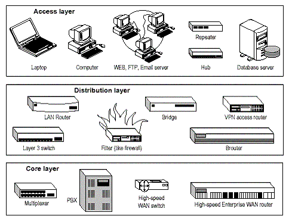

# KIẾN TRÚC MẠNG 3 LỚP

# MỤC LỤC

# 1.Tại sao có mô hình mạng 3 lớp
\- Trong các tài liệu của mình cissco đã đề xuất một mô hình mạng phân cấp gồm 3 lớp access, distribute, core cho các mạng doanh nghiệp

\- Mô hình này là đơn giản hóa việc xây dựng một hệ thống mạng, đảm bảo các tiêu trí về độ tin cậy, khả năng mở rộng, dễ bảo trì, quản lý và tiết kiệm chi phí. Ý tưởng xiên suốt của mô hình là  tập trung vào việc nhóm các thiết bị thành các khối chức năng gọi là các lớp (layer) đối toàn bộ hệ thống mạng

## 1.1.Core layer
\- Lớp này được coi như lớp sương sống của toàn bộ hệ thống mạng với các thiết bị switch, router, … có khả năng xử lý với tốc độ  cao và các thiết bị có tốc độ truyền tải dữ liệu lớn như cáp quang. Layer này không thực hiện việc định tuyến giữa các mạng LAN và thao tác với các packet thay vào đó nó đảm bảo tính tin cậy và khẳ năng truyền tải các packet với bên ngoài hệt thống.

\- Một số thiết bị có thể nằm trong layer này bao gồm:
- Cisco switches: 7000, 7200, 7500, and 12000 (for WAN use)
- Catalyst switches: 6000, 5000, and 4000 (for LAN use)

## 1.2.Distribution layer
\- Layer này bao gồm các LAN base router và các switch layer 3. Nó đảm bảo khả năng định tuyến giữa các mạng LAN và các subnet trong mạng doanh nghiệp, áp dụng các policy-based cho các kết nối trong mạng. Nó cũng được gọi là workgroup layer.

\- Một số policy:
- Định tuyến VLAN
- Packet filtering
- QoS: quyết định quyền ưu tiên của các packet

\- Một số thiết bị có thể nằm trong layer này bao gồm:
- Các dòng router 2600, 4000, 4500

## 1.3.Access layer
\- Layer này bao gồm các switch và các hub. Nó còn được gọi là desktop layer bởi chức năng của nó tập trung vào việc kết nối các thiết bị truy nhập, đảm bảo khả năng truyền tại tới các thiết bị đó.

\- Các thiết bị ở tầng này bao gồm:
- Hub
- Repeater
- laptop
- printer

# 2. Lợi ích của mô hình phân cấp này là gì?
\- **Hiệu suất cao**: Ta có thể dễ dàng thiết kế một hệ thống mạng với tốc độ cao bởi mỗi layer sẽ chỉ thực hiện một số chức năng nhất định giảm thiểu tắc nghẽn vì phải xử lý qúa nhiều chức năng cùng lúc tại cùng vị trí.

\- **Tăng khả năng quản lý và troubleshoot khi có sự cố xảy ra**: Mô hình phân cấp cũng giup việc quản lý và xử lý lỗi trở nên dễ dàng. Ví dụ trong tình huống ta gặp các vấn đề về policy chỉ cần kiểm tra lại phân đoạn distribute mà không cần thiết phải kiểm tra các phần khác.

\- **Dễ dàng trong việc quản lý các policy** vì các policy chỉ đặt tại distribute layer ta chỉ cần duy nhất tạo, xóa và sửa đổi tại đây.

\- **Khả năng mở rộng cao**: Việc phân nhỏ tạo ra các vùng tự trị khiến cho việc mở rộng trở nên dễ dàng khi có yêu cầu cao hơn.

\- **Dự đoán hành vi**: Khi quản trị hoặc lên kế hoạch xây dựng một mạng. Mô hình cho phép bạn biết điều gì xảy ra khi một tải trọng đặt lên nó.

# THAM KHẢO
- https://cnttshop.vn/blogs/tin-tuc/tim-hieu-ve-core-switches-distribution-switches-va-access-switches-trong-he-thong-mang#:~:text=Distribution%20Switch%20l%C3%A0%20thi%E1%BA%BFt%20b%E1%BB%8B,b%E1%BB%8B%20trong%20l%E1%BB%9Bp%20truy%20c%E1%BA%ADp.
- https://toanvnu.wordpress.com/2017/01/03/mo-hinh-three-layered-trong-thiet-ke-network/