# GIAO THỨC STP

# MỤC LỤC

# 1.STP là gì và sao phải sử dụng STP
\- **Spanning Tree Protocol (STP)** là một giao thức ngăn chặn sự lặp vòng, cho phép các bridge truyền thông với nhau để phát hiện vòng lặp vật lý trong mạng. Sau đó giao thức này sẽ định rõ một thuật toán mà bridge có thể tạo ra một cấu trúc mạng logic chứa vòng lặp (loop-free)

\- Một trong số đó là **broadcast storm** có thể gây nguy hiểm nghiêm trọng cho hệ thống mạng do các gói tin broadcast bắn đi truyền lại giữa các switch rồi giữa các máy host. Ngoài ra còn có **Instability MAC table**, **Multi frame copy**, **Bridging loop do các gói unicast**

# 2.Các yếu tố STP sử dụng
\- **Bridge ID** và **chi phí đường đi** là 2 yếu tố để STP dựa vào để tính toán.

## 2.1.Bridge ID
\- **BID** là một trường có 8 byte, gồm 2 trường con:
- **MAC address**: 6 byte được gán cho bridge
- **Bridge priority**: là độ ưu tiên bridge có 2 byte tạo thành 216 giá trị từ 0 - 65.535. Độ ưu tiên bridge có **giá trị mặc định là giá trị ở khoảng giữa (32.768)**.

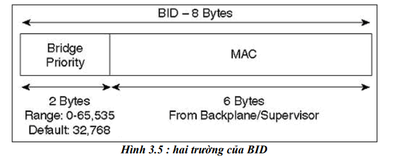

## 2.2.Chi phí đường đi
\- STP sẽ đánh giá các bridge khác bằng cách chia băng thông của liên kết, định nghĩa chi phí là 1000 Mbps bằng cách chia băng thông của liên kết. Ví dụ: một liên kết 10BaseT có chi phí là 100 (1000/10), Fast Ethernet và FDDI sử dụng chi phí là 10 (1000/100). Với các loại đường dẫn tốc độ  cao hiện nay, các đường dẫn trên 1gb sẽ có chi phí đường đi là 1 (Ví dụ OC-48 ATM trong 1000/2400 Mbps= 41667 bps - một con số không hợp lệ với cách tính của phiên bản STP  802.1D)

> Điều này khiến cho STP không thể chọn đường đi tốt nhất

- IEEE cập nhật và sử dụng bảng tính co dãn không tuyến tính dưới đây để tính chi phí:

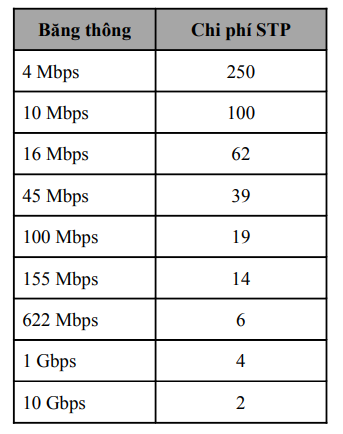

## 2.3.BPDU - chứa thông tin
\- Các switch sẽ dựa vào BID và 1 số các thông tin khác nữa để quyết định trong quá trình STP hoạt động, **BPDU** chính là các gói tin chứa các thông tin sau:
- **Root BID**: cho biết bridge gốc
- **Root path cost**: cho biết chi phí đường đi của bridge gốc
- **Sender BID**: cho biết B-ID của bridge gửi BPDU này
- **Port ID**: cho biết BPDU đến từ port nào của bridge gửi

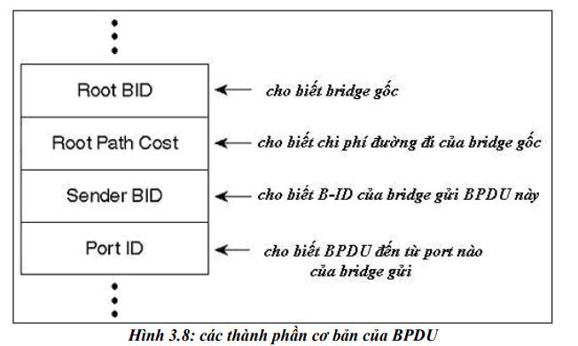

# 3.Các bước quyết định trong STP
## 3.1. General
\- Có 4 bước cơ bản:
- **Root BID**
- **Root port**
- **Designated port**
- **Blocking port**

## 3.2 Mô tả sâu
\- Scenario: Có 4 Switch được đấu nối với nhau như hình dưới

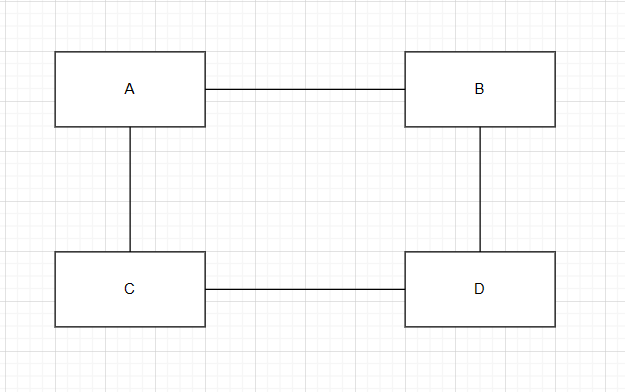

### a. Bước 1: Chọn switch gốc

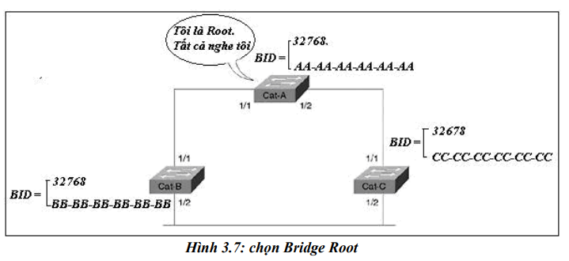

\- Bước 1: Ban đầu các switch đều sẽ gửi gói tin **BPDU** của STP đến nhau (ban đầu tất cả các switch đều giả sử bản thân là root switch)
- Để bầu chọn root switch, switch nào có BID nhỏ nhất thì được chọn làm root.
- Việc so sánh được thực hiện ở cả hai giá trị: **Bridge priority** và **MAC address**. Ưu tiên lựa chọn **Bridge priority có giá trị nhỏ nhất** để bầu root switch.
- Khi **Bridge priority** bằng nhau, các switch có giá trị bằng nhau sẽ chuyển sang so sánh bằng **MAC address**, **Mac address có giá trị nhỏ hơn** sẽ được bầu làm root switch. **MAC address được so sánh từ trái qua phải, số nào nhỏ hơn sẽ được chọn**.

\- Các BPDU 
- Chỉ được gửi giữ các bridge hoặc switch, không gửi đến các end machine
- Được gửi định kỳ 2s/lần

\- Ví dụ:
```
1. 0100.5a0c.fd86
2. 0100.5a0c.fd87
3. 0100.6000.0000

Result: 1<2<3
Choose 1
```

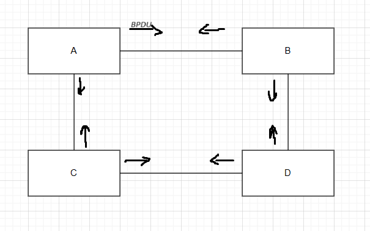

### b.Bước 2: chọn Root port
\- Bước 2: Chọn Root switch đã xong, chỉ có switch A mới được gửi gói tin BPDU. Các switch còn lại chuyển qua chế độ lựa chọn root port. **Tiêu chí lựa chọn root port là tổng path cost trở về root switch là nhỏ nhất**

\- Để chọn cổng gốc, STP dựa vào chi phí để xét root port như ví dụ sau:
- Giả sử giữ 4 switch đều được gắn dây fast ethernet, tốc độ 100mbps, vậy path cost của các đường sẽ bằng nhau (=19)
- Tính từ switch C gửi tính cost path về switch A = 19, path cost từ switch C-D-B-A là 57. Chọn port từ C về A là root port

\- Luật Tie-Break - luật này được sử dụng để so sánh các giá trị khác nữa nếu xảy ra 1 số trường hợp bằng nhau:
- Sender Bridge ID: Cổng nào kết nối switch mà switch đó có bridge ID nhỏ nhất -> port đó sẽ được chọn làm Root-port.
- Sender Port ID: Port ID của Switch bên kia thì port nào của switch bên kia có giá trị port-ID nhỏ hơn thì chọn port bên switch mình kết nối với port ID nhỏ hơn đó.
- Priority của port: có giá trị từ 0 -> 255, default=128. Port nào có priority nhỏ hơn thì port đó có Port ID nhỏ hơn.
- Vị trí của port: Xét theo hạng của số thứ tự của port. Port số 1 < port 2 -> port số 1 làm root-port
- Khi các luật trên không giải quyết được thì nó sẽ xét đến Port ID trên chính nó

Priority và vị trí của port

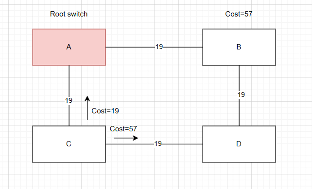

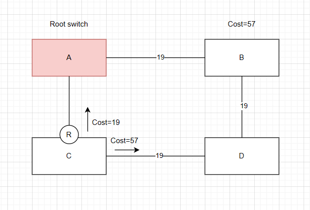

- Tương tự như vậy với switch B
- Đối với switch D, path cost của 2 đường đều là 38, port nào được nối với switch nào có sender ID nhỏ hơn thì được lấy port đó làm root (sender ID chính là địa chỉ MAC của switch đó - trong trường hợp này MAC của switch B nhỏ hơn MAC switch C - chọn port nối đến B làm root)

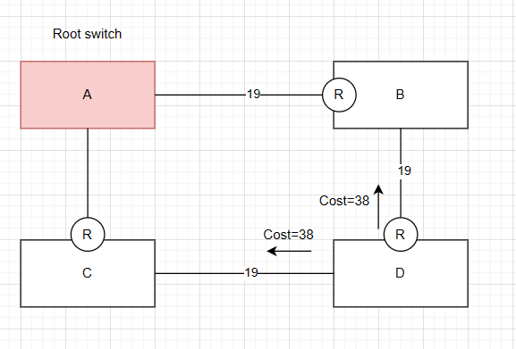

### b.Bước 3 + 4: chọn Designated port + block port
\- Những port nào nối trực tiếp tới một root port thì được coi là một designated port

\- Các port đi từ root switch A đều được coi là designated port

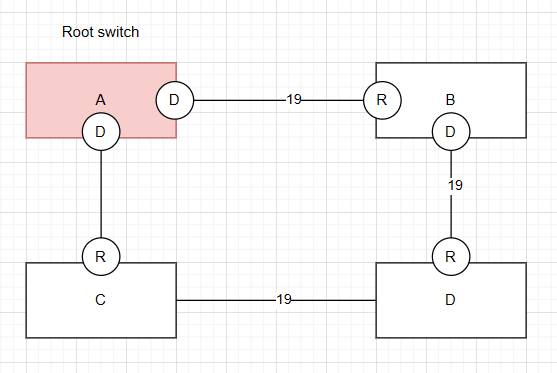

\- Riêng đối với 2 đầu port từ switch C và switch D nối với nhau chưa thể xác định được designated port, ta làm cách như sau:
- Tính từ switch C, path cost về root switch là 19, tính từ switch D, path cost về root switch là 38 (lưu ý: không tính con đường nối giữa 2 switch chưa xác định được designated port)
- Từ switch C về switch A là ngắn nhất, vậy port của C là designated port, còn của D thì bị block

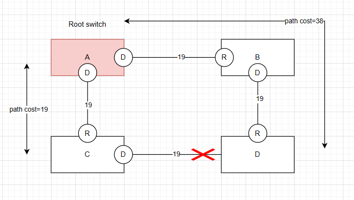

# 4.Các trạng thái của STP
\- Sau khi bridge phân chia được các cổng như root port, designated port và non-designated port, root port và designated port chuyển tiếp lưu lượng, trong khi cổng không được chỉ định thì khóa lưu lượng.

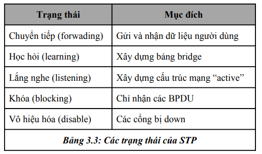

\- Lần lượt các trạng thái của STP chuyển tiếp các trạng thái như sau:
- Trạng thái “disable” cho phép người quản trị mạng quản lý việc ngừng hoạt động của một cổng. Sau khi khởi tạo, các cổng bắt đầu trong trạng thái “blocking” để lắng nghe các BPDU.
- Trong trại thái STP bắt đầu hoạt động, các switch sẽ vào trạng thái "listening" - ví dụ như là các switch đều giả sử chúng là root switch, chúng đều lắng nghe các gói tin BPDU để dần dần xây dựng cấu trúc network (không có dữ liệu người dùng được gửi trong đó)
- Các cổng được chỉ định và cổng gốc sau 15s (giá trị mặc định của bộ định thời) sẽ chuyển qua trạng thái “learning”. Trong khoảng 15s khác, bridge vẫn không chuyển các frame của người dùng qua, mà xây dựng bảng bridge của nó. Khi bridge nhận frame, nó đưa địa chỉ MAC và cổng vào bảng bridge. Trạng thái “learning” sẽ giảm bớt số lượng tràn ngập khi việc chuyển tiếp dữ liệu bắt đầu
- Nếu một cổng vẫn là cổng được chỉ định hay cổng gốc ở khoảng thời gian cuối của trạng thái “learning”, thì cổng chuyển qua trạng thái “forwading” - trạng thái chuyển tiếp các dữ liệu người dùng.

\- Cơ bản về cách STP chuyển trạng thái theo sơ đồ dưới đây:

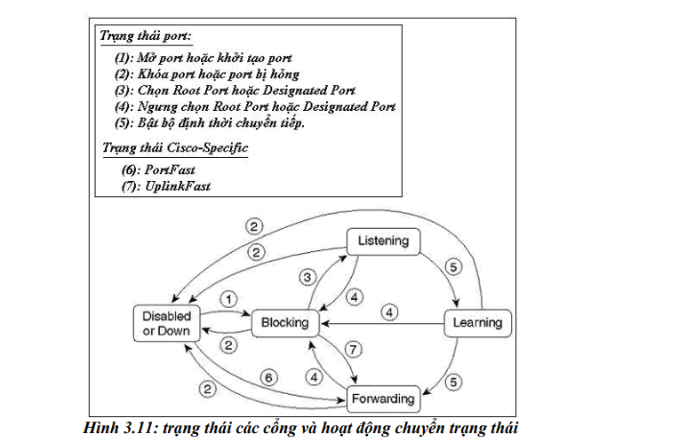

# 5.Timer của STP
\- STP sử dụng 3 bộ đếm thời gian dưới đây:

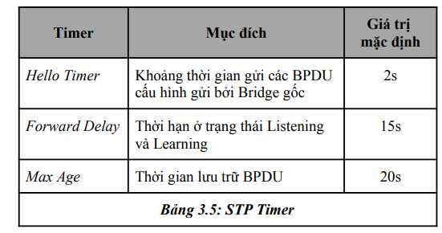


# THAM KHẢO
- https://fit.hcmute.edu.vn/Resources/Docs/SubDomain/fit/trungnh/63097205-Tom-t%E1%BA%AFt-Spanning-Tree-Protocols.pdf
- https://youtu.be/eq0p4S0fW9M?si=SoYb8oHHpia0jwr9