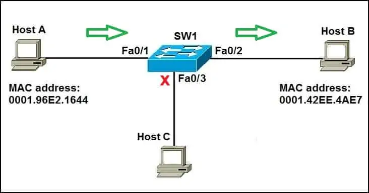
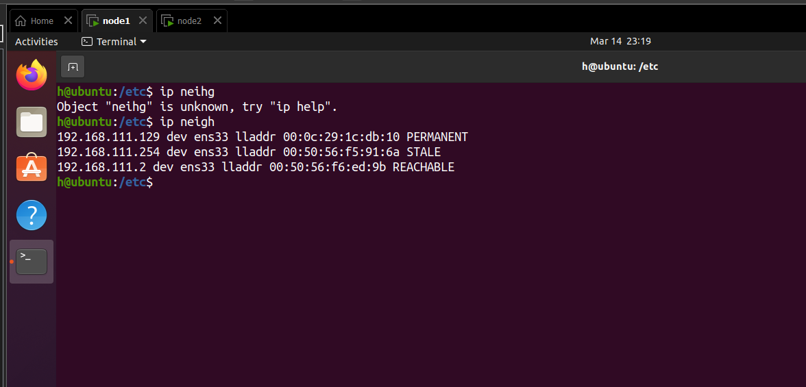

# NETWORK DEVICES 

# MỤC LỤC

# 1. HUB
\- Hub trong mạng đóng một vai trò quan trọng trong việc truyền và phát sóng dữ liệu. Hub là một thiết bị phần cứng được sử dụng ở lớp vật lý để kết nối nhiều thiết bị trong mạng. Hub được sử dụng rộng rãi để kết nối mạng LAN. Một hub có nhiều cổng. Không giống như switch, hub không thể lọc dữ liệu, tức là nó không thể xác định đích đến của gói tin, vì vậy nó sẽ phát hoặc gửi tin nhắn đến từng cổng.

\- Có những loại hub phổ biến là active hub, passive hub và intelligent hub

\- Hub:
- Truyền half-duplex
- Hỗ trợ share băng thông và broadcast transmit (hay còn gọi là chỉ perform được frame flooding)
- Có thể phát hiện xung đột trong mạng và gửi tín hiệu gây nhiễu đến từng cổng
- Hub không hỗ trợ VLAN và STP
- Không thể lưu địa chỉ MAC và port

# 2.Switch
\-  Mỗi card mạng có một mã định danh duy nhất được gọi là **địa chỉ MAC**. Địa chỉ này được sử dụng trong mạng LAN để liên lạc giữa các thiết bị trên cùng một phân đoạn mạng. Các thiết bị muốn liên lạc cần biết địa chỉ MAC của nhau trước khi gửi gói tin.

\-  Switch cũng sử dụng địa chỉ MAC để đưa ra quyết định chuyển tiếp hoặc lọc chính xác. Khi một switch nhận được một khung, nó sẽ liên kết địa chỉ MAC của thiết bị gửi với cổng mà nó được nhận. Bảng lưu trữ các liên kết như vậy được gọi là **MAC table**. Bảng này được lưu trữ trong bộ nhớ dễ thay đổi, do đó các liên kết sẽ bị xóa sau khi khởi động lại switch.

\- Switch có 3 chức năng chính trong mạng LAN:
- **Address learning**: switch học địa chỉ MAC bằng cách đọc địa chỉ MAC trong các frame được gửi qua nó.
- **forward/filter decision**: quyết định gửi các frame dựa trên các điều kiện filter.
- **Loop avoidance**: sử dụng STP để giải quyết vấn đề loop trong network



\- Ví dụ 1 trường hợp giao tiếp cơ bản qua switch giữa 3 máy A, B và C:
- Giả sử máy chủ A muốn giao tiếp với máy chủ B lần đầu tiên. Máy A biết địa chỉ IP của máy B, nhưng vì đây là lần đầu tiên hai máy giao tiếp nên MAC không được biết. Máy chủ A sử dụng quy trình ARP để tìm ra địa chỉ MAC của máy chủ B. Switch chuyển tiếp yêu cầu ARP ra tất cả các cổng ngoại trừ cổng mà máy chủ A được kết nối. Máy B nhận được yêu cầu ARP và phản hồi bằng địa chỉ MAC của nó. Máy B cũng học địa chỉ MAC của máy A (vì máy A đã gửi địa chỉ MAC của nó trong yêu cầu ARP). Máy chủ C nhận được yêu cầu ARP nhưng không phản hồi vì địa chỉ IP được liệt kê trong yêu cầu không phải của chính nó.
- Như đã đề cập ở trên, switch sẽ tìm hiểu địa chỉ MAC nào được liên kết với cổng nào bằng cách kiểm tra địa chỉ MAC nguồn của mỗi khung nhận được. Vì máy B phản hồi bằng phản hồi ARP bao gồm địa chỉ MAC của nó nên switch biết địa chỉ MAC của máy chủ B và lưu địa chỉ đó vào bảng địa chỉ MAC của nó. Đối với máy chủ A, switch biết địa chỉ MAC của nó nhờ yêu cầu ARP kèm theo địa chỉ đó.
- Bây giờ, khi máy A gửi một gói đến máy B, switch sẽ tra cứu trong bảng địa chỉ MAC của nó và chỉ chuyển tiếp khung ra cổng Fa0/2 – cổng mà máy B được kết nối tới. Các máy chủ khác trên mạng sẽ không tham gia vào quá trình liên lạc

> Default thì MAC table có thể ghi nhớ MAC address trong vào 300ms (5p)

## a.Command manage ARP table on switch
\- Dưới đây là những command dùng để kiểm tra ARP table trong máy host, không phải trên switch
\- Có thể sử dụng `arp` command hoặc `ip neighbor show` để xem bảng MAC table đang được ghi nhớ trong máy. Thường thì người dùng sẽ sử dụng ip neigh để thay thế cho arp do ip neigh bắt nguồn từ iproute2 - một network tool hiện đại trong hệ thống linux hiện nay:
```
arp -a
```
```
ip neighbor show
```

\- Trong linux, neighbor cache hay còn được gọi là ARP cache. Để flush tất cả các entries đã được lưu vào arp cache, dùng ip neigh để clear:
```
ip neighbor flush all
```

\- Có các state sau đây của một entry xuất hiện khi có thiết bị kết nối tới:
- **Incomplete**: system đã gửi ra gói ARP, nhưng không nhận được phản hồi
- **Resolved**: chỉ rằng MAC address đi cùng với IP đã resolved và system được biết tới
- **Permanent**: tức entry được đưa vào arp table thủ công và không bị ảnh hưởng bởi aging, timeout của arp ảnh hưởng
- **Stale**: entry đã bị outdate và không còn được xác thực, stale state xuất hiện khi kết nối bị ngắt 
- **Reachable**: đang kết nối

\- Khi ping giữa 2 máy, state Reachable và ngắt kết nối state chuyển sang timeout. Sau một thời gian (arp aging), entry hiển thị kết nối arp giữa 2 máy sẽ mất. Đây là entry tạm thời. Để thêm entry permanent (không bị arp aging gây ảnh hưởng), ta tạo file `ether` và thêm giá trị vào file để arp nhận biết entry vĩnh viễn:
- Tạo file ether:
```
sudo nano /etc/ether
```
- Thêm nội dung vào file như sau:
```
00:0c:29:1c:db:10 192.168.111.129
```
- Dùng `-f` để inform arp tiếp nhận static entry mới được thêm vào file
```
sudo arp -f /etc/ether
```

- Dùng ip neigh để kiểm tra:
```
ip neigh
```



- Muốn xóa entry thì:
```
sudo arp -d <ip_address>

```


# THAM KHẢO
- https://www.geeksforgeeks.org/what-is-network-hub-and-how-it-works/
- https://study-ccna.com/how-switches-work/
- https://manpages.ubuntu.com/manpages/focal/man8/ip-neighbour.8.html