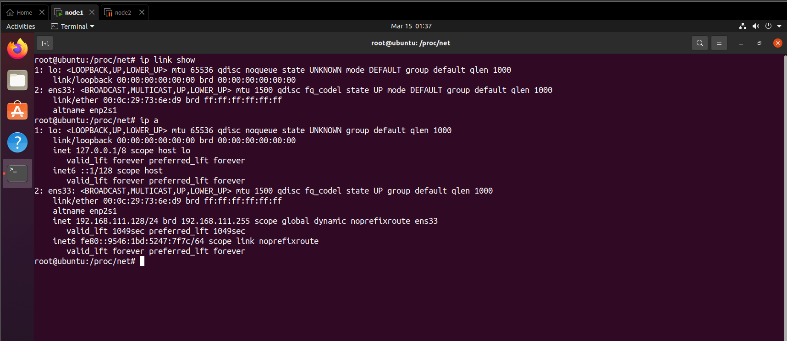

# TÌM HIỂU IPROUTE2 - CÔNG CỤ THAY THẾ NET TOOLS

# MỤC LỤC

# 1. Lịch sử của iproute2
\- Nhiều quản trị hệ thống vẫn quản lý và khắc phục sự cố các cấu hình mạng khác nhau bằng cách sử dụng kết hợp các công cụ dòng lệnh ifconfig, Route, arp và netstat, được gọi chung là công cụ mạng. Ban đầu được bắt nguồn từ bộ công cụ BSD TCP/IP, các công cụ mạng này được phát triển để định cấu hình chức năng mạng của các nhân Linux cũ hơn. Sự phát triển của nó trong cộng đồng Linux cho đến nay đã chấm dứt kể từ năm 2001. Một số bản phân phối Linux như Arch Linux và CentOS/RHEL 7 đã không còn dùng các công cụ mạng nữa và những công cụ khác đang có kế hoạch làm như vậy để ủng hộ iproute2.

# 2. Một số command với iproute2
## 2.1. Network interface command
\- Liệt kê các interface trong system:
```
ip link show
```



\- Up/down một network interface:
```
sudo ip link set down eth1

sudo ip link set up eth1
```

## 2.2. Cấu hình Ip hoặc mac address trên interface
\- Thêm ip trên một network interface:
```
sudo ip addr add 10.0.0.1/24 dev eth1
```

\- Xóa ip trên một Network Interface
```
sudo ip addr del 10.0.0.1/24 dev eth1
```

\- Show các ip address trên một network interface:
```
ip addr show dev eth1
```

\- Thay đổi MAC addres trên một Network Interface:
```
sudo ip link set dev eth1 address 08:00:27:75:2a:67
```

\- Show IP route:
```
ip route show
```

\- Add or modify default role:
```
sudo route add default gw 192.168.1.2 eth0

sudo route del default gw 192.168.1.1 eth0
```

\- Add or Remove a Static Route:
```
sudo ip route add 172.16.32.0/24 via 192.168.1.1 dev eth0

sudo ip route del 172.16.32.0/24
```

## 2.3. ARP command
\- Kích hoạt hoặc vô hiệu hóa ARP:
```
ip link set dev eth0 arp on

ip link set dev eth0 arp off
```


\- Xem arp table
```
ip neigh
```

\- Thêm hoặc xóa Static ARP Entry:
```
sudo ip neigh add 192.168.1.100 lladdr 00:0c:29:c0:5a:ef dev eth0

sudo ip neigh del 192.168.1.100 dev eth0
```

## 2.4. VLAN
\- Tạo hoặc xóa cổng VLAN:
```
ip link add eth0.10 link eth0 type vlan id 10

ip link del dev eth0.10
```

## 2.5. Thay đổi MTU
\- THay đổi gói tin tối đa:
```
ip link set dev eth0 mtu 1500
```

## 2.5. Chế độ promiscuous
\- Kích hoạt hoặc tắt chế độ promiscuous:
```
ip link set dev eth0 promisc on

ip link set dev eth0 promisc off
```

## 2.6. Chế độ multicast
\- Kích hoạt hoặc tắt chế độ multicast:
```
ip link set dev eth0 multicast on

ip link set dev eth0 multicast off
```

\- Thêm, xóa hoặc xem địa chỉ multicast:
```
ip maddr add 33:44:00:00:00:01 dev eth0

ip maddr del 33:44:00:00:00:01 dev eth0

ip maddr list dev eth0
```

## 2.7. Chế độ all-multicast
\- Kích hoạt hoặc tắt chế độ all-multicast:
```
ip link set dev eth0 allmulticast on

ip link set dev eth0 allmulticast off
```

## 2.8. Xem list kết nối
\- Xem các list socket kết nối:
```
ss -an
```

# THAM KHẢO
- https://www.xmodulo.com/linux-tcpip-networking-net-tools-iproute2.html

- https://blogd.net/linux/su-khac-biet-cua-bo-cong-cu-net-tools-va-iproute2-tren-linux/