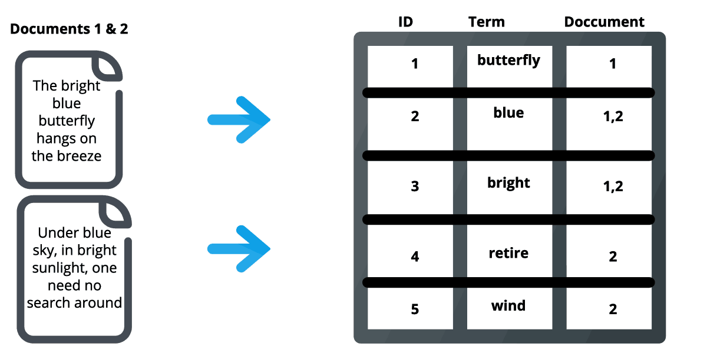
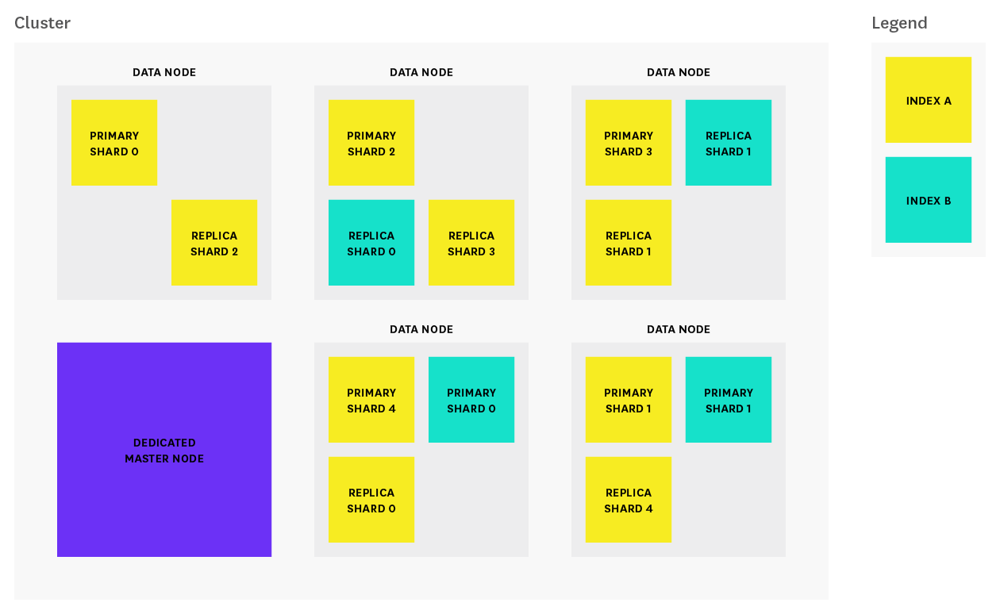

ELK phục vụ việc tăng tốc độ search trên hệ thống

# 1. ELK gồm
- ELK gồm `elastic search, kibana, beats và log stash`
  - Elastic search: store, search và analyze
  - Kibana: visualize và manage (như là một web interface cho elastic search)
  - Beats: data shipper, nhiệm vụ duy nhất là gửi dữ liệu đến log stash và elastic search
  - Log stash: collect, parse và transform log

# Architecture

- Trong một cluster có nhiều node (các elasticsearch node)
- Trong mỗi elasticsearch node có nhiều shard (có thể tập hợp các shard vào dưới 1 index)
- Mỗi shard chứa được các document (mỗi document chứa 1 JSON object trong đó)

> Cho phép mở rộng theo chiều ngang (tức các shard trong cùng 1 index có thể dàn trải ở các node khác nhau)

## Node - instance của elastic search
Node là một instance của Elasticsearch chạy trên một máy chủ. Một cụm Elasticsearch có thể bao gồm nhiều node, cho phép mở rộng hệ thống theo chiều ngang.
Mỗi node có thể chứa một hoặc nhiều index, là nơi lưu trữ dữ liệu.
## Cluster - cụm chứa các node elastic search
Cluster là một tập hợp các nodes Elasticsearch kết hợp lại với nhau. Nodes trong một cluster chia sẻ cùng một cấu hình và metadata(loại data cung cấp thông tin về 1 data - data about data).

Cluster giúp đảm bảo sự mở rộng ngang và tính sẵn sàng cao. Dữ liệu được phân tán trên nhiều node trong cụm.
## Index - tập hợp các doc của dữ liệu cùng kiểu
Index là một tập hợp các documents có cùng kiểu dữ liệu. Mỗi document đại diện cho một bản ghi trong index và được lưu trữ dưới dạng JSON.
Index được sắp xếp thành shards, là các phần nhỏ của index mà mỗi node có thể lưu trữ.
## Shard - thành phần trong index
Shard là một phần nhỏ của một index. Mỗi shard có thể được lưu trữ trên một node khác nhau trong cụm.
Sharding giúp phân chia và phân phối dữ liệu, nâng cao khả năng mở rộng ngang.
## Replica - bản sao của shard và Primary - bản chính của shard
Replica là bản sao của một shard. Elasticsearch cho phép bạn có các bản sao (replicas) của các shard để tăng tính sẵn sàng và đảm bảo không mất dữ liệu khi một node hoặc shard gặp sự cố.
Replication cũng giúp cải thiện hiệu suất truy cập đọc dữ liệu, vì các replica có thể phục vụ các truy vấn đọc.
## Document - bản ghi trong index
Document là một bản ghi dữ liệu trong một index. Mỗi document là một đối tượng JSON và được lưu trữ trong một index cụ thể và một kiểu cụ thể.
Document có thể chứa nhiều trường với các giá trị khác nhau, giống như các cột trong cơ sở dữ liệu SQL.
## Query DSL (Domain Specific Language):
Query DSL là ngôn ngữ được sử dụng để xây dựng các truy vấn tìm kiếm và phân tích dữ liệu trong Elasticsearch. Nó cung cấp cú pháp dễ đọc và linh hoạt để tạo ra các truy vấn phức tạp.
## RESTful API và Client Libraries:
Elasticsearch cung cấp một RESTful API, cho phép giao tiếp với hệ thống thông qua HTTP.

Có nhiều thư viện client cho nhiều ngôn ngữ lập trình khác nhau, giúp dễ dàng tích hợp Elasticsearch vào ứng dụng của bạn.

Elasticsearch có một kiến trúc phân tán, linh hoạt, và có khả năng mở rộng, làm cho nó trở thành một giải pháp phổ biến trong các hệ thống tìm kiếm và phân tích dữ liệu lớn.

# in conclusion:

> 1. JSON trong document trong shard, `Trong document là các object JSON`

> 2. Index chứa các dữ liệu cùng 1 kiểu dữ liệu, các `shard có nhiệm vụ là lưu trữ các document đó`

> 3. `cấu thành shard` (bản chất là lucene index) `thực chất là các segment trong lucene index`, `mỗi segment là inverted index` - có thể hiểu inverted index là một kiểu hashmap-like đối với cấu trúc dữ liệu, chia nhỏ dữ liệu trong các document, tập hợp các term có chung đặc điểm, cho biết các term có thể nằm trong những document nào. (đọc thêm về inverted index ở https://www.geeksforgeeks.org/inverted-index/)

> 4. `một node chứa được nhiều các shard của các index khác nhau`, node là một server elastic search, `tập hợp các node thì thành 1 cluster`.

> 5. `sẽ có 3 node khác nhau có thể tồn tại trên cluster `: MASTER DATA và CLIENT, trong đó `node data` là thành phần core của elastic search
  - MASTER job: phân bổ các shard, quản lý index và quản lý chung trên cluster
  - DATA job: index document, search và thống kê
  - CLIENT job: hoạt động như load balancer, định tuyến các truy vấn

# lưu trữ và tìm kiếm trong elastic search
# Lưu trữ dữ liệu và tìm kiếm
## Mô hình lưu trữ
Elasticsearch sử dụng Lucene của Apache - một thử viên full text search viết bằng Java. Về bản chất, nó sử dụng một cấu trúc dữ liệu gọi là inverted index (chỉ mục đảo ngược) để có thể thực hiện tìm kiếm với hiệu suất cao.

Document chính đơn vị cơ sở để quản lỹ dữ liệu trong Elasticsearch và inverted index được tạo ra bằng việc tokenize (thuật ngữ trong Elasticsearch) các khái niệm trong document. Bằng việc sử dụng kỹ thuật inverted index, một bảng chỉ mục các khái niệm và danh sách document liên quan đến khái niệm đó sẽ được tạo ra.

Nó khá tương đồng với chỉ mục của một cuốn sách, nơi hiển thị một danh sách các khái niệm được sử dụng cùng với số trang mà nó xuất hiện. Trong Elasticsearch, khi nói rằng một document được index, thì chúng ta hiểu rằng, inverted index của document đó đã được tạo ra.

Ví dụ, khi chúng ta cần tìm từ khoá "Việt Nam", Elasticsearch sẽ thực hiện tìm kiếm trên inverted index (rất nhanh do các từ được sắp xếp), tìm được từ khoá "Việt Nam", sau đó trả về ID của các document tương ứng. Để có thể tìm kiếm nâng cao hơn (ví dụ, tìm với từ khoá "Viet Nam"), thì quá trình phân tích và index document là rất quan trọng.

Ngoài ra, quá trình tìm kiếm thực tế còn phức tạp hơn nữa, khi mà Elasticsearch còn phải đánh giá mức độ tương qua giữa những từ trong index với từ khoá cần tìm.
