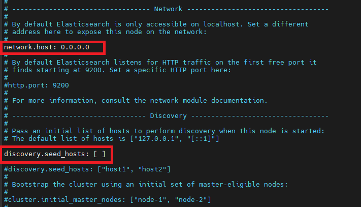

# CÀI ĐẶT TRÊN CLUSTER dưới dạng service trên các host VM
- OpenJDK installed

## 1. Cài đặt ELK trên các host

> Làm lần lượt các bước theo các thao tác dưới đây trên từng node - trong hướng dẫn này sẽ thực hiện trên 3 node

https://www.fosstechnix.com/how-to-install-elastic-stack-on-ubuntu-22-04/ - Hướng dẫn cài đặt ELK

```
wget -qO - https://artifacts.elastic.co/GPG-KEY-elasticsearch | sudo gpg --dearmor -o /usr/share/keyrings/elasticsearch-keyring.gpg

sudo apt-get install apt-transport-https

echo "deb [signed-by=/usr/share/keyrings/elasticsearch-keyring.gpg] https://artifacts.elastic.co/packages/8.x/apt stable main" | sudo tee /etc/apt/sources.list.d/elastic-8.x.list

sudo apt-get update && sudo apt-get install elasticsearch

```
- Cài đặt OpenJDK cho elasticsearch

```
sudo apt install openjdk-11-jdk
```
- Cài đặt môi trường JAVA_HOME cho biến
```
sudo nano /etc/environment
```
và xóa và copy paste `JAVA_HOME="/usr/lib/jvm/java-11-openjdk-amd64"`
- Load môi trường cho biến 
```
source /etc/environment
```
- verify biến JAVA_HOME
```
echo $JAVA_HOME
```

- Chạy elasticsearch với systemd
```
sudo /bin/systemctl daemon-reload
sudo /bin/systemctl enable elasticsearch.service
sudo systemctl start elasticsearch.service
```
## 2. Config elasticsearch - nếu chỉ có 1 node
```
sudo nano /etc/elasticsearch/elasticsearch.yml
```
- Trong đó:
  - Tìm mục network và mod: `network.host: 0.0.0.0`
  - thêm dòng `discovery.seed_hosts: [ ]` vào dưới mục discovery
  - Tìm dòng `xpack.security.enabled: true` và thay `true`-> `false`
- Sau đó restart elasticsearch

```
sudo systemctl restart elasticsearch
```


## 3. Config trên các nodes trong cluster

https://www.thegeekstuff.com/2019/05/install-elasticsearch-cluster/ - Hướng dẫn cài đặt và config trên các nodes trong cluster

# Cài đặt elasticsearch trên docker (single node)
1. tạo file docker compose với thông tin config như sau:
```
version: '3.7'
services:
  elasticsearch1:
    image: docker.elastic.co/elasticsearch/elasticsearch:7.11.1
    container_name: elasticsearch1
    environment:
      - xpack.security.enabled=false
      - node.name=elk-node1
      - cluster.name=elk-docker-cluster
      - discovery.type=single-node
    volumes:
      - elasticsearch-data-volume:/usr/share/elasticsearch/data
    ports:
      - 9200:9200
      - 9300:9300
    networks:
      - elastic
  kibana:
    container_name: kibana
    image: docker.elastic.co/kibana/kibana:7.4.0
    restart: unless-stopped
    environment:
      - ELASTICSEARCH_HOSTS=http://elasticsearch1:9200
      - cluster.name=elk-docker-cluster
      - node.name=kibana-node1
    ports:
      - 5601:5601
    networks:
      - elastic
    depends_on:
      - elasticsearch1
volumes:
  elasticsearch-data-volume:
    driver: local
networks:
  elastic:
    driver: bridge
```

2. chạy `sudo docker compose -f elastic-search-kibana-docker-compose.yaml up` để run docker compose

# Cài đặt elasticsearch và kibana trên docker (3 nodes elasticsearch)
1. tạo file docker compose với thông tin config như sau:
```
version: '3.7'
services:
  es01:
    image: docker.elastic.co/elasticsearch/elasticsearch:7.11.1
    ports:
      - 9200:9200
      - 9300:9300
    environment:
      node.name: es01
      discovery.seed_hosts: es01,es02,es03
      cluster.initial_master_nodes: es01,es02,es03
      cluster.name: mycluster
      bootstrap.memory_lock: "true"
      ES_JAVA_OPTS: -Xms256m -Xmx256m
    volumes:
      - es-data-es01:/usr/share/elasticsearch/data
    ulimits:
      memlock:
        soft: -1
        hard: -1
    healthcheck:
      test: ["CMD-SHELL", "curl http://localhost:9200"]
      interval: 10s
      timeout: 10s
      retries: 120
  es02:
    image: docker.elastic.co/elasticsearch/elasticsearch:7.11.1
    ports:
      - 9201:9200
      - 9301:9300
    environment:
      node.name: es02
      discovery.seed_hosts: es01,es02,es03
      cluster.initial_master_nodes: es01,es02,es03
      cluster.name: mycluster
      bootstrap.memory_lock: "true"
      ES_JAVA_OPTS: -Xms256m -Xmx256m
    volumes:
      - es-data-es02:/usr/share/elasticsearch/data
    ulimits:
      memlock:
        soft: -1
        hard: -1
    healthcheck:
      test: ["CMD-SHELL", "curl http://localhost:9200"]
      interval: 10s
      timeout: 10s
      retries: 120
  es03:
    image: docker.elastic.co/elasticsearch/elasticsearch:7.11.1
    ports:
      - 9202:9200
      - 9303:9300
    environment:
      node.name: es03
      discovery.seed_hosts: es01,es02,es03
      cluster.initial_master_nodes: es01,es02,es03
      cluster.name: mycluster
      bootstrap.memory_lock: "true"
      ES_JAVA_OPTS: -Xms256m -Xmx256m
    volumes:
      - es-data-es03:/usr/share/elasticsearch/data
    ulimits:
      memlock:
        soft: -1
        hard: -1
    healthcheck:
      test: ["CMD-SHELL", "curl http://localhost:9200"]
      interval: 10s
      timeout: 10s
      retries: 120
  kibana:
    image: docker.elastic.co/kibana/kibana:7.11.1
    container_name: kibana1
    depends_on:
      es01:
        condition: service_healthy
      es02:
        condition: service_healthy
      es03:
        condition: service_healthy
    ports:
      - 5601:5601
    environment:
      - ELASTICSEARCH_HOSTS=["http://es01:9200","http://es02:9200","http://es03:9200"]
```

# Cài đặt elasticsearch, kibana, filebeat và logstash trên docker (3 nodes elasticsearch)
- các thông tin 3 nodes elasticsearch và kibana giữ nguyên như trên
### Lưu ý khi thêm config filebeat vào docker compose
