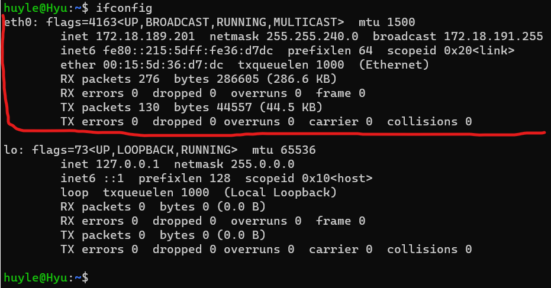

# Network là gì?

[What is network](https://www.ionos.com/digitalguide/server/know-how/what-is-a-network/)

[Types of network](https://www.javatpoint.com/types-of-computer-network)

- Được định nghĩa là sự kết nối của ít 2 máy tính, kết nối với nhau bằng các phương thức vật lý khác nhau, từ đó chia sẻ tài nguyên của các máy tính cho nhau, network có thể nói đến các thiết lập nhỏ giữa các thiết bị cục bộ trong mạng cục bộ (local) hoặc như các mạng lớn toàn cầu như internet

> LAN - mạng cục bộ 

- Mạng trong một khu vực nhỏ
- Các máy tính cá nhân được kết nối với nhau thông qua cáp (wired lan) hoặc wifi (wireless lan)
- Ít tốn kém, tốc độ cao và bảo mật cao hơn

> PAN - Mạng cá nhân

- Nói đến sự kết nối giữa máy tính cá nhân và các thiết bị cá nhân cá nhân khác (điện thoại di động, máy in, etc) trong khu vực nhỏ 10 mét trở xuống
- Cũng có 2 loại kết nối gồm wire PAN (cổng USB) và wireless PAN (wifi, bluetooth)

> MAN - mạng lưới đô thị

- Các mạng LAN nhỏ kết nối sẽ tạo thành MAN - một mạng lưới bao khu vực rộng hơn (được sử dụng trong doanh nghiệp)

> WAN - mạng lưới diện rộng

- WAN là mạng trải rộng trên địa lý rộng lớn hơn như giữa các thành phố, giữa các quốc gia
- Các phương thức kết nối WAN đa dạng qua đường dây điện thoại, cáp quang hoặc vệ tinh
- Internet là một trong những mạng WAN

# Network config là gì?

[What is network configuration?](https://www.vmware.com/topics/glossary/content/network-configuration.html#:~:text=The%20right%20network%20configuration%20is,security%20and%20improve%20network%20stability.)

- Cấu hình mạng là điều chỉnh thông số network cần thiết, cài đặt, điều khiển mạng để hỗ trợ lưu lượng truy cập qua mạng, tăng cường bảo mật và cải thiện độ ổn định của mạng.
- Cấu hình mạng cũng có thể được quản lý tự động thông qua trình quản lý mạng qua những việc như: duy trì network, thay đổi cấu hình, khởi chạy device, theo dõi và báo cáo số liệu

# Linux Network Configuration

## Sử dụng để cấu hình mạng ifconfig (interface configuration)

> Sử dụng ifconfig để hiện các thông tin của các network interface (network interface) trong kernel (cũng được dùng để kiểm tra địa chỉ của máy chủ)

- Giải thích dòng eth0:

| Title | expression |
| :---:         |     :---      |
| eth0   | là tên của giao diện mạng ethernet (eth0 ở đây là NIC - network interface card chứa địa chỉ MAC)   |
| flags=4163<UP,BROADCAST,RUNNING,MULTICAST>    | các flags của giao diện mạng, header tiêu chuẩn của các thiết bị mạng |
| mtu   |   max transsited unit - đơn vị dât |
| inet   |    |
| netmask   |    |
| broadcast   |    |
| inet6   |    |
| prefixlen   |    |
| scopeid   |    |
| ether   |    |
| txqueuelen   |    |
| RX packets   |    |
| RX errors, dropped, overruns, frame   |    |
| TX packets, byte   |    |
| TX errors, dropped, overruns, carrier, collision   |    |

