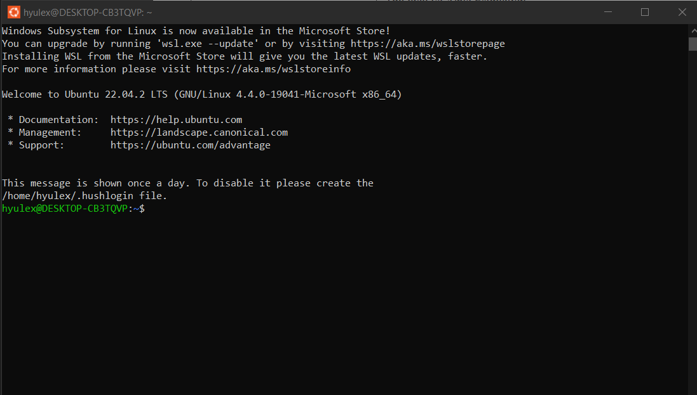

# Terminal

- Terminal có thể là một thiết bị hoặc một chương trình giúp người dùng thực thi các lệnh trên máy tính (input, output environment)
  Trong Ubuntu, terminal có thể được mở dễ dàng trong start, loại language default để tương tác với HĐH Ubuntu là bash.

# Console

- Console có thể được coi là một loại terminal, chỉ có thể giao tiếp với hệ thống máy tính được đính vào (keyboard, monitor, etc)

# SSH Protocol

- SHH là secure shell
- Nó bao gồm cả giao thức mạng và bộ tiện ích cơ bản
- Thường dùng để thực thi các remote command line
