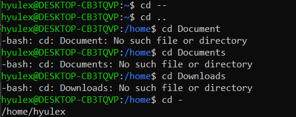
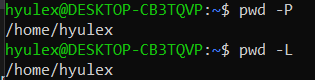
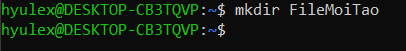
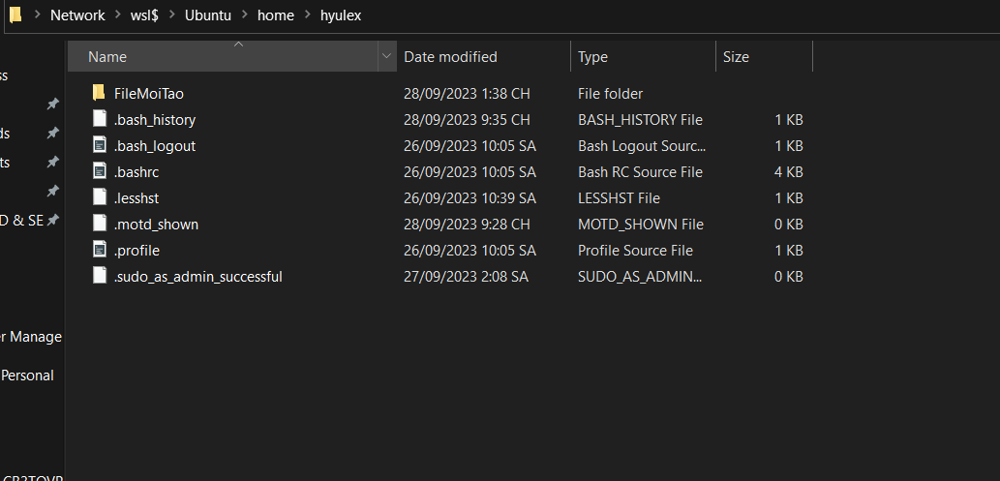
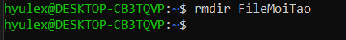
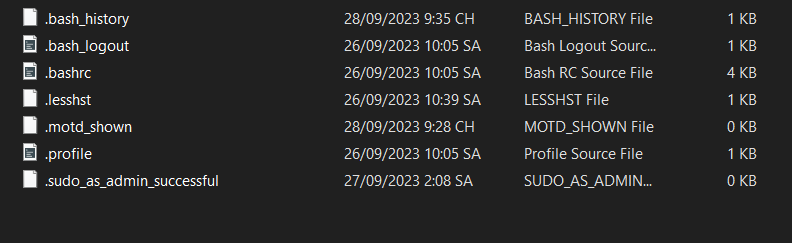
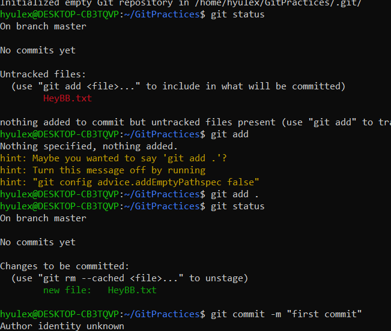

# Cấu trúc cây thư mục

- /: là root, root có quyền tác động vào thư mục này
- /bin: bao gồm các tệp thực thi của người dùng (user)
- /sbin: chứa các tệp nhị phân hệ thống, dùng để quản trị hệ thống
- /etc: chứa các tệp cấu hình hệ thống local cho máy chủ
- /dev: chứa tệp quản lý các thiết bị ngoại vi
- /proc: lưu các tiến trình đang chạy
- /var: các file biến hệ thống ex: mysql, log, other DB files
- /tmp:các tệp tạm thời của hệ thống và các app khác
- /usr: chứa các tệp chỉ đọc và có thể chia sẻ, các thư viện và tệp nhị phân thực thi
- /home: chứa các user file
- /boot: chứa kernel và các tệp cần thiết để khỏi đông linux
- /lib: gồm các thư viên đã được share cần thiết để khỏi động hệ thống
- /opt: các file của các nhà cung cấp từ các phần mềm, chương trình được cài vào máy
- /mnt: tạm thời chứa các file system khi các quản trị viên sửa hoặc làm việc các file hệ thống
- /media: các hardware như ROM, RAM hay phân vùng đĩa cứng
- /srv: data từ dịch vụ máy chủ, liên quan đến CVS

# Command line

## cd

- Gõ cd để quay về thư mục gốc /home (đây là directory default)

## pwd

- cho user thấy directory path hiện tại

## mkdir

- tạo directory mới (tạo folder mới)

## rm

- để remove file tệp, folder (với default rm không thể xóa được directory)

## rmdir

- để remove directory trống

## push (chưa làm được)

- Đẩy tệp git local lên git remote

## tree

- Hiển thị cây thư mục dưới dạng liệt kê đầu dòng có phân cấp

## mv (chưa làm được)

- Để di chuyển tệp, thư mục qua các thư mục khác
