# Các câu lệnh #2

---

## Cat

- Dùng để đọc nội dung file, có thể hiển thị thêm số dòng kèm theo nếu gõ thêm option -n

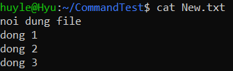

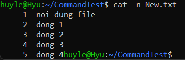

- Viết đè nội dung file (edit nội dung mới file, nội dung cũ bị xóa)

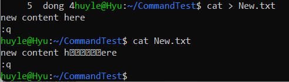

- Nén file hoặc kết hợp nội dung file

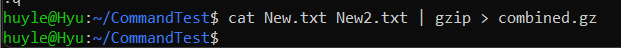

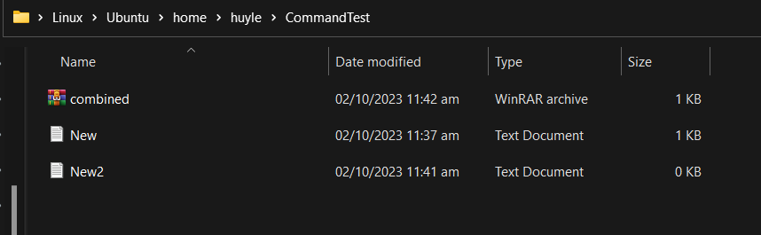

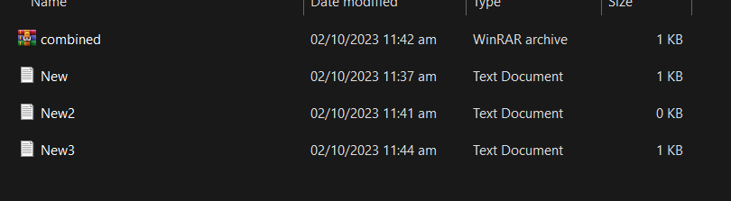

## Head

- In ra các dòng đầu tiền trong file (default là 10 dòng), có thể điều chỉnh số dòng bằng cách thêm option -n như sau:

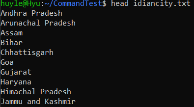

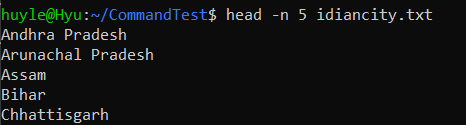

- option -c đi kèm để hiển thị nội dung tính từ ký tự đầu tiên tương ứng với số byte đã nhập vào (ở đây là 10 bytes)

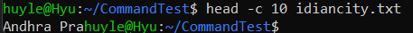

- option -q để hiển thị số dòng đầu tiên của nhiều file cùng lúc mà không chứa tên file trên cùng, nội dung các file xếp lần lượt dựa vào thứ tự các file được liệt kê:

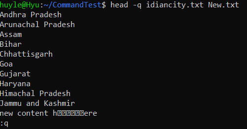

- option -v sẽ hiển thị file cùng các dòng đầu tiên của nó, đồng thời hiển thị tên file trên cùng

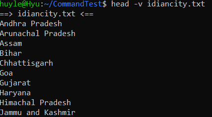

## Tail

- In các dòng từ cuối file trở lên (default là 10 dòng), có thể điều chỉnh các dòng bằng cách thêm option -n:

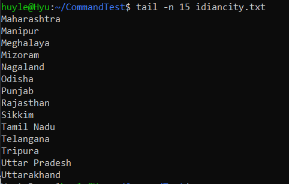

- option -c đi kèm để hiển thị nội dung file tính từ ký tự cuối cùng tương ứng với số byte đã nhập vào (ở đây là 10 bytes)

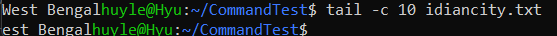

- option -q để hiển thị số dòng cuối cùng của nhiều file cùng lúc mà không chứa tên file trên cùng, nội dung các file xếp lần lượt dựa vào thứ tự các file được liệt kê:

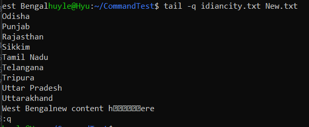

- option -f thường được dùng để quan sát các log file và sẽ được update liên tục vào cuối nội dung file khi có dòng mới thêm vào (gõ ctrl+C để thoát trạng thái đọc file):

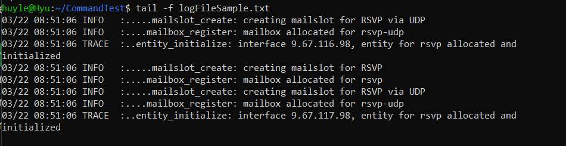

- option -v sẽ hiển thị file cùng các dòng cuối cùng của nó, đồng thời hiển thị tên file trên cùng

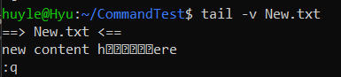

## Vim

- Là một chương trình soạn thảo (text editor), thường được dùng để chỉnh sửa file, code, giúp các thao tác trong command line nhanh hơn (trợ giúp chỉnh sửa nhanh chóng thuận tiện)

## Nano
- Cũng giống như vim, nano là một text editor

## Rm
- Được dùng để xóa file mà không thông báo

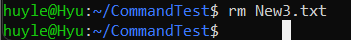
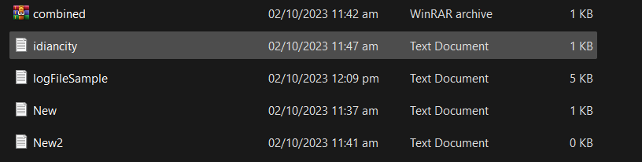

- Nếu gặp protected file, có thể sử dụng option -f để xóa file không thông báo
- Được dùng để xóa nhiều file

- Xóa thư mục với option -d (tùy chọn này có tác dụng với thư mục trống), option -r sẽ giúp user xóa thư mục vó chứa file
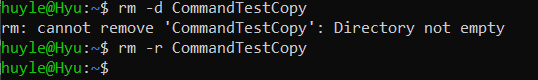

## Grep
- Được dùng để tìm một chuỗi trong một file
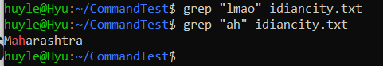

- Được dùng để tìm chuối trong nhiều file (các file cùng một format tên) - Ví dụ: grep *.txt là tìm nội dung tất cả các file txt với chuỗi cần tìm

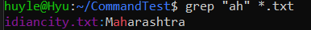

- Được dùng để tìm kiếm không phân biệt hoa thường, dùng option -i
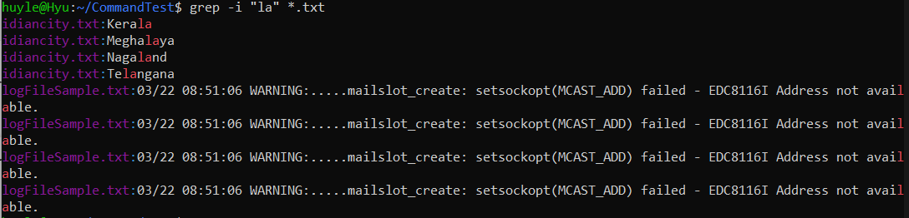

- Được dùng để tìm kiếm regex trong file
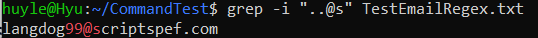

- Có thể hiển thị thêm số dòng trước (A), sau (B), hoặc xung quanh (C), hoặc xung quanh với số dòng chỉ định (n)
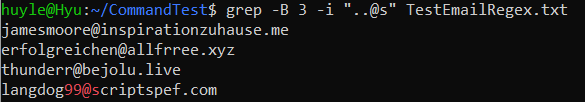

- option -r sẽ giúp tìm tận cùng các file trong các thư mục con
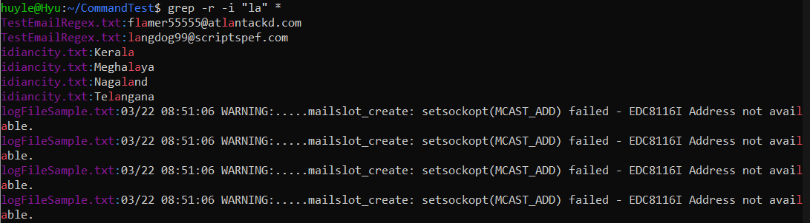

- Được dùng để tìm kiếm file không chứa từ khóa được điền
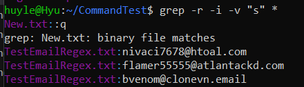

- Với từ khóa và chỉ muốn hiển thị từ khóa đó trong file nào, sử dụng option -l
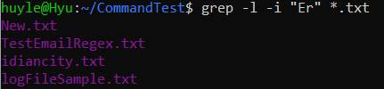

