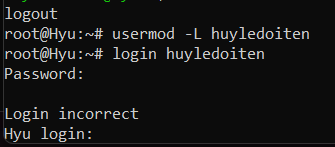

# User, group user in Ubuntu
---
## User
https://www.freecodecamp.org/news/how-to-manage-users-in-linux/#:~:text=A%20user%20in%20Linux%20is,these%20unique%20properties%20listed%20above.

https://www.baeldung.com/linux/primary-vs-secondary-groups#:~:text=There%20are%20two%20types%20of,the%20two%20types%20of%20groups.

- User chỉ người dùng, cá nhân tương tác với hệ điều hành, đóng vai trò trong bảo mật các quyền truy cập, phân bổ tài nguyên và quản trị hệ thống. Một user trong linux liên kết với một account dùng đăng nhập vào hdh linux
- Có 2 loại user: system user (user này được tạo trong quá trình cài đặt hdh) và regular user
  - Super User (root): Đặc quyền cao nhất trên hệ thống, chỉnh sửa các ứng dụng, service và các task full control. không thể bị xóa, chỉ có thể disable
  - System user: được dùng để chạy các services hoặc các phần mềm ứng dụng (có UID nằn trngo khoảng 1-999)
  - Regular user: có thể được tạo ra bảo user quản trị, có quyền truy cập nhất định vào một số file dựa trên quyền được thiết lập sẵn (UID default từ 1000-trở đi)
---
## Group
- Trong linux, Group là một nhóm người dùng. Admin sẽ sử dụng group để phân các user cũng như quyền để access vào các file và các resource khác.
- Group có 2 loại group: primary group và secondary group
  - Primary group: nhóm này sẽ được tạo cùng tên group khi mới khởi tạo tạo hoặc folder
  - Second group: nhóm sẽ bao gần các user được thêm sau đó 1 cách thủ công

## Useradd và các lệnh quản lý user liên quan

## Lệnh với user
- Useradd được dùng để thêm user mới, dùng sudo đi kèm để được cấp quyền kèm tạo user mới - thường thì đây được gọi là low level ultity khi thêm user mới do useradd không hỗ trợ tạo home directory, nếu có thì cần thêm  option -m để tạo thêm home directory đi kèm với user đó

- Các normal user sẽ được tự động gán UID > 1000, trong khi đó các unique user có UID < 1000

_Các user ID gán cho từng user_

- Adduser cũng được dùng để thêm user mới - với high level ultity kèm thêm thêm các thông tin cơ bản và đồng thời hỗ trợ tạo home directory.

- Sau khi tạo user, để chuyển user trong wsl terminal cần option -l <user name> vào shell

## Các lệnh liên quan đến quản lý group và user
- Groupadd dùng để thêm group mới để quản lý các user (Tương tự như các UID, các GID cũng được tự động đánh ID cho normal user và unique user)

- Để check xem user thuộc group nào, sử dụng groups <user name> (Nếu user chưa được gán vào group nào thì user đó nằm trong group có chứa tên user đó)

_Riêng user huyle nằm trong rất nhiều group được chia bởi space_

- gpasswd cũng được dùng để thên các user vào group có sẵn tương tự như usermod, và gpasswd cũng có thể remove user khỏi group khi có option -d được thêm vào.

- Với gpasswd <group_name>, hệ thống yêu cầu nhập mật khẩu mới cho group

## Passwd
- Passwd được dùng để thêm mật khẩu cho user đã được tạo (có thể là tạo từ useradd)

- Với quyền của root, admin có thể thay đổi password của bất kỳ user nào mà không cần biết mật khẩu user đó là gì
- Đối với group, user có thể cài mật khẩu cho group bằng gpasswd để thay đổi các thông tin quản trị nhóm, trong đó có cả group password. Group password được chia với tất cả mọi người trong nhóm, mục đích để phục vụ cho bảo mật nâng cao.

https://pimylifeup.com/gpasswd-command-on-linux/

## Usermod
- Usermod được dùng để modify các thông tin đăng nhập của user. Root mới được execute usermod command. Các user khác không có quyền sử dụng usermod trừ khi sử dụng sudo để execute command với quyền cao hơn (Có thể truy cập vào root bằng command prompt hoặc kết nối ubuntu server bằng SSH trong window khi sử dụng WSL, đối với local thì không được phép truy cập root)

- Có thể được dùng để thêm user vào group có sẵn:

- Có thể thêm một user vào nhiều group bằng cách

- Sử dụng option -l để đổi tên user

- Sử dụng option -L để lock user và sử dụng -U để unlock user

## Userdel
- Userdel được dùng để xóa user, nhưng directory của user đó vẫn còn tồn tại, dùng -r để xóa user cùng với directory đi kèm:

