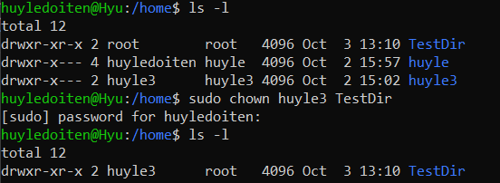

# Quyền và các command chmod, chown, setuid, getuid, umask
---
- Trước khi đi sâu vào các command tương tác với tệp và quyền, sử dụng -ls -l để long list các tệp cũng như nhìn thấy các quyền để sử dụng đúng các command:

- r for read, w for write, o for other, a for all

  - dr là directory (ám chỉ ubuntu-desktop-installer là thư mục)

## Chmod
- Chmod được dùng để quản lý quyền truy cập tệp
- Sử dụng 
chmod <u for user, g for group, o for other, a for all user> (+ cho thêm quyền, - ngược lại) <file name> 
như dưới đây để thêm quyền hoặc bớt quyền

- Có thể sử dụng = để cho đối tượng ở 2 vế chia sẻ quyền như nhau (ở đây group và user đều có quyền tác động vào file ngang bằng nhau)

- Để thêm được quyền cùng lúc nhiều đối tượng, sử dụng dấu phẩy giữa mỗi đối tượng

 ## chown
- Chủ yếu chown được dùng để thay đổi quyền sở hữu từ user này sang user khác (có tác dụng đối với cả group)

_Giờ user huyle2 (mới) có thể sử dụng được cả quyền write như user huyledoiten (cũ)_

- Có thể áp dụng tương tự như user đối với group'

- Trong trường hợp muốn thay đổi cả group và user cùng lúc:

- Đối với thư mục, thay <file name> -> <directory name> (các trường hợp thay đổi group hoặc thay đổi đồng thời user và group cùng lúc tương tự như thao tác với file)

## Setuid và setgid
- Setuid và Setgid được coi là quyền đặc biệt ngoài các quyền như rwx.
- Setuid  cung cấp quyền đặc biệt cho owned user, file và dir của user luôn được thực thi dưới quyền của chủ sở hữu

  - 

  _rwxr ở phần đầu cho biết các quyền của root, không có setuid_

  -

  _rwsr cũng cho biết các quyền của root, không thay x bằng s cho thấy đã setuid_
> Vậy nếu file đã được setuid, các user khác có thể execute file với tư cách như là root

- Setgid tương tự như setuid, nhưng là đối với group, group là chủ sở hữu, tất cả các member của group sở hữu đó có quyền truy cập tất cả các file trong đó

## umask
- Linux sử dụng octal bit để xác định quyền của user và các group tương tác với file hoặc dir
  - 0: không quyền
  - 4: quyền read
  - 2: quyền write
  - 1: quyền execute
  > Ví dụ, khi tạo mới 1 file, 1 dãy như -rw-r--r-- = 644 sẽ được sinh ra (quyền read và write với onwed user, quyền read với group, quyền read với other)
  > Tương tự, khi tạo mới 1 dir, dãy drwxr-xr-x = 751 sinh ra (full quyền cho chủ sở hữu, read và exectute với group và read đối với other)

- Umask được dùng để set default quyền các file hoặc dir do người dùng tạo ra. Umask default được tính theo công thức:

"Default permission = pre-defined initial permission – umask permission"
  - Giá trị pre-defined đối với file là 666
  - Giá trị pre-defined đối với dir là 777

- Như vậy đối với umask default là 0022, có nghĩa là quyền 644 được áp dụng với file được user tạo ra sắp tới

- Để sửa umask default:

_Với umask 222, umask default sẽ là 444. octal bit sẽ là quyền chỉ read với tất cả các loại user_
_unmask 333 cũng sẽ đặt quyền chỉ read với tất cả các loại user, nhưng lần này với bit (0,1) theo công thức tính sau

-Cùng một umask, khi tạo dir mới pre-defined sẽ là 777 - umask

