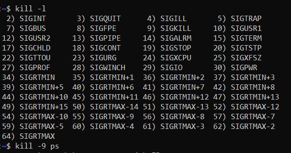

# Process và một số command
---
> Process là gì?

- Process là phiên bản của chương trình đó đang hoạt động. Bất cứ khi nào khởi động một chương trình, một process sẽ bắt đầu hoạt động

> Parent process, child process là gì?

- Những initial process là các parent process (tiến trình cha) và các tiến trình khác sinh ra từ tiến trình gốc là child process (tiến trình con)
- Các tiến trình con có thể sinh ra các tiến trình con nữa, từ đó có thể sinh ra cây quá trình

> Có 2 cách để khởi chạy tiến trình

- Foreground process: là tiến trình chạy trực tiếp trên màn hình (foreground) mà sử dụng GUI mode, CUI mode. Tiến trình bị sử dụng bởi người dùng, đợi input của người dùng trước khi đưa ra output trên màn hình
- Background process: là tiến trình đang chạy và không hiển thị trực tiếp trên màn hình, không cần tới sự can thiệp của người dùng. Thông thường, các process trong background là các tiến trình con. Trong linux, những process chạy ở background này thường được gọi là daemon

> Có 3 loại tiến trình 

- interactive process: là những quy trình được user quản lý bằng command line
- batch process: là hàng loạt các quy trình, hoặc có thể nói là nhóm các nhiệm vụ. Các tiến trình tự động theo lịch mà không cần tới sự can thiệp của người dùng
- Daemon: hàng loạt các process hoạt động background mà không cần sự kiểm soát của người dùng. Chúng chạy trong background để giám sát và đảm bảo các thành phần hệ thống trong hệ điều hành chạy bình thường

> Tìm hiểu kỹ hơn về daemon - background process in linux

[Daemon là gì?](https://cuongquach.com/daemon-trong-linux-la-gi.html)

[What is Daemon?](https://itsfoss.com/linux-daemons/)

- Daemon là hàng loạt các process hoạt động background mà không cần sự kiểm soát của người dùng. Chúng chạy trong background để giám sát và đảm bảo các thành phần hệ thống trong hệ điều hành chạy bình thường (daemon có thể được gọi là service trong OS Window)
- Các Daemons thường thấy: systemd, networkd, snapd (các daemons có d ở cuối tên)
  - systemd: daemon này thống nhất cấu hình và hành vi dịch vụ
  - rsyslogd: daemon này ghi lại thông báo trong hệ thống, đồng thời hỗ trợ các đăng nhập trên local và remote
  - udisksd: xử lý các hoạt động truy vấn, gắn, ngắt kết nối hoặc tháo các thiết bị lưu trữ trên hard disk hoặc USB
  - logind: daemon xử lý các hành động truy cập của user
  - httpd: quản lý dịch vụ HTTP, thường được chạy với phần mềm máy chủ web 
  - sshd: daemon này chịu trách nhiệm quản lý SSH và các kết nối thông qua SSH
  - ftpd: daemon này điều khiển FTP service, phục vụ truyền file qua những máy tính - trong đó một máy đóng vai là server và một máy là client
  - crond: daemon này phục vụ những hoạt động kiểm tra hệ thống và update hệ thống

## ps

https://ls-da3m0ns.medium.com/why-running-ps-command-without-options-on-shell-shows-only-two-entries-fbfec9fc9024

- Ps được dùng để hiển thị số tiến trình đang chạy (tĩnh), định vị tiến trình, hỗ trợ kill và nice quản lý process. Nếu user chỉ dùng ps không dùng tới các option, ps sẽ chỉ hiện các process liên quan đến terminal hiện tại:

- Một số thông số cơ bản trong ps như sau:
  - User: tên user đang sử dụng process đó
  - PID: process ID
  - %CPU: phần % CPU process đó sử dụng
  - TTY: thông tin terminal user đăng nhập (có thể khi kết nối từ xa bằng SSH thì thông số có thể là pts/0)
  - TIME: thời gian process chạy trên cpu (các time ghi 00:00:00 thì là các tiến trình parent và các process con sẽ có thời gian chạy dưới đó hoặc các process này đang không chạy)
  - CMD: tên câu lệnh thực hiện process đó
  - %MEM: phần % RAM process đó sử dụng
  - VSZ: virtual memory size hiển thị dung lượng bộ nhớ ảo theo KB mà process đó dùng
  - RSS: resident set size hiện lượng RAM phải sử dụng để chạy command đó cho đến khi ra output
  - STAT: trạng thái process, nhìn chung S là sleep (hiện tại không sử dụng cpu), R là run (hiện tại đang sử dụng cpu)
  - START: process bắt đầu vào thời gian nào
> Đây là những thông số chung trong câu lệnh ps
- Ps -aux có thể tạo bảng hiển thị các process dễ nhìn như top nhưng không có cập nhật các process đang chạy

- Ps -x hiện tất cả các tiến trình dưới quyền người dùng đang login sở hữu

- ps -A hiển thị tất cả các process trên hệ thống (thêm option -H để xem dưới dạng tree)

- ps -H hiện các thread

- ps -f hiện các process dưới dạng đầy đủ hơn

- Trên một port ID (PID) cụ thể, sử dụng ps -fp <PID>

- Trên một tên user cụ thể, sử dụng ps -U <user name> (tương tự với nhóm, sử dụng option -G để xem các process liên quan đến group)

- Có thể sử dụng thêm 1 số option cùng ps để hiện các cột như đi kèm như mong muốn: ở đây hiện tất cả các process, -o option để hiện các cột đi kèm được điền sau đó

## Top
- Top giống như ps, giúp user theo dõi các process đang hoạt động, bảng process được update từ 3-4s liên tục (bấm Ctrl+C để thoát khỏi top command). Các thông số tương tự như ps và đồng thời có chứa thêm một số thông tin như sau

  - top - 14:32:56 : Thời gian tại thời điểm dùng top command (14h32 pm)
  - up 1:21 : khoảng thời gian sử dụng hệ thống
  - 1 user : số lượng user sử dụng hệ thống
  - load average: thời gian upload trung bình
  - Tasks: tổng số task hiện tại đang tồn tại trong nền
  - running, sleeping, stop, zombie: số lượng task đang chạy, số lượng task đang trong trại thái ilde, số lượng task đã dừng hoạt động và zombies hiện các process đã dừng nhưng vẫn sót lại bit dư thừa do chương trình lỗi hoặc không hoạt động đúng mong muốn.
  - CPU %us: phần trăm process của user đang chiếm trong cpu
  - ___ %sy: phần trăm tiến trình của root sử dụng
  - ___ %ni: phần trăm các tiến trình có độ nice thấp do user sử dụng
  - ___ %id: phần trăm cpu đang idle
  - ___ %wa: phần trăm CPU đợi các tiến trình in out đang xử lý
  - ___ %hi: phần trăm cpu xử lý gián đoạn phần cứng
  - ___ %si: phần trăm cpu xử lý gián đoạn phần mềm
  - ___ %st: phần trăm máy ảo xử dụng
  - MiB Mem ___ total: tổng bộ nhớ hệ thống (KiB)
  - MiB Mem ___ used: tổng bộ nhớ đã sử dụng (KiB)
  - MiB Mem ___ free: tổng bộ nhớ còn trống (KiB)
  - MiB Mem ___ buff/cache: lượng dung lượng RAM hiện tại đang dùng cho chức disk caching (disk caching là chức năng thực hiện trong bộ nhớ đệm để tăng tốc các process trong hệ thống) [bài viết buffcache](https://vietnetwork.vn/linux/buffer-cache-la-gi-trong-he-dieu-hanh-linux/)
  - MiB Swap ___ total: tổng swap (bộ nhớ RAM ảo) có sẵn trong đơn vị
  - MiB Swap ___ free: tổng swap đang trống
  - MiB Swap ___ used: tổng swap đã được sử dụng
  - MiB Swap ___ avail Mem: lượng RAM khả dụng trước khi sử dụng swap
  - PID: process id
  - USER: user start process
  - PR: mức độ ưu tiên do kernel linux quyết định cho process
  - NI: mức độ ưu tiên để cho cpu thực hiện (-19 là ưu tiên cao nhất và 20 là ưu tiên thấp nhất)
  - VIRT: tổng mức sử dụng bộ nhớ của 1 process (include code + RAM + Swap)
  - RES: tổng lượng RAM process sử dụng
  - SHR: dung lượng bộ nhớ được chia sẻ với các process khác
  - S: status của process, S là sleep, R là run
  - %CPU: phần trăm process đó sử dụng
  - %MEM: phần trăm process sử dụng RAM
  - time: số thời gian process run

[Top command entries](https://www.transip.eu/knowledgebase/entry/1979-using-the-top-command-linux/)

- Để hiện rõ tên các process, dùng option -c

- Dùng -u <user name> để hiện các process của riêng một user

- Ngoài ra còn có thể dùng option -i để tránh hiện các idle process

- Sử dụng htop với giao diện dễ nhìn hơn, sử dụng kết hợp các phím F1,F2,F3.etc để quản lý trực tiếp trên bảng process

## Kill
- Dùng để tắt process, có 3 cách để kill process
- Có thể dùng các signal phù hợp để đi kèm với kill command, gõ kill -l để liệt kê các signal đi kèm để kill process

- Kill process theo tên command với killall <process name alike>

- Kill process theo process ID

## Nice
- Nice được dùng để nâng ưu tiên hoặc giảm ưu tiên cho process trước khi khởi động tiến trình(19 là mức ưu tiên thấp nhất, -20 là mức ưu tiên cao nhất, 0 nice là default)

- Dùng ps -l để thêm chỉ số NI (nice) vào sau các process, hoặc "ps -A -o user,pid,command,nice |grep..." để thêm các cột cụ thể vào kết quả lệnh ps

- Từ đó, user theo dõi được chỉ số nice các process và dùng nice -<-20 -> 19 value> <command name> để cộng/trừ số nice vào số gốc
(nếu muốn chỉ số -19 thì cú pháp là nice --19)

- Renice dùng để thiết lập ưu tiên tiến trình đó trong lúc chạy, tương tự như cú pháp nice, nhưng renice thay thế chỉ số nice thay vì cộng/trừ chỉ số.

