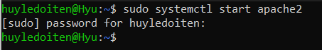

# systemctl và cấu trúc một tệp tin service
---

## Service là gì?
- Service (hay còn gọi là daemon) là tập lệnh (script) chạy trong nền. Service có đặc điểm là lắng nghe liên tục các request và gửi các phản hồi dựa trên request đó, service cũng có thể được sử dụng bởi một program khác

## systemctl
- systemctl là command được dùng để kiểm soát systemd và các service trong linux (systemd là program init system hoặc program suit - bộ chương trình hoạt động đầu tiên giúp khởi động hệ thống, bao gồm cả việc start và stop các service)
- systemctl = system control, systemctl hiện tất cả các services đang chạy trong background, thực hiện shutdown hoặc startup service. 

## Cách sử dụng

[Hướng dẫn sử dụng systemctl](https://bkhost.vn/blog/lenh-systemctl/)

[How to use systemctl#2](https://www.digitalocean.com/community/tutorials/how-to-use-systemctl-to-manage-systemd-services-and-units)

### Gõ systemctl trong terminal sẽ hiện tất cả các service chạy trong background, bấm Space để tiếp tục hiện danh sách các service, ctrl+C để thoát command

 
### systemctl reboot (khởi động lại), systemctl poweroff (tắt) là một số option dùng để tắt hoặc reboot lại hệ điều hành

### Để sử dụng systemctl start <service name>, cần phải biết tên service đó trong linux tên chính xác như nào, trong trường hợp người dùng không rõ service cần khởi động là gì:
  - Dùng pstree để hiện các service có trong linux, hoặc sử dụng systemctl list-units --type=service (option này sẽ hiện thêm status của các service như running, exited, failed)
  
  

  

  - systemctl list-units --type=service sẽ liệt kê những active service, để hiện thêm các inactive service, sử dụng systemctl list-units --type=service --all

  

  - Khi đã xác định được service đó, dùng systemctl start <service name>:

  

> UNIT: tên service; LOAD: những thành phần cấu hình đã được phân tích và được lưu trong bộ nhớ; ACTIVE: tình trạng active của service; SUB: low level của ACTIVE và hiện cụ thể trạng thái của các service (đã khởi động thành công hoặc đang chạy hoặc đã thoát); DESCRIPTION: mô tả các service đó làm gì
### Để xem service active status, các task hiện tại đang chạy và một số thông tin khác
- systemctl status <service.name>

- systemctl show <service.name> (để hiện chi tiết)

- systemctl cat <service name> (xem file cấu hình của service)

- systemctl list-dependencies <service name> (xem các dependencies của service đó)

### Với 1 số cách xem các service bên trên, dùng systemctl start <service name> (để start service) và systemctl stop service <để stop service> quản lý tình trạng hoạt động các service

### Để enable các service để enable (disable) khi hệ thống khởi động, sử dụng systemctl enable <service name> hoặc systemctl disable <service name>

### Trong trường hợp các service conflict với nhau, người dùng có thể sử dụng systemctl mask <service name> để chặn các tác động từ systemd tới service đó bao gồm start, stop, automatically or mannually miễn là service còn có mask. Dùng unmask sau đó để bỏ chặn service

- Dùng systemctl list-unit-files để list các service, service nào bị chặn sẽ có chữ masked

### Các file unit servive dùng systemctl edit để chỉnh sửa nội dung các file service (là một phần thay đổi của file - snippet), hoặc thêm --full để chỉnh sửa hết nội dung file cùng lúc

- Trong trường hợp thay đổi nội dung dẫn đến service hoạt động không như mong muốn hoặc gây ra lỗi, dùng rm với dir path sau để xóa snippet đó: 

sudo rm -r /etc/systemd/system/<service name>.d

và reload loại systemd để cho hệ thống quay lại sử dụng các cấu hình default

sudo systemctl daemon-reload

### Dùng systemctl để điều chỉnh các target
> Trước khi tìm hiểu về target, sơ qua về các loại system initializer program:

- Có 3 loại system initializer program (các chương trình khỏi động hệ thống) lần lượt cho đến đời hiện tại: sysV -> upstart -> systemd

[6 boot levels of linux](https://www.thegeekstuff.com/2011/02/linux-boot-process/)

[Init system và run level trong linux](https://blog.vinahost.vn/init-system-va-run-level/)

[Differences between SysV, Upstart, Systemd](https://www.computernetworkingnotes.com/linux-tutorials/differences-between-sysvinit-upstart-and-systemd.html)

- SysV là chương trình boot cũ linux, hệ thống khi bắt đầu chạy cần đi qua 6 run-level sau:
- 1. BIOS: Basic I/O system, chạy MBR
- 2. MBR: Master boot record, chạy GRUB (giai đoạn này linux tìm kiếm hệ thống trong phân vùng để boot hệ điều hành dc tìm thấy)
- 3. GRUB: Grand unified bootloader, chạy kernel
- 4. Kernel: kernel hoạt động, khởi chạy /sbin/init
- 5. Init: Tại đây linux sẽ nhìn vào /etc/inittab để quyết định linux run level, có 6 run level như sau:
    - 0 - halt - tắt hệ thống
    - 1 - single user mode - không cấu hình network, cho phép đăng nhập user non-root (hoặc là chế độ rescue mode, 1 user)
    - 2, 3, 4: Chế độ nhiều user, có network, sử dụng dưới giao diện CLI
    - 5 - X11: Chế độ nhiều user, có network, sử dụng dưới giao diện GUI
    - 6 - reboot
- 6. Run level programs: Những services bắt đầu khởi động sau quá trình thực hiện init level

- Upstart được gọi là event-based (dựa vào các event để khởi động hệ thống), update của sysV. Một sự kiện ở đây được coi là một thay đổi trong hệ thống, upstart sẽ detect các sự thay đổi đó và mới thực hiện các thay đổi cần thiết.

- Systemd là phiên bản initilizer program hiện đại thay thế cho sysV và Upstart, khởi động dựa vào các unit (tập hợp các unit gọi là target), hay được gọi là target-units. Việc thay đổi các target cũng là thay đổi cách hệ thống được boot lên

> Trước khi tiếp về systemctl tác động đến các target, tìm hiểu về target:

[Explain about targets in systemd](https://www.pearsonitcertification.com/articles/article.aspx?p=3129465&seqNum=2#:~:text=Type%20systemctl%20get%2Ddefault%20to,the%20required%20packages%20are%20installed.)

- Target: systemd target là group các unit có chung đặc điểm với nhau (.service cũng là một dạng target), sẽ có những target có tác dụng và cũng có thể không. Trong những target đó, có một nhóm isolatable target (những target đặc biệt), có thể được sử dụng để boot system hoặc thay đổi trạng thái hiện tại của hệ thống. Có 4 target được sử dụng trong lúc booting (có thể được sử dụng):
  - emergency.target: được dùng để fix system, chỉ cần tới số lượng nhỏ các unit cần thiết để chạy hệ thống
  - rescue.target: chạy tất cả các unit cần thiết để khởi động linux bình thường nhưng với môi trường đơn giản để người dùng thực hiện fix system
  - multi-user.target: trạng thái mà system cho phép chạy với non-graphical user sessions
  - Graphical.target: system hiện GUI, hiện tất cả các chức năng cần thiết của một hệ điều hành.

> Cách sử dụng systemctl để điều chỉnh các target:

- Target default của systemctl là: graphical.target

- Có thể set default target mong muốn với systemctl set-default <target name>

- Để xem các target sẵn có trong hệ thống dùng: systemctl list-unit-files --type=target

- Systemd cũng được dùng để tách biệt target khiến systemd không động vào được (nên sử dụng systemctl list-dependencies multi-user.target để view các unit trong target đó trước khi cô lập để tránh gây lỗi hệ thống)

sudo systemctl isolate multi-user.target

### systemctl được sử dụng để thực thi một số event như shortcut
- Chẳng hạn như dùng sudo systemctl rescue, sẽ đưa máy về chế độ 1 user

- 1 vài shortcut khác có thể thay thế cho rescue như: halt (dừng hệ thống), poweroff, reboot

## Cấu trúc 1 tệp tin service

[Service file structure](https://vizartpandey.com/how-to-read-and-write-systemd/#:~:text=service%20file%20is%20a%20unit,process%20that%20systemd%20can%20manage.)

- Để biết 1 cấu trúc tệp tin service, có thể dùng sudo systemctl cat apache2.service để xem nội dung file service. Gồm 3 phần: Unit, service và install

> Unit

- Description: Mô tả service
- Before: những unit điều kiện để đáp ứng service
- After: những unit điều kiện để đáp ứng service
- Documentation: link dẫn đến tài liệu liên quan đến service
- Default dependencies: thư viện, module mặc định cần thiết
- Conflict: unit xung đột với service

> Service

- Type: kiểu startup của service
- ExecStart: command để chạy service đó
- ExecStop: command để dừng service đó
- ExecReload: command để reload service
- Restart: khi nào service đó tự động restart

> Install
- WantedBy: chỉ định target mà service đó khởi động được