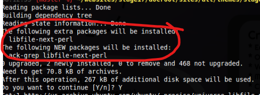
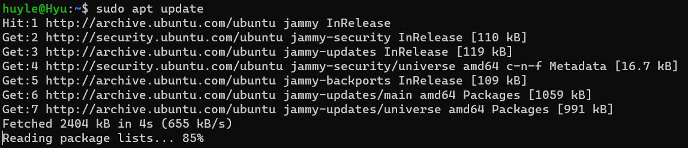
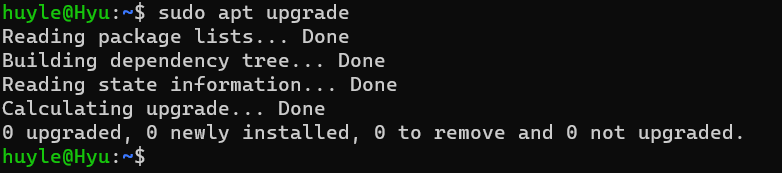
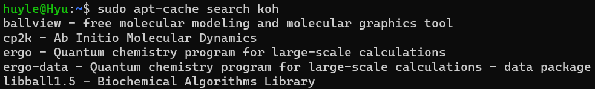
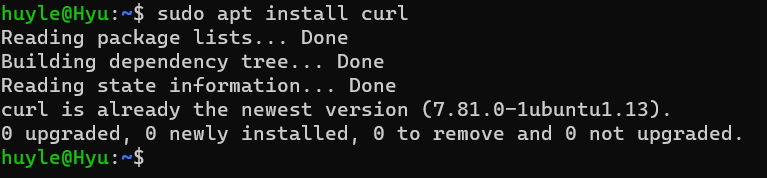
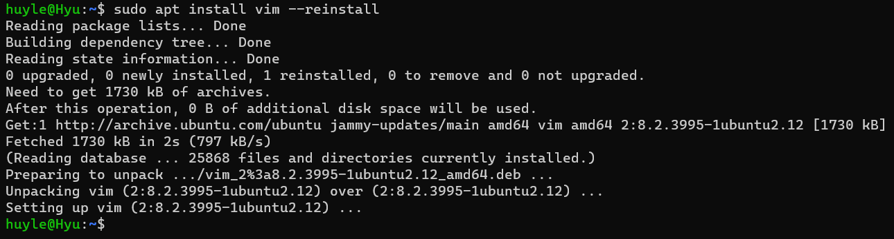
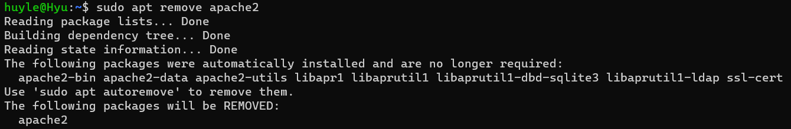

# Package là gì?

[An overview of package management in linux](https://www.linode.com/docs/guides/linux-package-management-overview/)

[Package management in linux](https://www.scaler.com/topics/cyber-security/package-management-in-linux/)

- Package trong linux là kết hợp của các tệp, và các loại dữ liệu khác và các thông tin cần thiết để cài đặt phần mềm ứng dựng hoặc tools trên linux. Package có thể là command-line utility, GUI app, hoặc là thư viện phần mềm. Hoặc nói cách khác, package như một digital box bao gồm những thành phần cần thiết để cài đặt mà không cần phải cài riêng biệt.
- Các HĐH linux sử dụng package manager để quản lý các package để cài đặt các phần mềm ứng dụng, tuy nhiên mỗi hệ điều hành linux để có nhưng package khác nhau và kernel cũng có sự khác nhau.
- Trong linux, quản lý package là việc bảo trì và duy trì các packge trong trong hệ thống. 
- Các phần mềm ứng dụng được thiết kế cho linux hầu hết được phân phối dưới dạng package (deb với ubuntu/debian và rpm. CentOS/RHEL)

# Dependency là gì?
- Dependencies là các thư viện, các package, các module được cài vào để cho chương trình chạy. 

_Đây là các package khác đi kèm khi cài 1 package_
# Repository là gì?

- Các package được thiết kế và cất giữ trong các repository (kho lưu trữ), đơn giản được gọi là nơi lưu trữ các packkage. Thường một repo có thể lưu trữ hàng nghìn package.
- Các repository của linux là local biên dịch và bảo trì cho từng phiên bản phân phối của linux (mỗi bản phân phối của linux sẽ có một kho chính riêng)

# Package manager là gì
[package manager](https://garywoodfine.com/what-is-a-linux-package-manager/#:~:text=What%20are%20package%20managers,complete%20Graphical%20User%20Interface%20application.)

- Package manager xuất hiện để giúp trình quản lý các package trở lên tiện lợi. Hỗ trợ giảm bớt sự phức tạp bằng cách tự động quy trình cài đặt, nâng cấp và xóa bỏ cũng như các dependencies liên quan
- Khi sử dụng package manager,package manager sẽ tải package thích hợp từ repo đã được cấu hình
- package manager ở thường thấy:
  - dpkg (debian pack)
  - APt (advanced package tool)
  - rpm (RedHat package tool)
  - DNF  (dandified yum)
  - Homebrew
  - zypper
  - flatpak
  - Pacman
  - snap
  - synatic 

# yum 
- yum và dnf đều là tool quản lý package (dnf là phiên bản cải tiến hơn của yum, yum vẫn được hỗ trợ đến hiện tại)
- Distro:  RHEL/CentOS 7, Fedora 21
- Công cụ quản lý gói cơ bản: rpm
- Package file format: .rpm

# dnf
- yum và dnf đều là tool quản lý package (dnf là phiên bản cải tiến hơn của yum)
- Distro: RHEL/CentOS 8, Fedora 22
- Công cụ quản lý gói cơ bản: rpm
- Package file format: .rpm

# apt
- apt, apt-get, apt-cache đều là tool quản lý package (apt-get apt-cache là hai công cụ cũ hơn, có tác dụng hỗ trợ nhau quản lý package và vẫn được hỗ trợ cho tới hiện tại)
- Distro: ubuntu, debian và kali linux
- Package format: .deb
- Công cụ quản lý gói cơ bản: dpkg
- Apt dựa trên dpkg để quản lý package trong OS. Apt như là phiên bản nâng cấp hơn của dpkg, giúp quản lý package và dependencies một cách tự động

---
---
> Sử dụng apt để update và upgrade các package system

[Use of apt, apt-cache, apt-get](https://vitux.com/how-to-use-apt-get-package-manager-on-ubuntu-command-line/)
- Sử dụng "sudo apt update" để cập nhật các package index file trong hệ thống, nó chứa các thông tin về các package có sẵn cũng như phiên bản mới của chúng.
- Nếu "sudo apt update" là để thu thập các thông tin quan trọng của hệ thống, thì "sudo apt upgrade" để cập nhật về máy các package mới nhất

> Sử dụng apt-cache

- Sử dụng "sudo apt-cache search <package_name_keyword>" để search các packages trong local repository (có thể sử dụng "apt update" và "apt upgrade")

- Cũng có thể sử dụng "sudo apt-cache show <package_name_keyword>" để hiện chi tiết các thông tin về package cần tìm trên local repository

> Sử dụng apt để install các package

> Sử dụng apt để reinstall package đã cài

> Sử dụng apt để remove package khỏi system

- Có thể sử dụng "sudo apt purge <package_name_keyword>" để remove hoàn toàn package và các file configuration

# zypper
- Distro: openSUSE
- Command: zypper
- Công cụ quản lý gói cơ bản: ZYpp (còn được gọi là libzypp)
- Packet format: .rpm

# pacman
- Distro: Arch-based, bao gồm có 2 phiên bản linux là Arch và Manjaro
- Command: pacman
- Packet format: .tar.xz (và các loại format dạng tar khác)

# portable
- Distro: Gentoo
- Command: emerge
- Packet format: .tbz2 hoặc ebuild shell scripts (Các package portable thường là các shell script, dùng shell script để cài đặt các package)

# slackware package management
- Distro: slackware
- Command: slackpkg, pkgtool, installpkg, upgradepkg, removepkg
- Packet format: .tgz và .txz