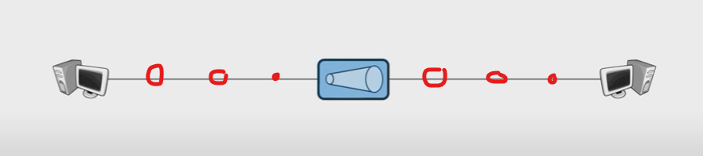
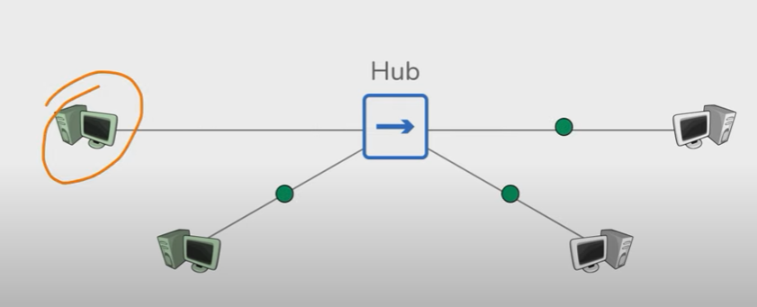
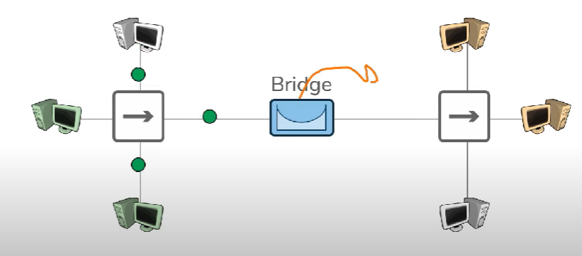
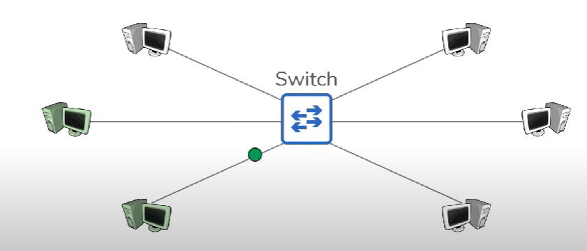
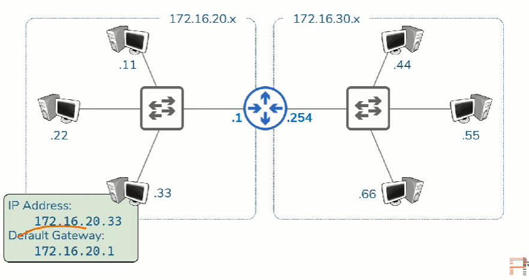

[Videp switch, hub, bridge, switch và router](https://youtu.be/H7-NR3Q3BeI?si=egN3jk-toTvocPko)

# Repeater

- Khuếch đại signal về như cũ để duy trì tín hiệu truyền data (tránh mất mát dữ liệu)
- Cons: Chỉ có 2 port (input và output)

# Hub

- Là multiple-port repeater
- Tác dụng như repeater + gửi signal đến tất cả các host trong cùng 1 network
- Pros: có nhiều port
- Cons: khi 1 host gửi signal thì tất cả những máy còn lại trong network đều nhận được signal

# Bridge

- Để kết nối các hub với nhau, chỉ có 2 port
- Truyền/Ngăn không cho signal từ một bên hub sang bên hub khác
- Pros: đã ngăn được signal trong một hub truyền sang các hub còn lại
- Cons: không ngăn được signal thừa thãi nếu 2 host hai bên bridge liên lạc nhau

# Switch

- Có nhiều port
- Vừa đóng vai trò là hub và bridge cùng một lúc
- Được dùng chủ yếu hoạt động trong LAN
- pros: đã ngăn được các signal thừa sang những host khác
- cons: không gửi được signal cho các host ở những network khác

# Router

- Router cung cấp thêm IP address giúp các host trong LAN network di chuyển data cho nhau giữa các host trong các network khác nhau
- Đồng thời router giúp các data trong các network chuyển dịch đảm bảo an toàn, nhanh hơn
- Việc sử dụng kết hợp các router và các switch giúp tạo nên hệ thống network rộng lớn

