# VLAN là gì

[Explain VLAN but more informative](https://community.fs.com/article/understanding-virtual-lan-vlan-technology.html)

[Video explain vlan with illustration](https://youtu.be/MmwF1oHOvmg?si=lQTP5ScTgrnzYXki)

- Virtual LAN hay virtual local area network: có thể hiểu là computer, network hoặc các thiết bị network device khác kết nối nội bộ với nhau bất kể khoảng cách giữa các thiết bị trên (biến 1 switch thành nhiều switch và mở rộng VLAN ra các switch khác)
- Use:
  - VLAN kết nối các thiết bị trong các LAN khác nhau nhằm tăng cường kết nối và bảo mật
  - Tránh thêm các thiết bị để tạo ra 1 mạng LAN riêng biệt
  - Có tính mở rộng dễ dàng (chia 1 physic switch thành nhiều virtual switch)

- Về cơ bản các nội bộ các host trong VLAN chỉ giao tiếp với nhau bằng MAC, VLAN có sự xuất hiện của IP với mục đích:
  - Để giao tiếp với các VLAN khác nhau bằng inter-VLAN (các VLAN giao tiếp với nhau bằng switch layer 3 hoặc switch layer 2 với router) với mục đích hoạt động trong mạng LAN lớn hơn và kết nối các mạng LAN khác nhau

# Unicast, multicast và broadcast là gì?
- Unicast là phương thức gửi/nhận dữ liệu 1-1
- Multicast là phương thức gửi/nhận dữ liệu 1-1 hoặc 1-nhiều (nhóm cụ thể hoặc tất cả các device trong cùng một network)
- Broadcast là phương thức gửi/nhận dữ liệu đến tất cả các thiết bị trong một network
- Các phương thức này đều xuất hiện trong các loại network khác nhau (LAN, WAN etc)

# Cách VLAN hoạt động (giữa switch)

[Video explain VLAN](https://youtu.be/A9lMH0ye1HU?si=vWW1m7xzANRFNsDo)

[What is VLAN?](https://www.geeksforgeeks.org/virtual-lan-vlan/)

- Setup: có 2 máy tính và 1 switch. Mỗi một switch đã được setup sẵn VLAN10, VLAN20

> 1. Gán port vào VLAN (trong ví dụ, 2 máy đã được gán vào cùng VLAN10)
> 2. Máy A tạo frame và gửi cho máy B
> 3. các frame untagged sẽ được switch tự động chuyển gửi từ máy A sang máy B (do chúng nằm trong cùng một VLAN)

- Setup 2: Có 2 máy tính và 2 switch. Mỗi một switch đã được setup sẵn VLAN10, VLAN20 và TRUNK (là một VLAN link giữa 2 switch mà trong các switch có chứa nhiều VLAN)

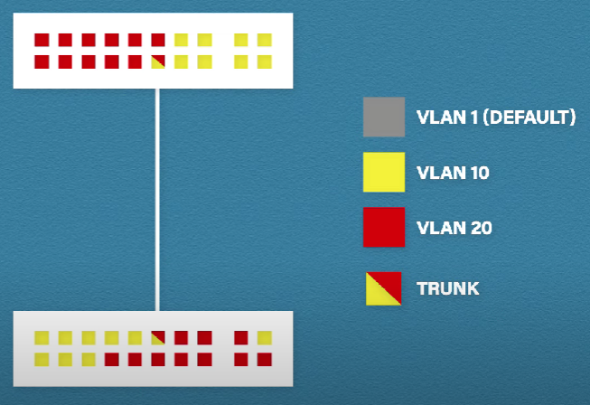

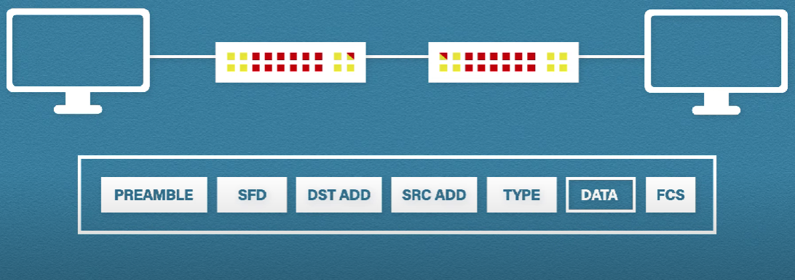

> 1. Gán port vào VLAN: Mỗi cổng trên switch có thể được gán cho một hoặc nhiều VLAN (ở ví dụ, các cổng trên switch được gán vào 2 nhóm VLAN10 và VLAN20)
> 2. Gán trunk port: cổng được sử dụng để những VLAN trong một switch giao tiếp được với những VLAN trong một switch khác
> 3. Máy tính gửi các frame tới switch A để chuyển cho máy tính được kết nối bên switch B (các frame mới được gửi từ máy bên switch A là untagged)
> 4. Khi đi qua trunk port từ switch A (cổng kết nối 2 switch A và B), frame sẽ được đánh thêm header dot1q (trong này có chứa VLAN id) và sẽ được switch B gỡ khi đến VLAN (dot1q sẽ hỗ trợ tới đúng VLAN tương ứng cả 2 bên switch - VLAN10 từ switch A đến VLAN10 của switch B)

- Vậy trong đó, untagged và tagged là gì:
  - untagged: chỉ frame không xác định (frame không được gán thẻ VLAN cụ thể). Trong một switch có nhiều VLAN, mỗi VLAN có nhiều thiết bị, các frame untagged sẽ được tự động chuyển theo VLAN default nếu không có tag đi cùng (hay còn là access link được hình thành khi các máy trong VLAN của một switch giao tiếp với nhau)
  - tagged: xảy ra khi có 2 switch trở lên kết nối với nhau. Switch bên nhận cần phải biết VLAN nào từ bên gửi chuyển đến. Các frame lúc này cần được đánh tag (chứa các thông tin, trong đó có VLANid) bằng 802.1Q protocol để switch chuyển frame đến VLAN tương ứng sau khi gỡ tag (đưa frame quay trở lại là untagged => đã xác định là cùng VLAN).
    - Trong quá trình chuyển tiếp frame giữa 2 switch, ngoài việc đánh tag, frame này sẽ được di chuyển qua trunk port (cổng cho phép nhiều VLAN chuyển frame qua đó) (hay còn được gọi là trunk link)
  - Access link chuyển traffic thuộc về 1 VLAN hoặc khi di chuyển các frame không đánh tag
  - Trunk link chuyển traffic của nhiều VLAN khác nhau tới các VLAN tương ứng hoặc di chuyển các tagged frame

- Ngoài cách chỉnh trunk link hoặc access cố định để cho các VLAN giao tiếp, còn có DTP (dynamic trunk protocol) có thể chuyển linh hoạt giữa access link và trunk link trên 2 đầu port của switch [What is DTP?](https://www.learncisco.net/courses/icnd-2/vlans-and-spanning-tree/dynamic-trunking-protocol.html)

# Cách các VLAN khác nhau giao tiếp (kết hợp switch và router)

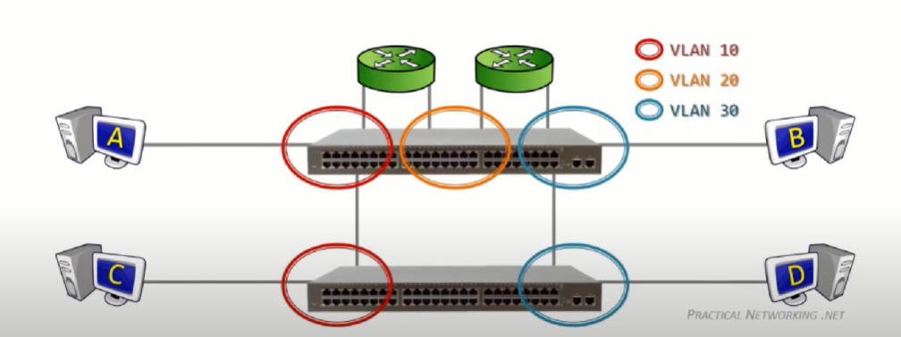

# Các loại VLAN phổ biến

> Default VLAN

[VLAN Default](https://www.geeksforgeeks.org/types-of-virtual-lan-vlan/)

- Một loại VLAN mặc định khi switch được đưa vào sử dụng. Mặc định tất cả các port trên switch là VLAN 1. Không thể đổi tên hoặc xóa VLAN 1

> Data VLAN

[Data VLAN](https://www.ciscopress.com/articles/article.asp?p=2181837&seqNum=4)

- Một loại VLAN để mang các traffic do người dùng tạo nên, dùng để phân tách mạng thành nhóm người dùng hoặc thiết bị 

> Native VLAN

[What is native VLAN?](https://www.packetswitch.co.uk/what-is-a-native-vlan-and-how-does-it-work/)

- Native VLAN là tiếp nhận các untagged frame trong quá trình các VLAN giao tiếp với nhau thông qua trunk link
- Một loại VLAN được phát triển để hỗ trợ các loại thiết bị không hỗ trợ gắn tag vào frame 
- Gán cổng trunk port (802.1Q) cho 2 thiết bị để tạo native VLAN

_Lưu ý: Native vlan default là VLAN 1, nếu muốn chuyển native VLAN khác là 10 thì cần phải được cấu hình lại_

> Voice VLAN

[Voice VLAN](https://www.geeksforgeeks.org/types-of-virtual-lan-vlan/)

- Một VLAN được tạo ra để mang Voice traffic để đảm bảo lưu lượng thoại ổn định và độ trễ không quá 150 ms.

> Management VLAN

[Management VLAN](https://www.geeksforgeeks.org/types-of-virtual-lan-vlan/)

- VLAN management là bất kỳ VLAN nào có quyền truy cập vào khả năng quản lý của một switch, được sử dụng để quản lý các VLAN

# Các loại VLAN dựa trên cách cấu hình

> Port-based VLAN (static VLAN): VLAN dựa trên port ở trên switch, tức là mỗi một port được gán cho 1 VLAN
> MAC address based VLAN (Dynamic VLAN): VLAN dựa trên MAC address ở trên thiết bị, tức là khi có máy kết nối đến switch bằng việc cắm máy vào 1 cổng bất kỳ trên switch, VMPS server được cắm trên switch (có thể hiểu như là một db chứa thông tin địa chỉ MAC nào thuộc VLAN nào) sẽ check xem máy đó thuộc VLAN nào và gán VLAN đó cho máy đó. Dynamic VLAN gán một port với nhiều VLAN và khi một thiết bị mới được cắm vào mà chưa có mặt trên VMPS server, máy đó sẽ không được giao tiếp với bất kỳ thiết bị nào khác trong network. Nhưng việc quản lý trên dynamic VLAN khó quản lý hơn so với static VLAN

> IP subnet-based VLAN: Gán VLAN theo subnet của device

> Protocol-based VLAN: Áp dụng cho mạng có nhiều giao thức, Vlan dựa trên giao thức có thể gán Vlan theo loại giao thức và định dạng đóng gói của khung

> Policy-based VLAN: VLAN được nhóm theo các quy tắc (có thể hiểu là các VLAN bên trên kết hợp), tăng cường kiểm soát, nâng cao bảo mật

# VLAN_lab with Cisco

> Setup:
1. Tạo kết nối giữa 2 PC và 1 Switch
2. Gán IP cho 2 PC
3. Vào phần CLI của Switch -> Switch>en để nâng cao quyền và bắt đầu setup

> Tạo 1 VLAN mới (data vlan)
1. Dùng "switch# conf t (switch# configure terminal) để vào chế độ chỉnh sửa cấu hình
2. Tạo VLAN mới:
  - `switch(config)# vlan 10` (Tạo VLAN 10)
  - `switch(config-vlan)# name mathew` (Gán name cho VLAN mới được tạo)
3. Lúc này,2 VLAN mới tạo sẽ chưa kết nối với 2 PC, sử dụng:
  - `Switch(config)#interface fastEthernet 0/1`(vào chế độ config interface của fasethernet 0/1)
  - `Switch(config-if)#switchport access vlan 10` (gán vlan 10 vào kết nối fasethernet 0/1)
4. exit và sử dụng `show vlan` để kiểm tra tình trạng kết nối (có thể vào 1 trong 2 máy tính và ping để kiểm tra kết nối giữa 2 máy -> không được vì 2 máy nằm ở 2 network khác nhau)

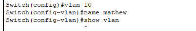

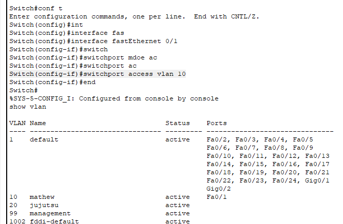

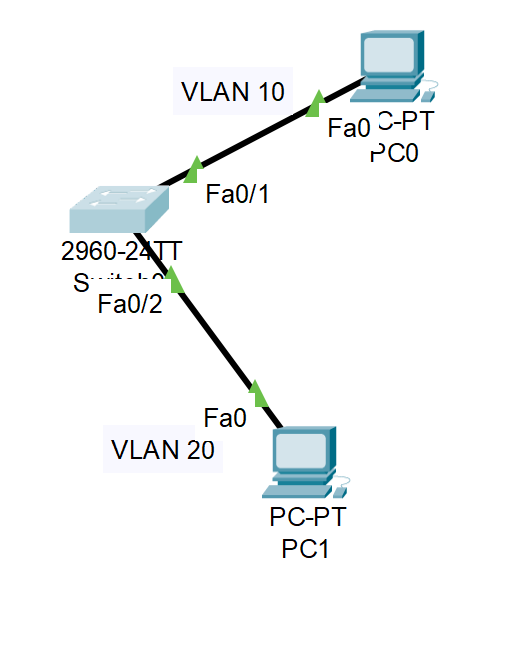

> Tạo management VLAN

1. Tạo riêng vlan 99 và đặt tên là management
2. Kết nối với pc tới vlan 99 trên switch bằng telnet hoặc SSH
  - Vào chế độ `conf t` để config terminal
  - `Switch(config)#int vlan 99` để tiếp tục chế độ configure interface của vlan 99
  - `Switch(config-if)#no shut` để giữ cho kết nối không bị tắt
  - `Switch(config-if)#ip add 10.0.0.1 255.0.0.0` để thêm địa chỉ IP và subnet mask để cho telnet có thể bắt được kết nối theo địa chỉ
  - `exit` để ra chế độ config bình thường và `Switch(config)#line vty 0 4` để vào chế độ config line (config các đường kết nối tới switch hỗ trơ lên tới 0, 1, 2, 3, 4 dành cho tới 5 admin làm việc cùng lúc tới switch)
  - `Switch(config-line)#password cisco` để cài đặt password cho máy host muốn kết nối tới switch qua telnet hoặc SSH
  - `Switch(config-line)#login` để thực hiện login sau khi người dùng nhập password hợp lệ phía trên
  - `exit` để ra chế độ config bình thường và `Switch(config)#enable secret cisco1` để bắt người dùng nhập thêm password nếu muốn chuyển từ chế độ user bình thường sang chế độ PRIVILEGED phục vụ config sâu hơn vào switch

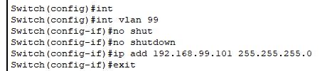

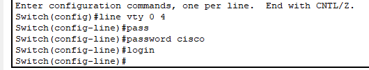

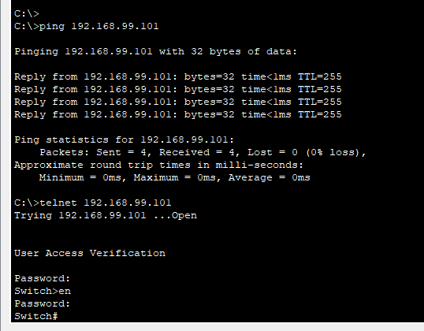

> Tạo trunk link để cho phép các VLAN cùng id giao tiếp với nhau qua 1 đường dẫn

1. Tạo riêng 1 network mới gồm: `1 switch kết nối với 2 pc: 1 pc VLAN default và 1 pc VLAN 20`
2. Kết nối 2 switch với nhau bằng `cáp cross-over cable`
3. Tạo `trunk link kết nối với cổng đã cắm bên switch 0`
  - Vào config cổng fastethernet 0/5: `Switch(config)#interface fastEthernet 0/5`
  - Chuyển sang mode trunk: `Switch(config-if)#switchport mode trunk`
  - Cho phép VLAN range (số lượng VLAN di chuyển qua trunk link): `Switch(config-if)#switchport trunk allowed vlan 1-99`
4. Tạo `trunk link kết nối với cổng đã cắm bên switch 1` các bước tương tự như trên
5. Thử ping 2 pc cùng 1 VLAN ở 2 bên switch

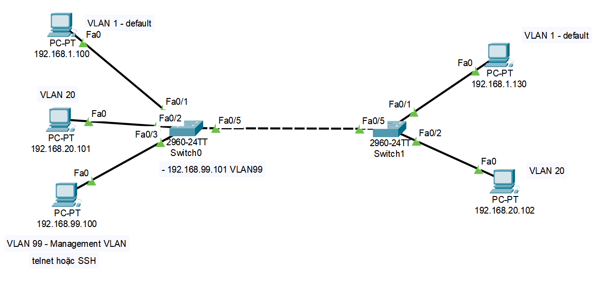

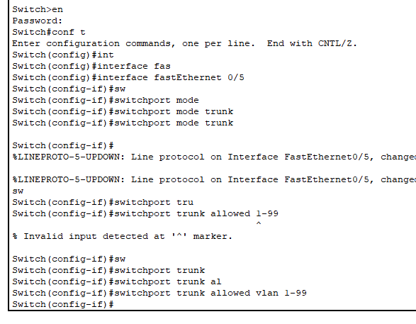

> Tạo native VLAN

1. Tạo vlan mới nằm trong khoảng trunk link đã định sẵn (trunk link vlan 1-99 thì tạo vlan 98)s
2. Native VLAN ở các switch từ đầu sẽ là VLAN 1 - default VLAN, cả 2 switch làm theo các bước sau:
  - Vào chế độ interface config fastethernet 0/5 (cổng có trunk link): `Switch(config)#interface fastEthernet 0/5`
  - Tạo vlan native mới với: `Switch(config-if)#switchport trunk native vlan 98`

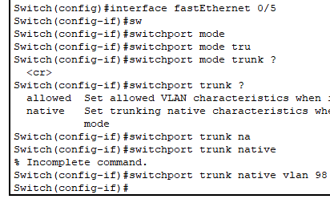

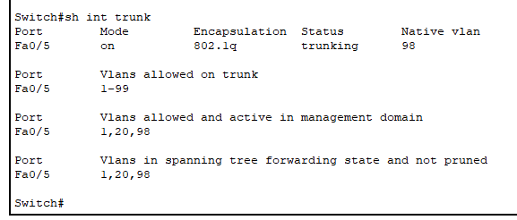

> Tạo kết nối giữa các VLAN khác nhau thông qua một kết nối router trên một switch (Router on a stick) do hạn chế về cổng trên router

[Vid tham khảo Router on a stick](https://youtu.be/qwJlypSanLc?si=RwSZlbUWSRru17bu)

1. Tạo các VLAN trên mỗi switch và gán IP và gateway theo các label như hình vào các pc
  - Lần lượt các VLAN sẽ được sắp xếp vào các subnet tương ứng như sau để dễ quản lý
    - VLAN 10: 192.168.10.0/24
    - VLAN 11: 192.168.11.0/24
    - VLAN 12: 192.168.12.0/24
2. Tạo trunk link trên switch trung gian là switch 1
  - `Switch(config)#interface range fastEthernet 0/1-3` để vào chế độ config đa port
  - `Switch(config-if-range)#switch mode trunk` để chuyển các port đó sang chế độ trunk thay vì access
3. Thêm các gateway cho các sub-interfaces của các VLAN lần lượt như sau:
  - `Router(config)#interface gigabitEthernet 0/1.10` vào chế độ config sub-interface 10
  - `Router(config-subif)#encapsulation dot1Q 10` sử dụng tiêu chuẩn dot1q để đóng gói các gói tin
  - `Router(config-subif)#ip address 192.168.10.1 255.255.255.0` thêm ip cho sub-interface (có thể hiểu là gateway con)
  - Làm tương tự các 2 sub-interfaces còn lại
  - `exit` và vào lại config interface của gigabitEthernet 0/1: `Router(config)#interface gigabitEthernet 0/1` và `no shutdown` để giữ cho cổng này luôn hoạt động

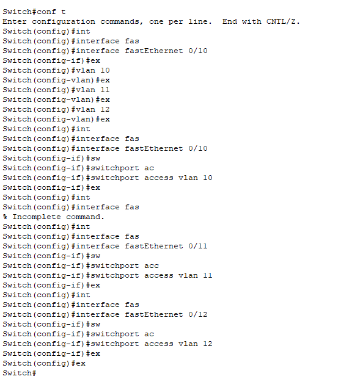

_Command lần lượt để gán các VLAN vào từng cổng trên switch (làm tương tự với các switch còn lại, kể cả switch 1 trung gian cũng cần phải biết các VLAN nhưng chỉ cần tạo các VLAN để khai báo)_

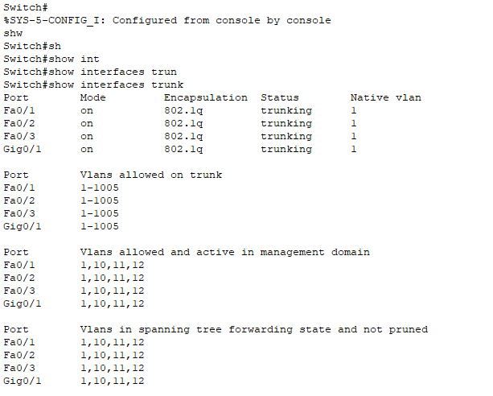

_Sau khi đã tạo trunk link mode cho các port ở Switch 1 CLI, có thể dùng show interface trunk để kiểm tra (ở các port ở switch còn lại sẽ tự động chuyển sang trunk mode, không cần config gì thêm)_

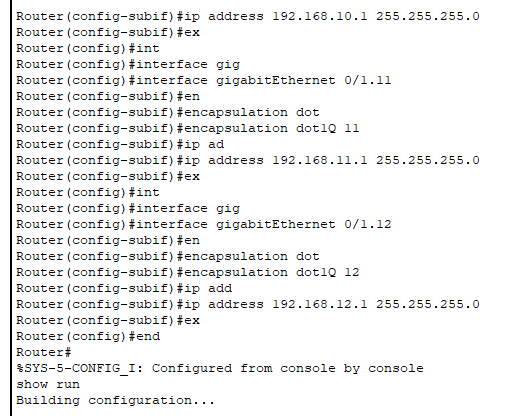

_Config lần lượt theo command cho các sub-interfaces_

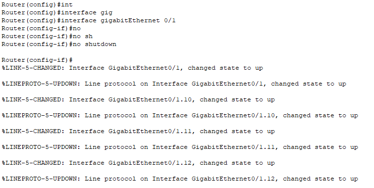

_No shutdown để giữ cho port luôn hoạt động_

> Vậy luồng di chuyển như thế nào khi gửi từ máy 1 VLAN này sang 1 VLAN khác: Gói tin sẽ đi từ máy đến switch trung gian -> gói tin di chuyển lên router để tìm gateway -> từ gateway gói tin gửi đến địa chỉ IP đích