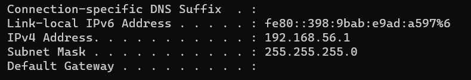
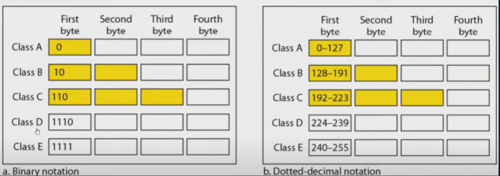
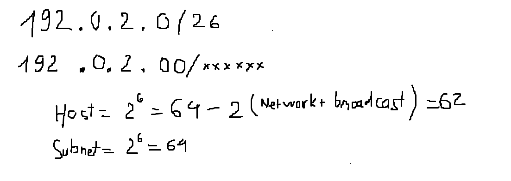
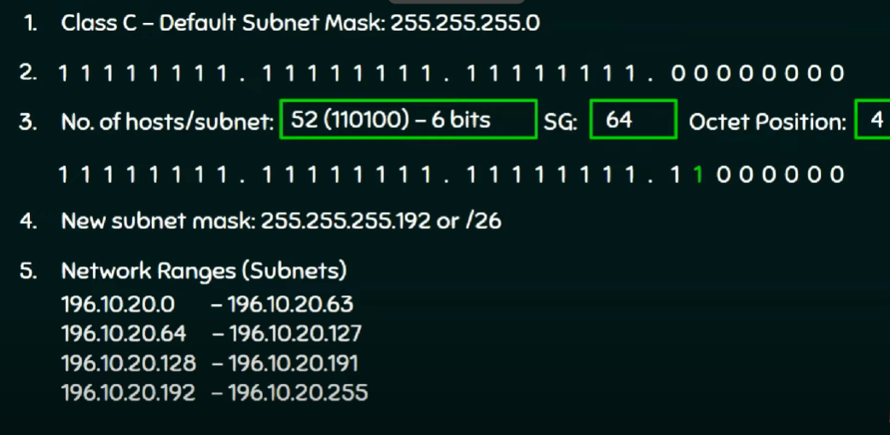
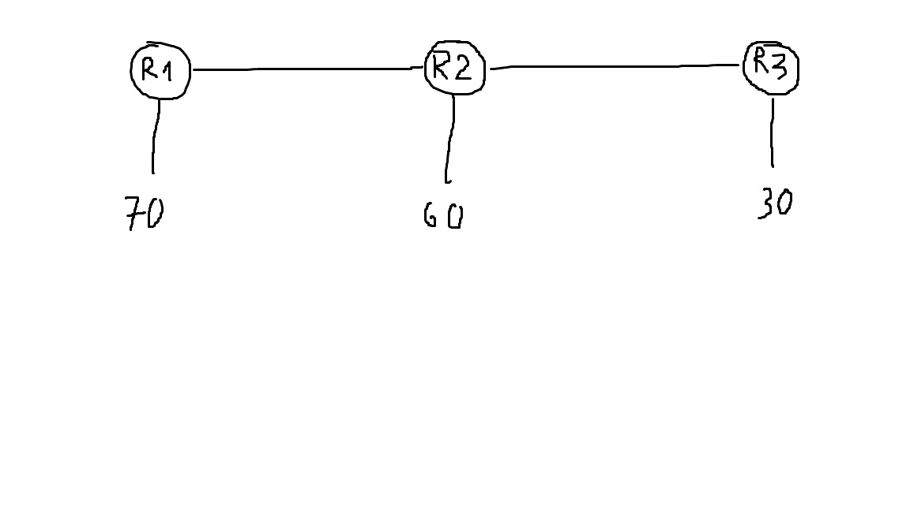

# Subnet và subnet mask

[Subnet,IP,subnet mask](https://www.cloudflare.com/en-gb/learning/network-layer/what-is-a-subnet/)

- Subnet là một phần mạng lưới trong cả một network. Subnet làm cho mạng hoạt động hiệu quả hơn. Thông qua subnet, lưu lượng truy cập mạng có thể di chuyển một khoảng cách ngắn hơn mà không cần đi qua các bộ định tuyến không cần thiết để đến đích. 

- Subnet mask là một số dạng 32 bit được tạo bằng cách đặt tất cả các host bit thành số 0 và đặt tất cả các network bit thành các số 1. Bằng cách này, subnet mask phân tách địa chỉ IP thành địa chỉ mạng và địa chỉ host.. Subnet mask có tác dụng xác định rõ phần network address và host address trong địa chỉ IP

# ip address (IPv4)
- Mỗi thiết bị khi kết nối với Internet được gán 1 ip adress
- IPv4 gồm có 4 phần số được cách nhau bằng các dấu chấm. Mỗi một IP có số nằm trong khoảng 0 - 255: 0.0.0.0 -> 255.255.255.255. Địa chỉ dạng 32 bit (2^32)

- Để phục vụ cho việc dễ tìm kiếm địa chỉ IP, IP được chia ra làm 5 lớp

  - Lớp A: địa chỉ ip có giá trị từ 1 - 126 (địa chỉ ip từ 1.0.0.1 đến 126.0.0.0). Dành riêng cho các tổ chức lớn. `Địa chỉ có 8 bit trước là network address và 24 bit sau là host address`
  - Lớp B: địa chỉ ip có giá trị từ 128 - 191 (địa chỉ ip từ 128.1.0.0 đến 191.254.0.0). Dành cho các tổ chức tầm trung. `Địa chỉ có 16 bit trước là network address và 16 bit sau là host address`
  - Lớp C: địa chỉ ip có giá trị từ 192 - 223 (địa chỉ ip từ 192.0.1.0 đến 223.255.254.0). Dành cho các tổ chức cá nhân, trong đó có cả máy tính cá nhân. `Địa chỉ có 24 bit trước là network address và 8 bit sau là host address`
  - Lớp D: địa chỉ ip có giá trị từ 224-239 (địa chỉ ip từ 224.0.0.0 đến 239.255.255.255). Dành cho việc phát các thông tin (multicast/broadcast)
  - Lớp E: địa chỉ ip có giá trị từ 240-255 (địa chỉ ip từ 240.0.0.0 đến 254.255.255.255). Dành cho việc nghiên cứu
  - 3 class đầu tiên là 3 class thường được sử dụng

- Ngoài ra còn có địa chỉ loopback: từ 127.0.0.0 đến 127.255.255.255 (127.0.0.1 thường được gọi là localhost): Một loại địa chỉ được xử lý bởi ngăn xếp giao thức TCP/IP bên trong chính nó tức là không truyền đến mạng, và localhost là một địa chỉ loopback address phổ biến

# ip address (IPv6)
- Địa chỉ IPv4 có giới hạn khi chỉ cung cấp IP cho hơn 4 tỉ thiết bị, gây ra sự thiếu hụt địa chỉ. Ipv6 xuất hiện để xử lý tình trạng thiếu hụt này
- Dạng địa chỉ 128 bit (2^128), trong địa chỉ có chứa cả chữ và số và được phân cách các phần bằng dấu :

# Có các loại địa chỉ IPv4 sau

> Public ip: Địa chỉ do IPS cung cấp cho router và phân chia cho các thiết bị trong mạng (các thiết bị kết nối cùng một router sẽ dùng chung public ip để kết nối với internet đồng thời tránh lãng phí địa chỉ ip)

- Dynamic IP address:địa chỉ ip được DHCP server phân tự động khi có thiết bị mới kết nối vào network hoặc là địa chỉ public ip thay đổi mỗi khi thiết bị được kết nối với mạng mới
- Static IP addres: địa chỉ ip được admin của network phân cho

> Private ip: là địa chỉ chỉ được trao đổi dữ liệu trong một local network và không được định tuyến với internet (không thể kết nối tới internet bằng địa chỉ này)

> Shared ip: nhiều trang web có cùng một địa chỉ ip với những domain khác nhau, tiết kiệm chi phí đáng kể cho doanh nghiệp. Thường được sử dụng để chạy nhiều dịch vụ trên đó: Thư, DNS, database. Nếu shared ip bị tấn công mạng như DDOS, toàn bộ các dịch vụ và các trang web trên shared ip đó đều bị ảnh hưởng

> Dedicated ip: địa chỉ ip mà không chia sẻ cho bất kỳ domain nào khác, địa chỉ mang lại sự ổn định cho máy chủ kể cả khi gặp lưu lượng truy cập cao

# Các lớp của một địa chỉ ip

[What classfull and classless ip](https://aws.amazon.com/what-is/cidr/)

- IP address gồm 2 phần:
  - Network address: một dãy số chỉ đến network indentifer duy nhất (phần địa chỉ này cho biết phần địa chỉ chung của các thiết bị trong toàn network)
  - Host address: dãy số chỉ đến máy chủ hoặc thiết bị riêng lẻ trên mạng (phần địa chỉ này chỉ địa chỉ riêng mỗi thiết bị trong toàn network)

# Lý thuyết subnetting và chia IP

> Classfull ip addressing

[Classfull ip addressing explain](https://youtu.be/VkgfyLf1raY?si=uWSwMzw59UCaHFb2)

- Hệ thống gán địa chỉ IP đầu tiên trên internet. Cách này chia địa chỉ IP ra thành 3 lớp (A, B, C, D và E)
  - Lớp A: Địa chỉ IPv4 loại A có 8 bit tiền tố mạng. Ví dụ: hãy xem xét 44.0.0.1, trong đó 44 là địa chỉ mạng và 0.0.1 là địa chỉ máy chủ.
  - Lớp B: Địa chỉ IPv4 loại B có 16 bit tiền tố mạng. Ví dụ: hãy xem xét 128.16.0.2, trong đó 128.16 là địa chỉ mạng và 0,2 là địa chỉ máy chủ
  - Lớp C: Địa chỉ IPv4 loại C có 24 bit tiền tố mạng. Ví dụ: hãy xem xét 192.168.1.100, trong đó 192.168.1 là địa chỉ mạng và 100 là địa chỉ máy chủ.

- Trong vấn đề thực tế, tổ chức với số lượng thiết bị lớn hơn 254 mà số lượng thiết bị này vượt quá địa chỉ IP mà lớp C cung cấp. Lúc này, lớp B cung cấp số lượng lớn địa chỉ IP cho các thiết bị, hoặc có thể nói là các host (65.534 host nếu chia theo lớp B) thì lúc này số lượng các IP còn lại khi chia theo lớp B không được dùng đến gây ra lãng phí và không hiệu quả.

[Classless ip addressing](https://www.geeksforgeeks.org/ip-addressing-classless-addressing/)

- Một phương pháp sử dụn rộng rãi, có thể tạo ra mạng con từ một mạng lớn , thông qua mạng con, có thể tại ra subnet. lượng truy cập có thể di ichuyeenr mộ mfi chuyển một khoảnh cá ngắn hơn trong cùng network

[Chia subnet với CIDR](https://youtu.be/YFcShc8jPoI?si=FE7E7cjcG0aXXoOB)

- Hệ thống CIDR (Classless Inter-Domain Routing) sử dụng VLSM (variable length subnet masking) để thay đổi tỉ lệ giữa network address và host address. Trong đó subnet mask là giá trị của địa chỉ mạng từ địa chỉ IP
- IP CIDR gắn thêm một giá trị hậu tố cho biết số bit tiền tố địa chỉ mạng vào địa chỉ IP thông thường.
- Ví dụ: 192.0.2.0/24, bit mượn là 2, trong đó 26 bit đầu tiên là địa chỉ mạng
  - Chia địa chỉ thành các bit, tức là 26 bit đầu tiên là network (phần bit này không thay đổi)
  - Số bit còn lại (6 bit còn lại là host address) - trong đó 000000 là network address và 111111 là broadcast address (có tác dụng khi host này được gửi dữ liệu đến, tất cả các host còn lại đều nhận được dữ liệu)
  - tổng cộng số host được gán IP là 62 + 1 (2^6+1) broadcast address
  - Cứ như vậy tính theo với 3 subnet còn lại thì có 4 subnet với mỗi subnet có 63 host
  - Vậy:
    - 2^(số bit mượn) = số subnet
    - 2^(số bit host còn lại) = số host trong mỗi subnet
- Với ví dụ tiếp theo, có mạng 192.168.1.0/24 và phải chia IP cho mô hình sau

- Ví dụ 2: chia 196.10.20.0 thành 52 host mỗi subnet

- Có thể sử dụng bảng bước nhảy để tính được số host mỗi subnet khi có số bit được mượn

# Cách subnetting và chia IP trong thực tế

> Trong thực tế, có ví dụ với chia IP cụ thể như sau: 192.168.1.0/24 và chia 3 subnet, mỗi subnet có số host là 13,10,5, trong mô hình có 3 router được kết nối với 3 network nhỏ khác nhau (dạng này không cho người quản lý biết số bit mượn?)

- Gọi số bit được mượn là n, số bit còn lại trong octet là m

  - Xác định số lượng kết nối: `5 kết nối` =  `5 subnet cần phải tạo` => `2^n >= 5`

  - Một subnet với 13 host sẽ đáp ứng được các subnet còn lại => `(2^m)-2 >= 13`

  - Trong một octet tổng giữa m và n = 8 => `m + n = 8`

giải HPT, ta được `n=3 với m=5` hoặc `n=4 và m=4`

Nhưng đây là cách chia đồng đều cho mỗi subnet

> Với mô hình như trên, mỗi subnet yêu cầu với các số lượng host khác nhau như: 70,60,30 thì sử dụng kỹ thuật chia VLSM (variable length subnet masking)

- Subnet 70 host:
  - 192.168.1.0/24 chia octet cuối cùng thành n (network bit) và m (host bit)
  - host = `(2^m)-2 >= 70` => host bit `m=7` và network bit `n=1` => `(2^7)-2 = 126`
  - subnet này chiếm `192.168.1.0/25` -> `192.168.1.127/25`
- Subnet 60 host (còn lại dải ip 192.168.1.128 -> 192.168.1.255)
  - host = `(2^m)-2 >= 60` => host bit `m=6` và network bit `n=2` => `(2^7)-2 = 62`
  - subnet này chiếm `192.168.1.128/26` -> `192.168.1.191/26`
- Subnet 30 host (còn lại dải ip 192.168.1.192 -> 192.168.1.255)
  - host = `(2^m)-2 >= 30` => host bit `m=5` và network bit `n=3` => `(2^7)-2 = 30`
  - subnet này chiếm `192.168.1.192/27` -> `192.168.1.223/27`
- Với 2 kết nối R1 với R2 và R2 với R3 được coi là mỗi host riêng trong network khác nhau (còn lại dải ip 192.168.1.224 -> 192.168.1.255)
  - /31 và /32 không phù hợp trong thực tế nên chọn /30 để có ít nhất 2 ip host trong mỗi network
  - host bit `m=2` và network `n=6` vậy bước nhảy là 4 
  - Có 2 ip range cho mỗi kết nối giữa 3 router như sau: `192.168.1.224/30` -> `192.168.1.227/30` và `192.168.1.228/30` -> `192.168.1.232/30`

> Nhưng trước khi đi vào subnetting và chia IP thì cần kiểm tra xem ip có hợp lệ không

- Câu hỏi:
  - Địa chỉ thuộc subnet nào?
  - Địa chỉ có dùng được cho host không?

- `2^(số bit network)` để tìm được số bước nhảy và ước lượng ip trên có hợp lệ hay không 