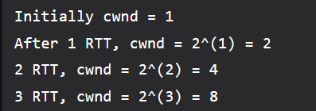
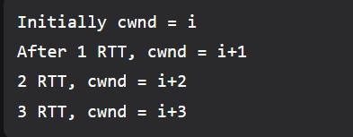
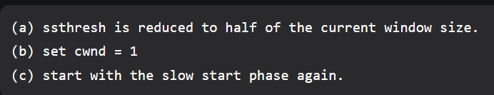
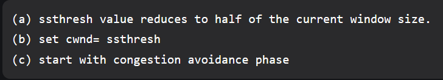
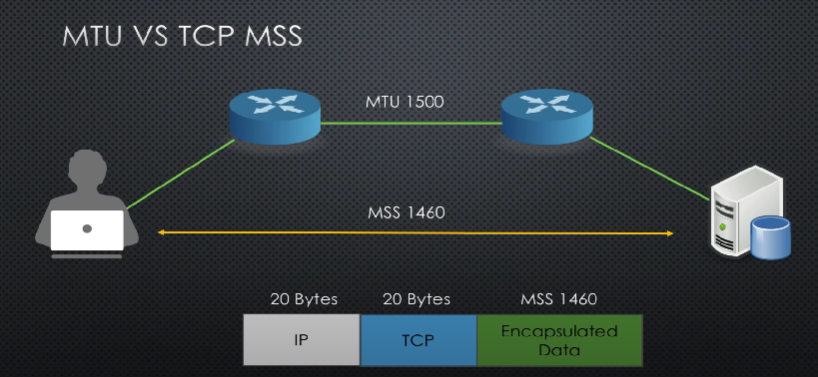
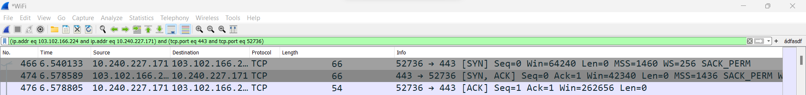
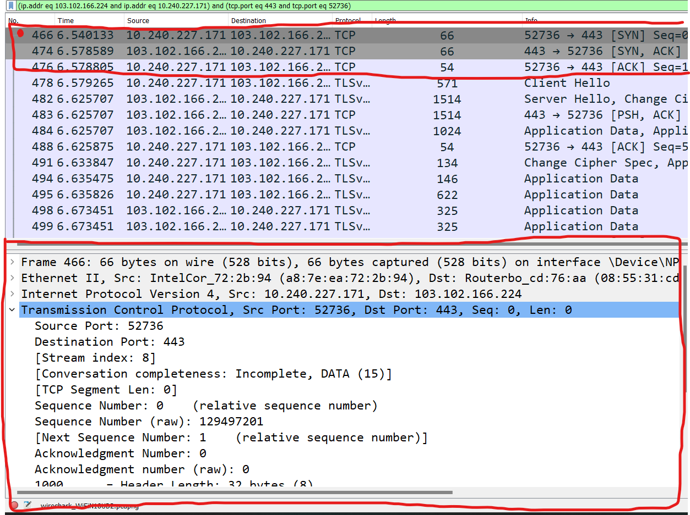

# TCP là gì?

[What is TCP](https://www.khanacademy.org/computing/computers-and-internet/xcae6f4a7ff015e7d:the-internet/xcae6f4a7ff015e7d:transporting-packets/a/transmission-control-protocol--tcp)

- Một giao thức vận chuyển dựa trên địa chỉ IP để đảm bảo đường truyền đáng tin cậy cho các packets (đảm bảo packet không bị lost hoặc thất thoát, lặp, hỏng)

# Packet trong TCP

[TCP packet format](https://www.geeksforgeeks.org/tcp-ip-packet-format/)

- Cách tổ chức trong TCP packet:
  - `Source port (16 bit)`: chứa số port của ứng dụng hoặc nguồn truyền
  - `Destination port (16 bit)`: thông tin port đích để truyền đến ứng dụng thích hợp
  - `Sequence number (32 bit)`: Đảm bảo dữ liệu được phân đoạn đúng thứ tự ở đầu gửi và sắp xếp đúng trật tự ở đầu nhận
  - `Acknowledgment Number (32 bits)`: Chứa số thứ tự sắp tới (upcomming sequence number) và phản hồi khi đã nhận.
  - `Data offset (4 bit)`: cho biết điểm bắt đầu của tải trọng dữ liệu TCP, cũng lưu trữ header TCP.
  - `Control flag (9 bit)`: TCP sử dụng một số control flag để thực hiện hành động truyền tải. Một số control flag quan trọng bao gồm:
    - `SYN (Synchronize)`: Chịu trách nhiệm kết nối người gửi và người nhận.
    - `ACK (Xác nhận)`: Mục đích của nó là truyền xác nhận xem người gửi đã nhận được dữ liệu hay chưa. 
    - `FIN (Kết thúc)`: Nó thông báo liệu kết nối TCP có bị chấm dứt hay không.
    - `RST (Reset)`: Chủ yếu dùng để reset kết nối khi xảy ra lỗi.
  - `Window size (16 bit)`: Kích thước cửa sổ nhận của người gửi được chỉ định bởi thuộc tính này.
   - `Checksum (16 bit)`: Nó cho biết liệu header có bị hỏng trong quá trình vận chuyển hay không. (Đơn giản hóa, tổng checksum data là 11 với data được gửi là 5 và 6, tổng checksum nhận được là 11 và data nhận được là 4 và 6 -> như vậy checksum giúp reciever nhận ra là thiếu 1 data trong số các data nhận được và thêm one complement sum: đảo nghịch tất cả các bit của sum thì sẽ thành checksum, phục vụ mục đích dễ so sánh sum với check sum hơn) - bên cạnh đó, TCP pseudo header được hình thành do kết hợp TCP header với 1 phần IP header để `giúp việc checksum các packet vừa xác nhận đủ data + đúng IP và port của host`
   - `Urgent Pointer (16 bit)`: Trường này trỏ đến byte dữ liệu khẩn cấp đầu tiên của gói (ưu tiên packet nào được xử lý trước)
   - `Options (Độ dài thay đổi)`: Trường này đại diện cho các tùy chọn TCP khác nhau
   - `Data payload`: Trường này chủ yếu chứa thông tin là dữ liệu ứng dụng thực tế đang được truyền đi.

- The initial 5 rows of the TCP header are always used.
So, minimum length of TCP header = 5 x 4 bytes = 20 bytes.
The size of the 6th row representing the Options field vary.
The size of Options field can go up to 40 bytes.
So, maximum length of TCP header = 20 bytes + 40 bytes = 60 bytes.

- Trong trường hợp mà đang trong quá trình thiết lập kết nối thì các packet trong TCP được gửi đi để thiết lập kết nối trước và sẽ không có sự xuất hiên của Data Payload

# Thiết lập kết nối trước khi truyền dữ liệu - 3 way handshake
- Trước khi di chuyển packet giữa 2 pc, một kết nối được gọi là `Bắt tay 3 bước - three way handshake ` sẽ được thiết lập trước

> Thiết lập kết nối: Tương ứng với `3 packet cho 3 bước để thiết lập kết nối`, mỗi packet được gửi để kiểm tra đường truyền, tín hiệu ổn định giữa 2 máy. Nhưng `3 packet để kiểm tra này không bao gồm data`. Sau khi quá trình thiết lập kết nối này hoàn thành, packet với data thật mới được chuyển đi

- Điều kiện tiên quyết: cả hai máy phải đều có địa chỉ IP duy nhất (IPv4 hoặc IPv6) và port được chỉ định để truyền data

1. Đầu tiên, PC1 gửi packet SYN với SYN (synchronize) bit được set là 1
2. Sau đó PC2 gửi ACK (acknowlegde) bit set là 1 cùng với SYN bit cũng được set là 1 (gói từ PC2 gửi về thường là gói SYN-ACK)
3. PC1 nhận được và sẽ gửi ACK lại đến PC2 để xác nhận nốt lần cuối cùng trước khi gửi packet

_ACK và SYN ở trong một TCP header_

# Truyền dữ liệu sau khi thiết lập kết nối

> Gửi packet chứa data: 

- PC1 gửi một data packet và sequence number. Máy tính thứ hai xác nhận nó bằng cách đặt bit ACK và tăng số xác nhận theo độ dài của dữ liệu nhận được.
- Lượng data nhận được được theo dõi kỹ lưỡng để đảm bảo lượng nhận vào thành công, ngoài ra còn có thể nhận biết được data thiếu hoặc trùng.

# Ngắt kết nối sau khi truyền dữ liệu

> Kết thúc kết nối: Việc kết thúc kết nối cũng cần phải qua `3 bước xác nhận như 3 bước kết nối`

1. PC1 (máy chủ) gửi một packet với FIN (finish) được set = 1
2. PC2 (máy khách) phản hồi với bit FIN set 1 tương tự cùng với bit ACK cho PC1 để báo đã nhận được thông báo tắt kết nối
3. PC1 nhận được phản hồi và gửi ACK đến PC2 để báo lần cuối cho PC2 trước khi ngắt kết nối

# TCP retransmission - TCP xử lý các packet bị thiếu, các duplicate
## Retransmission
[Retransmission trong TCP](https://www.cspsprotocol.com/tcp-retransmission/)

- Các packet bị lost có thể trong trường hợp xảy ra tắc nghẽn (congetstion), việc TCP truyền lại các packet (retransmission) xảy ra khi timer retransmission của message time out.

> Trên `mỗi một packet có một sequence number` (TCP sử dụng số này để đánh dấu số trong TCP header mỗi packet để sắp xếp lại các packet ở đầu reciever) -> Sau khi nhận được packet, `reciever sẽ gửi về sender số sequence vừa được gửi và số acknowledgement` (số này được đánh dấu tương ứng với số sequence để xác nhận với đầu sender rằng: tôi vừa nhận được sequence số ???, hãy gửi tiếp số sequence tiếp theo tương ứng với số ACK) -> Lúc này, sender biết được đầu reciever đã nhận được số sequence vừa gửi, `sender sẽ gỡ message khỏi hàng đợi retransmission`

## SACK - Selective ACK

[SACK trong TCP](https://www.cspsprotocol.com/tcp-retransmission/)

[Explain in detail](https://iponwire.com/tcp-sack-in-depth-review/)

[SACK in geeksforgeeks site](https://www.geeksforgeeks.org/selective-acknowledgments-sack-in-tcp/)

- Vậy retransmission được thực thi `trước khi` sender tiếp tục gửi packet với sequence tiếp theo và `khi không có sự tham gia của SACK`. Vậy đối với packet bị lost mà chỉ retransmission xảy ra thì sao?

- Với trường hợp không có SACK, chỉ làm việc với thuật toán retransmission thông thường:
  - Các SEQ và ACK được gửi-nhận tương ứng ở 2 đầu như bình thường
  - Đến khi SEQ 201 đến SEQ 401 được gửi, có đến 2 packet không đến nơi và chỉ có packet SEQ 401 đến. 
  - Reciever không gửi ACK tương ứng về sender với packet SEQ 201 và SEQ 301 mà chỉ gửi ACK 501 để báo rằng đã nhận được SEQ 401
  - Sender không biết reciever đã nhận được các SEQ từ 201 - SEQ 401 chưa vì chưa có ACK nào xác nhận và yêu cầu SEQ:
    - SEQ 201 chưa đến và không có ACK 301
    - SEQ 301 chưa đến và không có ACK 401 (chính thiếu ACk 401 nên sender gửi lại SEQ 401 1 lần nữa)
    - SEQ 401 gửi đến và có ACK 501
  - Sender gửi lại các SEQ 201, SEQ 301 và SEQ 401 (bị lặp, TCP sẽ xử lý sau)

- Với trường hợp có SACK:
  - Các SEQ và ACK được gửi-nhận tương ứng ở 2 đầu như bình thường
  - Packet SEQ 201 bị lỗi trên đường tới reciever, SEQ 301 đến reciever
  - Reciever gửi một DUP ACK#1: ACK 201, SACK LE=301 RE=401 để báo sender SEQ 201 đang thiếu và SEQ 301 đã được gửi thành công cho đến trước SEQ 401
  - Trong trường hợp này, một SEQ 401 tiếp tục được gửi đến, reciever tiếp tục gửi một DUP ACK#2: ACK 201, SACK LE=301 RE=501 để báo sender SEQ 201 vẫn đang thiếu và SEQ 301 đã được gửi thành công cho đến trước SEQ 501
  - Sender đọc được DUP ACK mà reciever luôn tục báo về, SEQ 201 được gửi về reciever
  - Reciever gửi ACK 501 coi như là báo đã nhận được đủ các SEQ từ 1 - 401 và sẵn sàng nhận SEQ 501 (nếu có)

- Như này SACK giúp TCP chỉ cần gửi lại các packet còn thiếu
- Vài điểm lưu ý với SACK:
  - SACK nằm trong phần option của TCP header, khi cần SACK sẽ được thêm vào mà không làm mất những phần header khác
  - Tối đa 32 byte out of 40 byte tổng của Option được dùng cho SACK

# Cotrolflow trong TCP - Điều khiển lưu lượng tải tránh tắc nghẽn của TCP

[controlflow trong TCP](https://www.cspsprotocol.com/tcp-flow-control/)

- Nếu không có `control flow` trong TCP thì tình trạng nghẽn sẽ trở lên tồi tệ hơn khi TCP là một giao thức vận chuyển đáng tin cậy: TCP sẽ tiếp tục gửi packet cho đến khi reciever tiếp nhận được packet (ví dụ như trường hợp reciever không tiếp nhận kịp các packet do sender gửi đến)
- Trong trường hợp này, trên giao thức TCP, reciever sẽ gửi thông tin về không gian còn lại cho sender trong khi packet đang trên đường đến. Sender sẽ nhận được thông tin về space capacity

> Hay space này còn được gọi là `window size`

- Trong quá trình truyền các packet giữa 2 ends, phần `window size trong TCP header của cả 2 đầu luôn tục được cập nhật`, cho đến khi window size = 0, sender sẽ không gửi cho đến khi window size > 0

# Congestion control trong TCP
- Các term trước khi tìm hiểu Congestion control:
  - RTT (round trip time): nói đến khoảng thời gian yêu cầu dữ liều cho đến khi phản hồi dữ liệu
  - RTO (retransmission timeout):

---
---
[Congestion control](https://www.geeksforgeeks.org/tcp-congestion-control/)

- Phần Control flow đã thể hiện rằng `window size các packet chuyển giữa sender và reciever được quyết định bởi reciever`
- Ngoài ra, tránh congestion xảy ra cần đến factor thứ 2 là: `băng thông mạng` quyết định window size
- Trong TCP có congestion policy - dùng để điều chỉnh hợp lý tránh tắc nghẽn, gồm 3 phần:
  - Slow start phase (khởi động chậm): ở giai đoạn slow start, sau mỗi một RTT, `congestion window size (cwnd) tăng theo cấp số nhân`
    - Ví dụ với congestion window size lần đầu tiên là 1 segment, sau khi phản hồi thành công. Gửi thành công sau lần 1, 2^1 segment lên thành 2 segment. Gửi thành công lần 2, 2^2 segement lên thành 4 segment. Cứ như vậy cho đến khi cwnd chạm đến ngưỡng hay đươc gọi là `threshold value (ssthresh)`, `congestion control sẽ chuyển sang giai đoạn thứ 2`

  

  - Congestion avoidance phase (tránh tắc nghẽn): sau khi chạm ngưỡng, cwnd sẽ chuyển sang cộng thêm giá trị tăng tiến (bắt đầu từ giá trị ngưỡng) để giảm tốc độ tăng giá trị cwnd (cụ thể là sau mỗi RTT, cwnd + 1 giá trị)

  
  
  - Congestion detection phase (phát hiện tắc nghẽn): nếu phát hiện tắc nghẽn xảy ra, cwnd giảm và tùy vào từng trường hợp mà congestion control sẽ quay trở về giai đoạn 2 hoặc 3 để thực hiện retransmission
    - Case 1: thực hiện retransmission do time out - congestion control dự đoán khả năng tắc nghẽn cao

    

    - Case 2: thực hiện retransmission do nhận được tầm 3 DUP ACK - congestion control dự đoán khả năng tắc nghẽn thấp

    

- Các phase có thể được biểu diễn qua đồ thị sau (trục x là giá trị cwnd, trục y là số lần gửi packet, giá trị ngưỡng khởi điểm là 32)
  - Ban đầu các lần gửi đều ổn định, cho đến khi cwnd chạm mốc 32 (chạm threshold). Giá trị sau đó được chuyển sang cộng tăng tiến
  - Cho đến lần gửi thứ 10, có 3 DUP ACK được gửi về. Control congestion chuyển về mức threshold mới là 38/2 = 19 và chuyển về phase 2
  - Tiếp tục đến lần gửi thứ 16, xuất hiện time out và control congestion thấy khả năng tắc nghẽn cao và đưa giá trị cwnd về điểm xuất phát và phase 1 lại bắt đầu

# MTU và MSS

[MTU and MSS comparision](https://www.geeksforgeeks.org/difference-between-mss-and-mtu-in-computer-networking/)

- MTU là gói tin tối đa trong một packet có thể được gửi đi trong quá trình truyền mạng
- MSS là gói tin tối đa trong một packet cùng với header của TCP trong quá trình truyền mạng

- Nếu MTU là 1500 thì MSS là 1460, trong đó TCP header chiếm 20 byte và 20 còn lại thì thuộc về IP. Thường thi giá trị MTU là 1500, giá trị này có thể thay đổi do thiết bị mạng

- Trên đường di chuyển trên mạng, MSS có thể tiếp tục thay đổi về giá trị nhỏ hơn để nhường chỗ cho những header khác (những header này có thể do các protocol khác đánh dấu)

# Dùng wireshark theo dõi trong TCP

_Đây là mô phỏng quá trình thiết lập kết nối "bắt tay 3 bước" khi sử dụng TCP trong khi giao tiếp với internet_

- Trong đó có một số trường thông tin:
  - Frame 466: 66 bytes on wire (528 bits), 66 bytes captured (528 bits).... : frame id 466 được chạy
  - Ethernet II, Src: IntelCor_72:2b:94 (a8:7e:ea:72:2b:94), Dst: Routerbo_cd:76:aa (08:55:31:cd:76:aa) : địa chỉ MAC đầu gửi và đầu nhận
  - Internet Protocol Version 4, Src: 10.240.227.171, Dst: 103.102.166.224 : địa chỉ IPv4 đầu gửi và đầu nhận
  - Phần TCP cho biết thông tin chi tiết bên dưới:
    - Source port: đầu gửi
    - Des port: đầu nhận
    - Stream index: do wireshark gán cho mỗi một TCP connection
    - Sequence number: đã nhận được frame có số sequence là n và ước lượng số sequence tiếp theo sẽ được nhận là n+1
    - Phần quan trọng trong thiết lập kết nối trong TCP là Flag: tập trung vào 2 mục là SYN và ACKnowledgement: SYN set là 1 -> phản hồi với SYN ACK đều được set là 1 -> ACK là 1. 2 máy, 1 client và 1 server, đóng vai trò người gửi người nhận thì sẽ lần lượt gửi các packet như trên để đảm bảo kết nối đã ok.
    - Window size: Lượng byte mà reciever có thể nhận các packet trước khi gửi ACK xác nhận về sender
  - Option: bao gồm các tùy chọn trong TCP header, trong đó quan trọng là SACK trong đó (tự động enable) để hạn chế số lần retransmission.