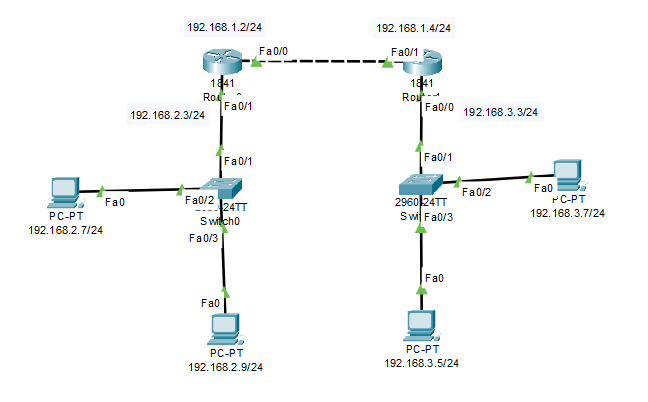
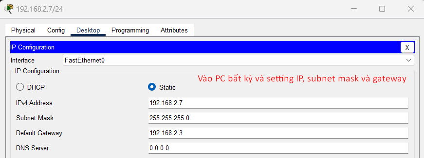
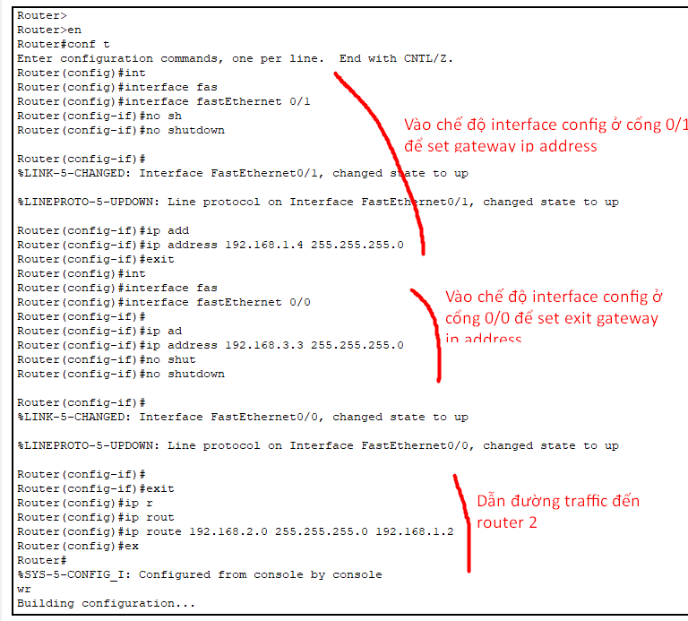

# Routing là gì?

[Routing](https://websitehcm.com/routing-la-gi-cac-loai-routing/)

- Là thuật toán quyết định đường đi ngắn nhất cho packet
- Thuật toán routing sử dụng các chỉ số dưới đây để tính toán chi phí
  - `Hop count`: số lần truyền qua các thiết bị (các node trong network)
  - `Độ trễ`: thời gian thực hiện routing (xử lý đường truyền cho một packet)
  - `Băng thông`: Dung lượng đường truyền của liên kết. Băng thông có tốc độ đường truyền càng cao thì sẽ càng được ưu tiên
  - `Tải`: nếu lưu lượng truy cập tăng thì tải cũng tăng lên, chỉ số này cho biết mức độ sử dụng của CPU
  - `Độ tin cậy`: có thể nói một mạng ổn định đường truyền sẽ có giá trị độ tin cậy cao, giá trị này thường được admin set

# Định tuyến tĩnh là gì?

[Static route](https://ipcisco.com/lesson/static-routes/)

- Là phương pháp cấu hình, thêm route theo cách thủ công vào bảng định tuyến (route table)

- Pros
  - Giảm chi phí
  - Tăng thêm tính bảo mật vì chỉ có quản trị viên là người duy nhất edit được
  - Không động đến băng thông giữa các router
- Cons:
  - Có thể định tuyến tĩnh trong mạng nhưng yêu cầu nắm kiến thức chắc về quản trị

# Có 3 tham số cần chú  ý trong static route:
> Destination Network IP Address: Địa chỉ của network cần đến (lưu ý là các địa chỉ có số bit bằng 0)

> Destination Subnet Mask: subnet mask của network cần đến

> Next hop destination (Exit interface): đường mà traffic sẽ đi qua để đến được ip address của network đó

# Lab

> Các bước test thử static route:

1. Tạo mô hình mạng như hình và gán các giá trị gateway, ip address và subnet mask phù hợp với các máy tính (sao cho máy ở SW1 khác subnet với subnet ở SW2)
2. Vào CLI lần lượt từng router và setup:
  - Vào chế độ config interface của cổng đang cắm của router: `Router(config)#interface fastEthernet 0/1`
  - `Dùng no shutdown` để giữ cho kết nối luôn hoạt động
  - `Router(config-if)#ip address 192.168.2.3 255.255.255.0` để thêm gateway (dùng cách này tương tự với thêm exit gateway interface của router này)
3. Sau khi đã thêm cả 2 gateway cho mỗi router, dùng ip route để thêm định tuyến cho router đến với nhau (làm command ở cả 2 router):
  - `Router(config)#ip route 192.168.2.0 255.255.255.0 192.168.1.2`
4. Ping các máy ở 2 bên router để kiểm tra kết nối

> Lưu ý rằng nếu không làm các bước trên ở cả 2 router tương ứng với nhau thì chỉ có nhận biết một chiều giữa các router

# Định tuyến default là gì?

[Định tuyến default](https://www.geeksforgeeks.org/default-route-in-cisco-routers/)

- Default route được coi là một định tuyến static (hoặc có thể coi là network tự động hoạt động routing lúc chưa config)
- Định tuyến default hoat động bằng cách gửi traffic đến bất cứ node unknown nào do bảng định tuyến hiện tại không chưa một chút thông tin nào về các IP đích đến
- `Router (config)#: ip route 0.0.0.0 0.0.0.0 172.16.2.3`

# Định tuyến động là gì?

[Định tuyến động](https://www.geeksforgeeks.org/what-is-dynamic-routing-in-computer-network/)

- Định tuyến động thực hiện điều chỉnh tự động các tuyến theo trạng thái hiện tại của tuyến trong bảng định tuyến. Định tuyến động sử dụng các giao thức để khám phá các điểm đến của mạng và các tuyến đường để tiếp cận chúng. RIP và OSPF là những ví dụ điển hình nhất về giao thức định tuyến động. Các điều chỉnh tự động sẽ được thực hiện để đến đích mạng nếu một tuyến đường bị hỏng.

- Một trong những giao thức được sử dụng trong dynamic routing đầu tiên là RIP (Routing information protocol)
- Dynamic có thể dựa trên trạng thái điều kiện hiện tại của mạng để có thể tự động điều chỉnh lại định tuyến đường đi

- Lưu ý:
  - Các router cần phải được cài đặt các giao thức giống nhau để dynamic routing hoạt động
  - Ban đầu các router hoạt động một cách thủ công, sau đóm nhờ sự trợ giúp của các protocol thì routing mới hoạt động tự động
  - Thông tin định tuyến được trao đổi giữa các bộ định tuyến, vì vậy trong trường hợp mạng bị hỏng hoặc bộ định tuyến không hoạt động và chia sẻ thông tin với các bộ định tuyến được kết nối thì bảng định tuyến của mỗi bộ định tuyến sẽ được sửa đổi chính xác theo tình trạng hiện tại

# So sánh Static route, default route và dynamic route?

| Usage | Static routing | Dynamic routing | Default route |
| -------- | -------- | -------- | -------- |
| Sử dụng trong trường hợp gì? | Mạng nhỏ (hoặc trong trường hợp phạm vi network không đổi) | Mạng lớn (hoặc mạng thường xuyên thay đổi) | Khi static route không được setup, xử lý hiệu quả các packet không rõ địa chỉ, đảm bảo tính liên tục của mạng, áp dụng khi mạng có một tuyến duy nhất đi ra ngoài (stub network - one way in, one way out)
| Định tuyến lại khi mất kết nối etc | Định tuyến lại thủ công | Tự định tuyến lại và ít có khả năng gây ra lỗi | Default
| Tự hiểu biết thông tin giữa các router | Không - Các thông tin về router phải tự làm setup thủ công | Các thông tin giữa các router được setup tự động | Không
| Giá cả duy trì | ít | nhiều | none
| Yêu cầu phần cứng | nhẹ | cao | nhẹ
| Secure? | More secure | Less secure - dễ bị các định tuyến độc hại xâm nhập, etc | như dynamic route
| Thuật toán phức tạp để hỗ trợ định tuyến | None | find shortest path | None

<!-- # Có thể kết hợp static routing và dynamic routing không? -->