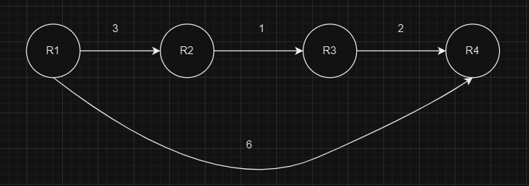
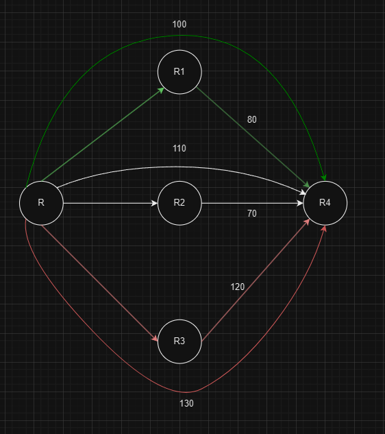

# EIGRP

[EIGRP introduce](https://www.geeksforgeeks.org/eigrp-fundamentals/)

- EIGRP (Enhanced interior gateway routing protocol) Một giao thức routing `sử dụng cả distance-vector và link-state` (hybrid), hay còn là advanced distance vector - `có chia sẻ thông tin giữa láng giềng và sử dụng các bảng route table, topology table và neighbor table (cách dùng các bảng này trong EIGRP khác hẳn OSPF)`
  - EIGRP khác với distance-vector truyền thống ở chỗ nó quảng cáo không chỉ thông tin đích và số liệu mà còn thông tin về toàn bộ cấu trúc liên kết cho neighbor + chỉ gửi các bản cập nhật cần thiết để tiết kiệm băng thông
  - EIGRP sử dụng các thông tin trong bảng topology table để đưa quyết định tuyến đường tốt nhất và nhanh chóng thích ứng với mạng 

- Hoạt động với `classless IP và 100% chống loop trong khi routing` - `chống loop bằng Feasible condition`
- `Convergence nhanh hơn so với OSPF và RIP trong khoảng 5s/lần` (RIP convergence 30s, OSPF convergence 10s) - Các router chỉ cần cập nhật route table trong một lần duy nhất, nếu có sự thay đổi chỉ cần thực hiện thay đổi đối với router liên quan
- Dễ dàng cấu hình hơn OSPF
- Dùng địa chỉ `multicast: 224.0.0.10` (Dùng multicast để giao tiếp và thiết lập kết nối giữa các router với EIGRP)
- Có thể thực hiện summary thủ công (thao tác nhằm tập hợp các IP theo network để giảm độ phức tạp trong routing) ở trên bất kỳ điểm router nào trên vùng mạng - trong khi OSPF có auto và manual nhưng việc này chỉ được thực hiện ở vùng backbone area (ABR)
- Hỗ trợ định tuyến cho đa giao thức thuộc lớp 3 - trong khi OSPF chỉ hỗ trợ cho IP
- Giao thức hoạt động trên lớp mạng - protocol số 88
- Có 3 giá trị AD (giá trị thể hiện độ tin cậy) trong EIGRP:

| route | AD | Giải thích |
|----------|----------|----------|
| Summary route | 5 AD | Khi mà các IP được tập hợp vào thành 1 network có chung prefix => AD giảm xuống => độ tin cậy tăng lên |
| Internal route | 90 AD | ... |
| External route | 170 AD | ... |
 
# Các process trong EIGRP
- Becoming neighbors: 2 router trở thành neighbor khi đều được cấu hình EIGRP
- Exchange routing information: các router lân cận trao đổi cấu trúc mạng cho nhau
- Choose the best routes: chọn tuyến đường tốt nhất từ bảng route đã xây dựng

# EIGRP sử dụng các bảng gì để giao tiếp giữa các router?
- Neighbor table: Dang sách các router kết nối trực tiếp và có sử dụng EIGRP

| Next-hop router | interfaces |
| ---- | ---- |
| ... | ... |

- Topology table: Danh sách các router được học qua EIGRP

| Destination |  |
| ---- | ---- |
| ... | ... |

- Routing table: Liệt kê best route

| Destination 1 |  |
| ---- | ---- |
| ... | ... |

# STEP1: Các xây dựng láng giềng

[Cách tính metric trong EIGRP](https://www.computernetworkingnotes.com/ccna-study-guide/eigrp-metric-k-values-explained-with-examples.html)

- Khi EIGRP đã được cấu hình trên router:
  1. EIGRP gửi hello cho router lân cận, trong gói hello cần lưu ý các điểm sau:
    - `hello interval` - default gói hello 5s/lần với băng thông cao hoặc 60s/lần với băng thông thấp
    - `hold timer` = x3 default (15s) - thời gian đợi nhận hello trước khi router quyết định láng giềng đã "dead"
  2. Khi gói hello được gửi, các thông số sau cần được xác nhận tương đồng giữa 2 router
    - `AS number`: Số định danh của một vùng mạng tự trị (mạng doanh nghiệp), có thể hiểu là một vùng mạng chứa các thiết bị thuộc một quản lý chung
    - `Subnet`: Cùng subnet
    - `K-value`: giá trị để đo metri cho EIGRP
      - K1 - Bandwidth (thường được dùng)
      - K2 - Load (hiếm được dùng)
      - K3 - Delay (thường được dùng)
      - K4 - Reliability (thường được dùng)
      - K5 - MTU
    - `Authentication`: đặt password ở trên 2 đầu router để tăng xác thực, hay còn gọi là xác thực MD5
  3. Gói hello từ đầu router này sẽ gửi lại sau khi đã match các parameter với đầu router bên kia để thiết lập kết nối
  4. `Exchange thông tin routing` (nhưng EIGRP không sử dụng UDP hay TCP để trao đổi thông tin) là `EIGRP sử dụng RTP (reliable transport protocol)` [sơ qua giao thức RTP](https://study-ccna.com/eigrp-reliable-transport-protocol-rtp/)

# STEP2: Cách chọn best route

- Ví dụ đơn giản dưới đây để nói về 2 khái niệm mà EIGRP sẽ sử dụng để chọn ra route ngắn nhất - EIGRP sẽ sử dụng các K-value để tính metric, sau đó các giá trị này sẽ được dùng để tính `FD (Feasible distance)` và `AD (Advertised distance/Reported distance)` để chọn ra best route và backup route
  - R2 đến R4 có 2 hop tới R4, metric là 1+2=3 => đây là AD
  - R1 đến R4 có 3 hop tới R4, metric được tính là 6 => đây là FD

- Để chọn best route cần tuân theo các điều kiện sau đây:
  - FD min => Successor
  - FD > FD min & AD < FD min => Feasible successor

| Next-hop | FD | AD |
| ---- | ---- | ---- |
| R1 | 100 | 80 |  
| R2 | 110 | 70 | 
| R3 | 120 | 120 | 

- Successor: FD min => 100 (FD nhỏ nhất) - Đây là best round
- Feasible successor: => 70 (AD < FD min) - Đây là backup round

> Trong trường hợp mà không có backup, EIGRP sẽ gửi các packet để cập nhật giữa các router

> Tiếp theo các successor sẽ được đưa vào Routing table để sử dụng

# EIGRP chống loop

[Cách EIGRP chống loop với feasible condition](https://www.practicalnetworking.net/stand-alone/eigrp-feasibility-condition/)

- Trường hợp này xảy ra khi R4 muốn quảng cáo mạng 9.9.9.0/29 cho R3, R3 đó lần lượt quảng cáo tới R2, R2 lần lượt quảng cáo nó tới R1, rồi cuối cùng quay lại R3.
- Feasible condition sẽ ngăn chặn lặp khi: AD > FD
- Ví dụ:
  - Con đường tốt nhất của R3 đến 9.9.9.0/29 là thông qua R4, vì nó có Khoảng cách khả thi thấp nhất là FD = 2816.
  - Tuyến đường từ R1 chứa RD là 5888. Giá trị này cao hơn FD của R3 (2816), do đó, quảng cáo từ R1 vi phạm Điều kiện khả thi và sẽ bị R3 bỏ qua.

# EIGRP chấp nhận loop-free path  - tuyến đường không xảy ra vòng lặp

- Xét với trường hợp quảng cáo mạng 9.9.9.0/29 broadcast, R2 lúc nào nhận được 2 quảng cáo: từ R3 và R1. Trong trường hợp này, R2 sẽ nhận nguồn có best FD (FDmin)
- Tuyến đường từ R1 chứa RD là 4096. Giá trị này thấp hơn FD của R2 từ R3 (4864), do đó, quảng cáo từ R1 sẽ được chấp nhận vì nó không vi phạm Điều kiện khả thi.

> Cả hai tuyến được lưu là successor và feasible successor như cách EIGRP chọn best route bình thường

