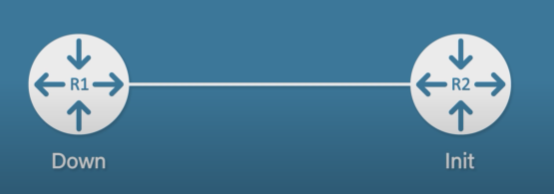
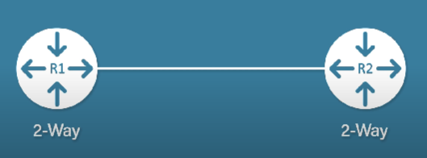

# OSPF (Open Shortest Path First) là gì?

[OSPF routing protocol](https://www.geeksforgeeks.org/open-shortest-path-first-ospf-protocol-states/)

- là `link-state routing`, Tìm đường dẫn tốt nhất giữa bộ định tuyến nguồn và bộ định tuyến đích bằng cách sử dụng đường dẫn ngắn nhất, mỗi một router có một route map, tức route table của các router đồng nhất với nhau và chức đầy đủ thông tin, là `một trong các IGPs - `, phương pháp tính theo `Link-state`
- AD value: 110
- Metric: bandwidth
- `Hoạt động trên nền giao thức IP`, protocol-id là 89
- `Multicast 224.0.0.5` để liên lạc thông thường và `224.0.0.6 ` để cập nhật lên router được chỉ định (DR)/router được chỉ định dự phòng (BDR)
- Thường loop trong OSPF xảy ra do config không nhất quán khi có sự thay đổi về cấu trúc mạng

- Về cơ bản, OSPF đưa các router kết nối và lựa chọn best route trong 3 quá trình cơ bản sau:
  - `Becoming neighbors`: trở thành láng giềng được thiết lập trên cùng một kết nối
  - `Exchange DB information`: các router trao đổi LSDB (Link State Database)
  - `Choose the best routes`: mỗi router chọn best route và thêm vào routing table từ các LSDB đã học được từ nhau

<!-- # OSPF được dùng khi nào? -->
- 

# Các term của OSPF
- `Route ID`: giá trị này tự xuất hiện để định danh router khi router tham gia vào giao thức OSPF
  - Router ID có dạng A.B.C.D (có dạng như một ip address)
  - Lấy router id dựa trên `IP cao nhất` (so sánh các số trong từng octet của IP address, giá trị cao nhất là được coi là IP cao nhất) trong các `interface đang active` (interface có trạng thái up/up - cổng up và protocol up) `(ưu tiên loopback interface nếu có)` - [understanding loopback interface](https://study-ccna.com/loopback-interface-loopback-address/)

- `Router priority`: gồm giá trị 8-bit được gán cho router đang chạy OSPF, được dùng để lựa chọn DR và BDR trong broadcast network
- `Designated router (DR)`: router được chỉ định để giảm thiếu số vùng lân cận được hình thành. Trong broadcast network, router yêu cầu cập nhật cho DR và DR sẽ phản hồi bằng cách cập nhật DR. Hay nói cách khác đây là con router điều phối thông tin (nếu không có DR việc cập nhật thông tin định tuyến sẽ trở nên hỗn loạn khi có bất cứ sự thay đổi trong mạng)
- `Backup Designated router`: một router được chỉ định làm backup thay cho DR nếu DR không hoạt động
- `DR and BDR election`: Router có mức độ ưu tiên cao sẽ được chỉ định làm DR (xem xét dựa trên 1-loopback cao nhất, 2-IP cao nhất trên các interface đang up)

# STEP1: OSPF thành lập quan hệ láng giềng thành công khi nào?
- Để thành lập thành công để các router có thể gửi packet hello cho nhau thì ở trên 2 router cần phải được config tương tự nhau ở cả hai đầu như sau:
  - `Area-id`: chia thành nhiều vùng khác nhau để thuật toán tìm đường diễn ra hiệu quả trong trường hợp có nhiều vùng mạng kết nối với nhau = nhiều router - đây là với trường hợp mạng đa vùng (Với TH mạng đơn vùng thì chỉ cần set 2 router cùng 1 area là được)
  - `Subnet/Subnet mask`: Thiết lập IP và subnet mask cho interface kết nối giữa 2 router saoo cho cùng subnet với nhau
  - `Hello (10s)/Dead timer(40s)`: Có thể hiểu set cặp giá trị này để: hello timer thời gian định kỳ router gửi hello cho router đầu kia - deadtimer thời gian router đợi gói hello từ router kia đến (nếu không set 2 cặp giá trị này khớp nhau trên 2 đầu router thì sẽ có trường hợp dead timer bị hết và router sẽ coi như router láng giềng kia không tồn tại - đồng nghĩa với việc nó sẽ bỏ hết tất cả thông tin liên quan đến người láng giềng kia)
  - `Authentication`: trong trường hợp có thêm những router khác đấu vào switch đang có, admin không muốn những router khác tham gia vào OSPF route thì set password trên những đầu router sử dụng OSPF để tăng tính xác thực
  - `Stub area flag`: thuộc về chỉnh sửa trong milti area setup

> Tất cả các thông tin ở đây đều phải same ở cả 2 đầu router

# STEP2: Các trạng thái của OSPF trong quá trình thành lập láng giềng
- Khi được thiết lập OSPF đi qua một số trạng thái nhất định sau:
  1. `Down`: không có gói hello packet nào được gửi trong trạng thái này (down ở đây tức là quá trình khởi động truyền thông tin neighbor chưa bắt đầu chứ không phải là việc chưa thiết lập kết nối vật lý)
  2. `INIT`: Khi nhận được gói hello từ router đầu kia gửi, router đầu nhận sẽ chuyển sang trạng thái INIT (nếu các thông tin phải đồng bộ ở cả 2 bên router)
  3. `2WAY`: trạng thái xảy ra khi 2 router đều gửi và nhận được gói hello từ nhau (tức 2 router này đã thiết lập kết nối cả 2 bên) - _Lưu ý, ở giữa quá trình 2WAY và Exstart, quá trình lựa chọn DR và BDR sẽ diễn ra_

  4. `Exstart`: DBD rỗng (DBD null) được chuyển giữa 2 router. `Quá trình lựa chọn master và slave diễn ra` (ai có router id cao nhất được chọn là master) - _Việc lựa chọn master - slave để xem ai có quyền gửi DBD trước_
  5. `Exchange`: lựa chọn master - slave xong, `quá trình trao đổi DBD bắt đầu` (tức các router đang trong quá trình kiểm tra DBD của )
  6. `Loading`: LSR (Link state request), LSU (Link state update) và LSAck (Link state acknowledgement) (quy trình này gửi request - gửi update - gửi thông báo đã nhận được update)
  7. `Full`: quá trình đồng bộ thông tin đã xong, OSPF đã sẵn sàng hoạt động khi các router chuyển sang state full

# STEP2.1: lựa chọn DR và BDR trước khi chuyển state router sang trạng thái exstart
- `Ưu tiên trước nhất ` DR và BDR được lựa chọn dựa trên: `router priority` (default là 1), admin có thể setup router priority cho các router nằm trong giá trị khoảng 0-255 -> router nào có số cao nhất thì sẽ được chọn là DR, cao thứ 2 thì làm BDR (nếu set pri là 0 thì router đó không tham gia vào bầu DR)
- `Trong trường hợp TH1 không sử dụng được, router nào có IP cao nhất sẽ được chọn làm DR, router cao thứ 2 sẽ làm BDR` (xem lại cách lựa chọn router ID ở bên trên)

> `Luật không chiếm quyền`: kể cả router nào đến sau có số pri cao và IP cao nhất sau khi đã được setup, router đó cũng không được chọn làm DR (đảm bảo sự ổn định của tiến trình)

# STEP3: Tính cost để chọn đường đi ngắn nhất

- Metric = 10^8 / bandwidth (bitpersec) trong đó
  - 10^8 là bandwidth được tham chiếu (tương đương 100Mbps)
  - bandwidth tốc độ băng thông của đường truyền hiện tại

> Lưu ý: metric không chấp nhận số thập phân, tức metric là số nguyên gần nhất

- Để tính metric trong đường truyền dài hơn khi qua các router khác nhau, cộng các metric trên mỗi đường truyền để tính ra tổng cost

# Các thông tin config khác

> Wildcard mask

- Giống như subnet mask nhưng đối lập, wildcard mask sử dụng trong ACL context (access list) để cho phép hoặc hạn chế IP hoặc network nào sử dụng OSPF 
  - Ví dụ với network 10.0.1.0/25 thì wildcard mask sẽ là 0.0.0.127 (Điều này có nghĩa là packet hello sẽ gửi cho các mạng thuộc 10.0.1.X)
  - Tức wildcard mask so sánh và chỉ ra tất cả phần bit mà các host trong network sử dụng

# Lab- Cách cấu hình OSPF (setup các router cùng thuộc 1 area id)

> Enable OSPF trên router và các cổng

1. `Router(config)#router ospf 1` dùng để bật OSPF trên router với id là 1
2. `Router(config-router)#network 192.168.2.0 0.0.0.255 area 0` để set network sử dụng OSPF, wildcard mask và area (setup tương tự với các network khác mà muốn sử dụng OSPF)

_Các router tự tìm nhau để cập nhập DBD (quá trình thiết lập láng giềng đã hoàn thành)_

Như vậy các host ở các router khác nhau đã có thể giao tiếp được với nhau

- Để xem các thông tin khác như router ID, DR, dùng `Show ip ospf interface ??? `