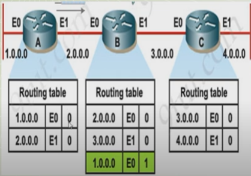
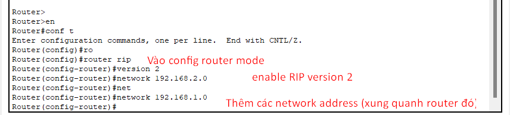

# RIP (Routing Information Protocol) là gì?

[RIP là gì?](https://www.geeksforgeeks.org/routing-information-protocol-rip/)

- Giao thức tính route với số hop ít nhất, hoat động trên network layer, `hoạt động trên nền giao thức UDP`, là một trong các IGPs (Interior gateway protocol)
- Giá trị AD (Administrative Distance): 120 và `phương pháp tính theo distance-vector `(Khoảng cách bao xa để đến đích - đi hướng nào để đến đích)
- Metric: hop
- Sử dụn port 520
- Sau khi được đánh path thì router có thể dẫn đường (route) cho routed protocol của mỗi thiết bị(hay là cách gọi khác của việc dùng IP đánh IP address cho các thiết bị)

> Hop count: là số lượng router xuất hiện giữa mạng nguồn và mạng đích. Số hop càng ít thì càng được ưu tiên

- `loop có thể xảy ra trường hợp khiến cho số hop tăng lên luôn tục do cách hoạt động của update route broadcast`:
  - Trong trường hợp một mạng bị mất như trường hợp dưới, không thể kết nối với mạng 4.0.0.0. 
  1. router B đã có mạng 4.0.0.0 do router C cập nhật cho trước đó 4.0.0.0 - hop 1
  2. Do mất kết nối với mạng 4.0.0.0, router drop mạng đó khỏi routing table
  3. Router B cập nhật routing cho router C, router lại có mạng 4.0.0.0 - hop 2 (do truyền đến router chưa có mạng đó nên router ngầm hiểu phải nhảy 1 thiết bị nữa mới đến mạng đó)
  4. Router C cập nhật lại routing cho router B, lúc này router B có 4.0.0.0 - hop 3
  5. Cứ như thế lỗi này xảy ra với các router và loop xảy ra

    

    - Trường hợp trên cũng có một trường hợp loop nữa xảy ra do
    1. Có một traffic cần được chuyển đến mạng 4.0.0.0
    2. router B nhận được và check routing table -> chuyển traffic ra cổng E1
    3. router C nhận được và check routing table -> chuyển traffic về cổng E0
    4. 2 traffic được chuyển đi chuyển lại giữa 2 router và xảy ra loop

Các đặc điểm thường thấy của RIP:
  - Update network định kỳ (30s/lần), Update các thông tin routing luôn là broadcast, Bảng routing được liệt kê đầy đủ trong các update được gửi
  - Không build được full map của network trong giao thức này (tức RIP chỉ follow theo hướng và tính khoảng cách trong network để đến đích đến)
  - Hoạt động theo cách sử dụng routing theo tin đồn (routing on rumor)

> RIP chia sẻ thông tin network với các router lân cận, tất cả các router đều được cập nhật bảng định tuyến sau một khoảng thời gian nhất định

# Dùng RIP khi nào?
- Dùng trong small network, cả RIPv1 và RIPv2 (nhưng chủ yếu được dùng trong giảng dạy)

# Có những cơ chế chống loop nào trong RIP
- RIP ngăn chặn vòng lặp bằng cách 
  - `giới hạn số hop được cho phép (<=15)`, route nào có số bước nhảy vượt 15 là mạng không thể kết nối được
  - Cập nhật ngay lập tức routing table cho các router khi phát hiện thay đổi về mạng (không phải đợi 30s để chuyển update)
  - Split horizon: chống cập nhật lại thông tin routing đến router sở hữu thông tin đó

# Cách AD hoạt động và routing

> AD là giá trị đo độ tin cậy của một con đường đến destination IP. Nằm trong khoảng `AD 0-255`. Metric `càng nhỏ thì độ tin cậy càng cao` [Abour AD value in routing](https://www.computernetworkingnotes.com/ccna-study-guide/administrative-distance-ad-explained.html)

- Sẽ có những trường hợp có nhiều con đường cùng dẫn đến một địa chỉ đích, khi đó AD sẽ cho biết router nên lựa chọn con đường nào để đi, VD: RIP có AD là 120, EIGRP là 90 thì router sẽ lựa chọn route có AD 90 để định tuyến hiệu quả nhất

_Tùy vào giao thức mà admin cấu hình, trong trường hợp này là RIP - giao thức ưu tiên số hop nhỏ nhất, router sẽ lựa chọn network 10.0.0.0/8 là đường đi_

_Trong trường hợp giao thức EIGRP được sử dụng, tuyến có băng thông cao = tuyến có tốc độ tải nhanh sẽ được sử dụng_

# RIP timer
- `Update timer`: thời gian các router gửi cập nhật routing table giữa nhau
- `Invalid timer`: không có update nào đến trong vòng 180s, destination router không hợp lệ 
- `Hold down timer` : đây là thời gian một router này chờ router lân cận gửi cập nhật định tuyến cho nó (default là 180s)
- `Flush time`: thời gian mà để router tiếp nhận giá trị đầu vào (trong khi cập nhật định tuyến), trong vòng thời gian nhất định (60s default) không nhận được giá trị đầu vào, router sẽ loại bỏ bản cập nhật đó

# Các loại RIP

| RIP version 1 | RIP version 2 |
| -------- | -------- |
| kiểu giao thức định tuyến classful | kiểu giao thức định tuyến classless |
| Không gửi kèm subnet | gửi kèm subnet |
| Gửi gói cập nhật định kỳ 30s/lần - broadcast - Source IP: 10.1.0.1 - Des IP: 255.255.255.255 | Gửi gói cập nhật định kỳ 30s/lần - multicast - Source IP: 10.1.0.1 - Des IP: 224.0.0.9 |
| không tổng hợp routing | có tổng hợp routing trước khi chuyển đi |
| Không xác thực các update | có xác thực |
| Không hỗ trợ VLSM | có hỗ trợ

- Riêng RIPng là routing protocol sử dụng IPv6

# Lab (với RIP ver 2)

1. Tạo mô hình mạng như hình và gán các giá trị gateway, ip address và subnet mask phù hợp với các máy tính
2. Setup các ip address vào các router interface
3. Vào các CLI của các router và thêm các network address vào các route table trong mỗi router
  - `Router(config)#router rip`
  - `Router(config-router)#version 2` bật RIP version 2
  - `Router(config-router)#network 192.168.2.0` để thêm network address vào bảng định tuyến (phải là network address xung quanh nó)
  - `Router(config-router)#no auto-sumary` dùng để tránh RIP tập hợp các subnet thành một mạng tổng hợp theo class (chẳng hạn nếu bật auto-sumary, các pc ở các router đều có prefix giống nhau thì nó sẽ tổng hợp thành một network lớn hơn -> dẫn đến định tuyến không mong muốn, ping lúc được lúc không) [Explain RIP auto-sumary](https://youtu.be/w5Ai9UNwILs?si=YmnRNyIN_p0_2owl)
  - làm tương tự với các router còn lại
4. Có thể dùng `show ip route` để check xem các router học bảng route của nhau như thế nào, `show ip route rip` để chỉ xem các route mà router đã học được

