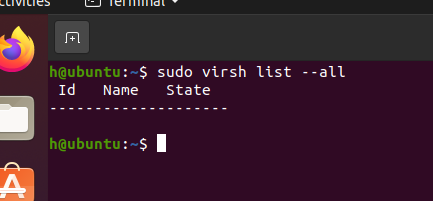
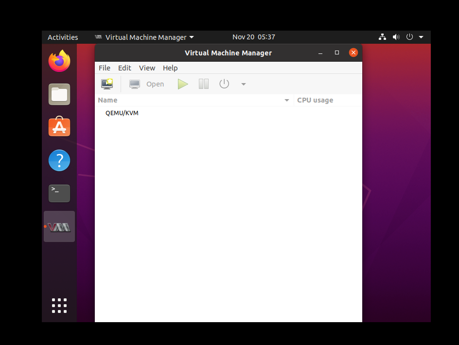
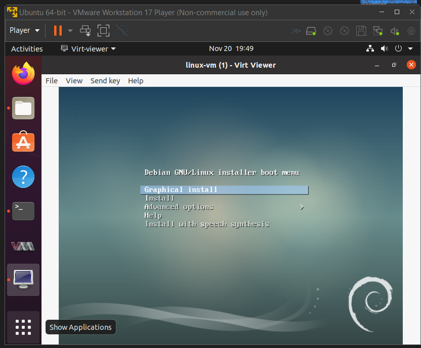
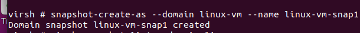
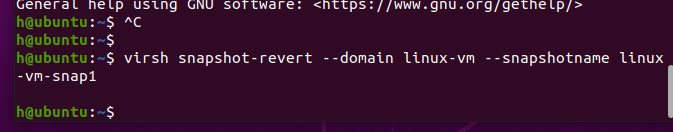

# QEMU là gì?

[Sự khác biệt giữa QEMU và KVM](https://linuxconfig.org/qemu-vs-kvm-hypervisor-whats-the-difference)

[Home page QEMU](https://www.qemu.org/docs/master/about/index.html)

> QEMU là Quick Emulators - là một trình giả lập và ảo hóa máy mã nguồn mở và chung, có thể được dùng như một giả lập (emulator) và cũng có thể được sử dụng như máy ảo (hypervisor) - `QEMU là emulator và hypervisor`
- Trong đó:
  - `Emulator`: hoạt động mô phỏng phần mềm nhưng không cần đến khả năng tương thích với phần mềm đó với hệ điều hành cụ thể (cụ thể là emulator sẽ cung cấp một môi trường tương thích để chạy phần mềm đó, có thể nói performance trong emulator có thể gần tương đương với máy native - hoặc là máy host) - `hay nói cách khác emulator là phần mềm cho phép một thiết bị này giả lập phần cứng của một thiết bị khác` [How emulator works?](https://youtu.be/10c6zC8IXjw?si=aX1K_iOGB8XFaPg7).
  - `Hypervisor`: tạo VM và quản lý VM (phân bổ và quản lý việc lập lịch trình tài nguyên VM dựa trên tài nguyên vật lý. Phần cứng vật lý vẫn thực thi, do đó CPU vẫn thực thi các lệnh CPU theo yêu cầu của máy ảo)

- Trong Linux: QEMU mô phỏng một phần cứng ảo, bao gồm đĩa, bộ nhớ, CPU, cổng nối tiếp, đồ họa và các thiết bị khác => cho phép người dùng sử dụng phần mềm gì đó mà không tương thích với phần cứng của máy tính.

- `QEMU là type 2 hypervisor`

# KVM là gì?

[what is KVM?](https://www.redhat.com/en/topics/virtualization/what-is-KVM)

- KVM (Kernel-based virtual machine) là một công nghệ ảo hóa mã nguồn mở có sẵn trong linux (KVM là một phần của linux). Đặc biệt là, KVM có thể biến Linux thành một hypervisor để quản lý các máy ảo chạy trong linux
- KVM cho phép các người dùng có thể tạo và chạy các CPU được tạo
- `KVM là type 1 hypervisor (bare-metal)`

> Tất cả các trình ảo hóa đều cần một số thành phần cấp hệ điều hành—chẳng hạn như trình quản lý bộ nhớ, bộ lập lịch quy trình, ngăn xếp đầu vào/đầu ra (I/O), trình điều khiển thiết bị, trình quản lý bảo mật, ngăn xếp mạng, v.v.—để chạy máy ảo.

> KVM sẽ bao gồm được tất cả các thành phầm trên 

- Mọi feature mà linux có thì KVM cũng có các feature tương tự:
  1. KVM sử dụng kết hợp Linux được tăng cường bảo mật (SELinux) và ảo hóa an toàn (sVirt) để tăng cường bảo mật và cách ly VM
  2. KVM có khả năng sử dụng mọi loại lưu trữ mà Linux hỗ trợ. Điều này bao gồm cả ổ đĩa cục bộ và lưu trữ kết nối mạng.
  3. Sử dụng được nhiều nền tảng phần cứng
  4. KVM thừa kế khả năng quản lý memory của Linux
  5. KVM có khả năng di chuyển giữa các VM đang chạy mà không bị gián đoạn. Đồng thời vẫn lưu trữ được các trạng thái hiện tại của các VM
  6. Bao gồm các bộ lập lịch và quản lý resource như Linux
  7. Chạy các ứng dụng trong VM với độ trễ thấp

# Sử dụng QEMU để quản lý các virtual machine

[sử dụng các máy ảo và quản lý máy ảo trong linux](https://linuxconfig.org/how-to-create-and-manage-kvm-virtual-machines-from-cli)

> Các yêu cầu cần thiết:
  - Root access
  - Các package cần thiết:
    - qemu-kvm – The main package
    - libvirt-daemon-system
    - libvirt-client - chứa `virsh` và các ứng dụng phía máy client
    - bridge-utils - để kiểm soát các ethernet device

# Pre-setup for virtual machine

1. Để chạy KVM, ta cần processor mà support hardware ảo.
  - Với Intel: vmx
  - Với AMD: svm
- Dùng `egrep -c '(vmx|svm)' /proc/cpuinfo` để count ký tự vmx hoặc svm trong file có path là /proc/cpuinfo xem cpu có hỗ trợ hardware ảo với chip intel hoặc amd không
> 0 thì CPU không hỗ trợ, 1 thì có (cả hai đều được nhưng trong TH không hỗ trợ hardware ảo thì vẫn có thể tạo và chạy máy ảo nhưng sẽ chậm hơn)

_Lưu ý: đảm bảo có bật công nghệ hỗ trợ ảo hóa trong BIOS_

_Lưu ý 2: chế độ support virtualization có trong CPU chỉ hoạt động với một hypervisor duy nhất (tham khảo thêm:[support virtualization doesn't work in VM](https://superuser.com/questions/1610226/my-processor-supports-intel-virtualization-technology-but-why-linux-vm-still-co))_

# Cài đặt KVM

[Cài đặt QEMU/KVM](https://help.ubuntu.com/community/KVM/Installation)

1. Cài đặt các package quan trọng (với các version từ 18.10 và cao hơn): `sudo apt-get install qemu-kvm libvirt-daemon-system libvirt-clients bridge-utils virt-manager`
  - Trong đó:
    - qemu-kvm: cài đặt hypervisor để tạo và quản lý các VM (làm phần mềm và phần cứng để chạy máy ảo)
    - libvirt-daemon-system và libvirt-clients: cung cấp các API và tool để quản lý các VM
    - bridge-utils: phần mềm cung cấp bridge để kết nối giữa các VM và host
    - virt-manager: cũng là một phần mềm dùng để quản lý các VM nhưng dưới dạng GUI

2. Add user vào libvirt group và kvm group để cho nhóm người dùng này có quyền tạo virtual machine: `sudo usermod -a h -G libvirt` - cho user h vào group libvirt - `sudo usermod -a h -G kvm`

3. Dùng `virsh list --all` để kiểm tra các guest và hypervisor (lưu ý là với người dùng nào mới có thể xem VM mà người đó tạo, )

4.  Khởi động libvirt daemon với: `systemctl enable --now libvirtd`

# Quản lý VM với virt-manager
- `sudo apt install virt-manager` để tải GUI quản lý VM về (giống với Virtual box, VMWare)

- Các thao tác thêm, sửa, xóa và dùng máy ảo giống với virtual box, VMWare

# Tạo máy ảo
- Dùng virt ultility để tạo VM mới

> virt-install --name=linuxconfig-vm \
> --vcpus=1 \
> --memory=1024 \
> --cdrom=/tmp/debian-9.0.0-amd64-netinst.iso \
> --disk size=5 \
> --os-variant=debian8

  - name=linuxconfig-vm: đặt tên cho VM
  - vcpus: set core cpu cho VM
  - memory: set mem cho VM
  - cdrom: path dẫn đến file iso OS
  - disk size: kích thước disk set cho VM
  - os-variant: loại OS

#  Clone máy ảo
- Dùng virt ultility để tạo clone từ VM đã tồn tại (lưu ý trước khi chạy clone cần phải `đảm bảo VM được clone ở state shut off`)

virt-clone \
--original=linux-vm \
--name=linux-vm-clone \
--file=/var/lib/libvirt/images/linuxconfig-vm.qcow2

- Trong đó:
  - original: VM ảo muốn clone
  - name: tên VM mới sau khi clone
  - file: tạo tham chiếu tới tất cả các đĩa cứng ảo liên quan tới VM gốc

# Quản lý VM đã tạo với virsh
- Một số command chung dùng để quản lý các VM

[Quản lý VM guest với virsh](https://bobcares.com/blog/manage-kvm-guest-virtual-machines-using-virsh-commands/)

> `virsh là một tool đi kèm với libvirt-client package để quản lý các VM dưới dạng CLI`
  - `virsh list`: liệt kê các VM đang chạy (virsh list --all để list tất cả các VM)
  - `virsh start <domain>`: chạy VM (có thể thay `start` bằng `autostart [--disable]` để cho VM tự chạy khi host reboot)
  - `virsh shutdown <domain>`: dừng VM nhẹ nhàng
  - `virsh destroy <domain>`: force dừng VM
  - `virsh reboot <domain>`: khởi động lại 1 VM
  - `virsh edit <domain>`: sửa thông tin config VM
  - `virsh dominfo <domain>`: xem các thông tin chi tiết trong một VM
  - `virsh suspend/resume <domain>`: tạm dừng 1 VM
  - `virsh save <domain> domain_name.save`: lưu 1 VM dưới dạng 1 file
  - `restore domain_name.save`: restore 1 VM từ 1 file
  - Để xóa hẳn 1 VM khỏi storage, dùng lần lượt các command sau đây:
    1. `virsh destroy <domain>` (trong trường hợp VM này vẫn chạy)
    2. `virsh undefine <domain>`: bỏ xác định VM để VM không xuất hiện trong pool
    3. `virsh pool-refresh default`: đưa storage về default
    4. `virsh vol-delete --pool default <domain>.qcow2`: xóa VM trong file .qcow2

## Các state của một VM đã tạo

[VM state](https://access.redhat.com/documentation/en-us/red_hat_enterprise_linux/7/html/virtualization_deployment_and_administration_guide/chap-managing_guest_virtual_machines_with_virsh#domain-states)

- Có 2 yếu tố ảnh hưởng tới các state của VM:
  - `Transient VM`: máy ảo tạm thời, sau một khoảng thời gian cho phép, VM này sẽ quay trở lại default (không lưu thông tin người dùng cá nhân nào sau khi reboot)
  - `Persistent VM`: máy ảo duy trì, người dùng có thể lưu các thông tin cá nhân trong quá trình làm việc với máy (có thể được coi như một máy tính cá nhân bình thường)
- Trong thời gian VM vẫn tồn tại (tức là chưa bị người dùng xóa hoàn toàn khỏi hypervisor), có thể có các state sau đây:
  - `Undefined`: Máy ảo chưa được xác định hoặc tạo
  - `Shut off`: Máy ảo đã được xác định nhưng không được chạy (với state này đối với transient VM, máy ảo sẽ không còn tồn tại)
  - `Running`: Máy ảo đã được xác định và đang chạy
  - `Paused`: Máy ảo đang tạm dừng hoạt động (suspend) (tức VM được tạm dừng và coi như là VM đó gần như vẫn hoạt động)
  - `Saved`: gần như paused, nhưng máy ảo lưu các thông tin config vào persistent storage (tức VM state được lưu vào disk và VM close hẳn)

## Cách tạo snapshot của VM (capture VM state)

[How to create snapshot](https://www.cyberciti.biz/faq/how-to-create-create-snapshot-in-linux-kvm-vmdomain/)

- Dùng `virsh snapshot-create-as --domain <domain> --name <snap_name>` để tạo snapshot cho một domain cụ thể (việc lưu VM state bao gồm cả ổ đĩa, CPU, memory và trạng thái của VM)

_Lưu ý: 1-Đảm bảo VM trong trạng thái shut off; 2-Đảm bảo VM sử dụng qcow2 disk_

- Dùng `virsh dumpxml freebsd | grep -i qemu` để kiểm tra trong file xml type có dạng qcow2 (qcow2 hay QEMU copy-on-write version 2, là một disk image, được sử dụng bởi phần mềm ảo hóa QEMU, nó chịu trách nhiệm lưu trữ nội dung ổ cứng VM QEMU [qcow2 là gì?](https://fileinfo.com/extension/qcow2))

- Trong trường hợp không muốn phải shutdown VM, sử dụng

`virsh snapshot-create-as --domain <domain> \`
`--name "snap_name" \`
`--description "Snapshot before upgrading to FreeBSD 11" \`
`--live`

trong đó: `--live` để duy trì VM vẫn chạy trong quá trình tạo snapshot

## Cách revert một VM về một snapshot
- Dùng `virsh snapshot-revert --domain <domain> --snapshotname <snap_name> --running` để đưa một VM về một snap đã tạo và chạy VM đó ngay lập tức với --running

## Delete
- Dùng `virsh snapshot-delete --domain freebsd --snapshotname 5Sep2016_S2` để delete snap của một VM

## Cách tạo snapshot của một VM (capure disk state)
- Trong trường hợp muốn ghi disk state của VM thay vì cả VM state (việc lưu trạng thái ổ đĩa sẽ tạo ổ đĩa ảo, ghi nhớ được các resource trong các file trong disk)

`virsh snapshot-create-as --name "<snap_name>" \`
`--description "RHEL 7.6 snapshot" \`
`--disk-only \`
`--live`
`--domain <domain>`

<!-- ## Start VM (detail)

[Start VM](https://access.redhat.com/documentation/en-us/red_hat_enterprise_linux/7/html/virtualization_deployment_and_administration_guide/sect-starting_suspending_resuming_saving_and_restoring_a_guest_virtual_machine-starting_a_defined_domain)

- Dùng `virsh start domain; [--console] [--paused] [--autodestroy] [--bypass-cache] [--force-boot]` trong đó
  - `--console`: khởi động VM ở level 3 (CLI)
  - `--paused`: khởi động VM ở paused state
  - `--autodestroy`: virsh disconnect đồng nghĩa với việc VM sẽ tự động shut off
  - `--bypass-cache`: được dùng nếu VM ở trong `managedsave`
  - `--force-boot`: loại tất cả các `managedsave` và chạy boot mới cho VM đó

## Restore VM (detail)

[Restore VM](https://access.redhat.com/documentation/en-us/red_hat_enterprise_linux/7/html/virtualization_deployment_and_administration_guide/sect-starting_suspending_resuming_saving_and_restoring_a_guest_virtual_machine-starting_a_defined_domain)

- Dùng `virsh save` để lưu trạng thái hiện tại của máy ảo
- Dùng `virsh restore <file> [--bypass-cache] [--xml /path/to/file] [--running] [--paused]` để phục hồi VM từ lệnh `virsh save'` đã dùng trước đó, trong đó:
  - `<file>`: tên file đã save trước đó
  - `--bypass-cache` dùng để tránh file system cache (tránh bị chậm quá trình restore)
  - `--xml /path/to/file` phải dùng khi save VM dưới dạng file XML để restore
  - `--running` chạy ngay file này để restore đè lên VM đang chạy
  - `--paused` chạy ngay file này để restore đè lên VM đang suspend -->