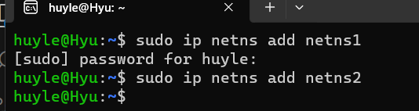
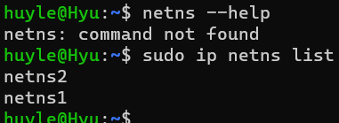
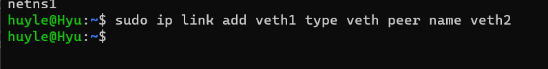
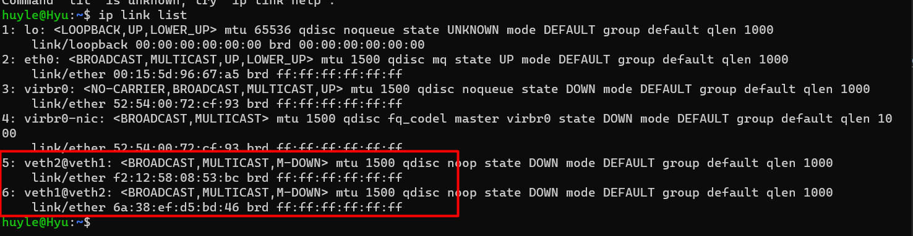
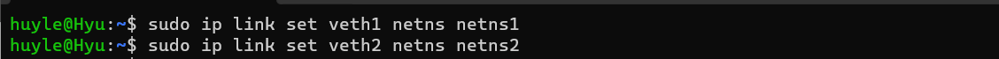
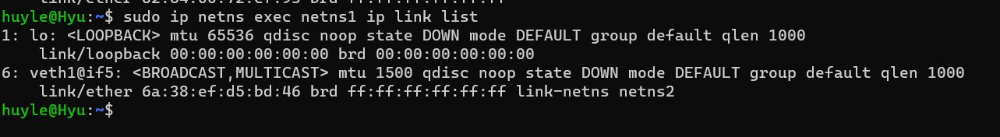
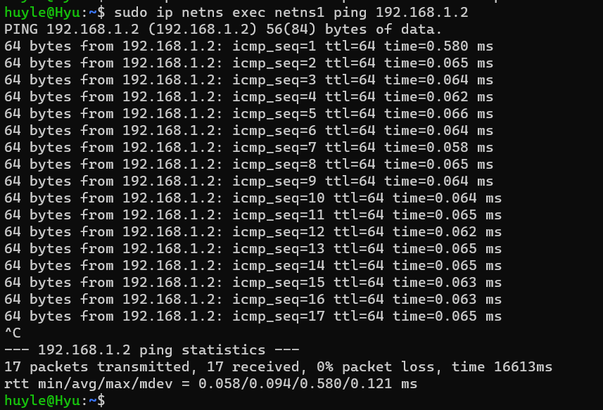

# What t h is namespace network?

[what the heck is namespace network?](https://www.bing.com/ck/a?!&&p=8acfa6d33334fdd1JmltdHM9MTcwMDY5NzYwMCZpZ3VpZD0yMjVjOGZmNi04NDc3LTZjYzctMzkxNy05YzZiODVlNTZkMWMmaW5zaWQ9NTI5Mw&ptn=3&ver=2&hsh=3&fclid=225c8ff6-8477-6cc7-3917-9c6b85e56d1c&psq=what+is+namespace+network&u=a1aHR0cHM6Ly93d3cuaG93dG9nZWVrLmNvbS9kZXZvcHMvd2hhdC1hcmUtbGludXgtbmFtZXNwYWNlcy1hbmQtd2hhdC1hcmUtdGhleS11c2VkLWZvci8&ntb=1)

- namespace network cung cấp tài nguyên hệ thống liên quan tới networking: IPv4, IPv6, thiết bị mạng, IP, rounting table riêng biệt

> Giống như virtual machine, namespace cung cấp những tài nguyên liên quan tới mạng như thiết bị vật lý (nhưng các tài nguyên này là ảo, một thiết bị trong một namespace có địa chỉ IPv4 riêng, có các interface network riêng, etc)

- namespace network là công nghệ container basic của `Docker` và `K8S`
- namespace kết hợp với `veth` để `kết nối giữa các namespace network khác nhau với nhau`
- Linux bao gồm 6 loại namespace: pid, net, uts, mnt, ipc, user

# Why We nEEd NAmeSpaCe NetWorK

[Usecase of namespace network](https://miro.medium.com/v2/resize:fit:828/format:webp/1*AcZ5xYvn5OfJK1D-9lpZ5A.png)

[usage of network namespace](https://platform9.com/blog/container-namespaces-deep-dive-container-networking/)

- Có một số trường hợp sử dụng sẽ cần đến network namespace:
  - Cách ly các traffic, các tiến trình (tránh communicate ra bên ngoài)
  - Tạo môi trường biệt lập cho các container (một số process hoặc app hoạt động cần có ngăn xếp mạng độc lập gồm giao diện mạng, địa chỉ IP, bảng định tuyến hoặc các tài nguyên khác)

# Practice với network namespace và veth

[How to practice namespace and veth](https://medium.com/@fi.shajal27/introduction-to-network-namespace-and-the-process-of-connecting-two-network-namespaces-d1817e292deb)

- Các bước dưới đây hướng đến tạo 2 network namespace => tạo veth để kết nối 2 network namespace => test kết nối

## 1. Tạo network namespace
- `sudo ip netns add <namespace-name-1>`
- `ip netns list` để kiểm tra các namespace network đã tạo
- `sudo ip netns delete <namespace-name-1>` để xóa network namespace nếu tạo nhầm

## 2. Tạo veth
- `sudo ip link add <virtual-ethernet-interface-1> type veth peer name <virtual-ethernet-interface-2>` 
- Dùng `ip link list` để kiểm tra các veth đã tạo

## 3. Kết nối các đầu của veth đến từng netns
- `sudo ip link set <virtual-ethernet-interface-1> netns <namespace-name-1>`

_Lưu ý: nếu đã kết nối 2 đầu veth vào 2 netns, command `ip link list` sẽ không còn show các veth đã tạo do 2 đầu cắm ảo đã thuộc về 2 mạng nằm ngoài phạm vi, vậy để kiểm tra, cần gõ chính xác cụ thể tên netns đi kèm để check được các interface đang tồn tại trong đó với `sudo ip netns exec <namespace-name-1> ip link list` (tức trong namespace đó thực thi command ip link list)_

- Để unlink một veth nếu tạo nhầm, dùng `ip netns exec <namespace_name> ip link set <veth_name> netns 1`

## 4. config các IP và subnet mask cho veth
- `sudo ip netns exec <namespace-name-1> ip addr add 192.168.1.1/24 dev <virtual-ethernet-interface-1>`

- `sudo ip netns exec <namespace-name-1> ip link set <virtual-ethernet-interface-1> up` để tạo trạng thái up cho các đầu veth để traffic được thông

## 5. ping kết nối
- `sudo ip netns exec <namespace-name-1> ping <ip-address-of-other-namespace>` để ping kết nối
_Lưu ý: ping đến địa chỉ IP của một namespace khác

