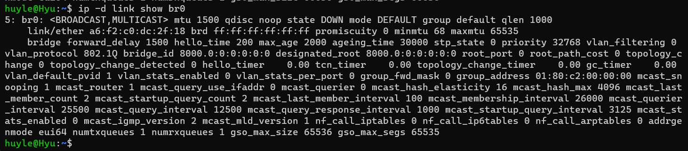
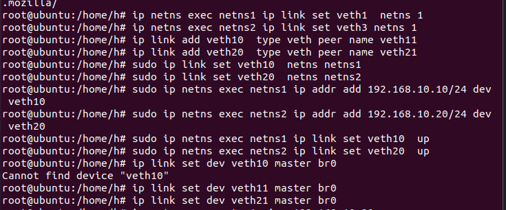

# Các bộ công cụ để quản lý network và quản lý bridge
- Iproute2 là tập hợp các tiện ích để kiểm soát mạng TCP/IP và kiểm soát lưu lượng trong Linux (ip link và bridge)
- Bridge-utils là công cụ quản lý bridge (brctl)
- net-tools

# Linux bridge là gì?

[introduce linux bridge](https://hechao.li/2017/12/13/linux-bridge-part1/)

- Linux bridge là một module có sẵn nằm trong kernel, có nhiệm vụ chuyển tiếp các packet trên router, trên gateway hoặc giữa VM và network namespace trên host
- Linux bridge đã bao gồm hỗ trợ cơ bản cho Giao thức Spanning Tree (STP), multicast và Netfilter kể từ loạt kernel 2.4 và 2.6.

<!-- - Bridge trong linux bao gồm 4 thành phần chính:
  - `Network port (interface)`: truyền traffic từ host qua switch
  - `Control plane`: dùng để chạy STP, ngăn chặn các vòng lặp, gây hỏng mạng 
  - `Forwarding plane`: sử dụng để xử lý các frame từ các port và quyết định chuyển tiếp dựa trên MAC db
  - `MAC learning DB`: chứa địa chỉ các host trong LAN -->

# Một số command bridge cơ bản 

[command basic](https://developers.redhat.com/articles/2022/04/06/introduction-linux-bridging-commands-and-features#spanning_tree_protocol)

- Có 2 command để setup bridge bắt nguồn từ iproute2: `ip link` và `bridge`
  - `ip link` để thêm và xóa bridge
  - `bridge` để hiển thị các setup

- Quản lý bridge:
  - Tạo bridge tên br0 mới: `ip link add br0 type bridge`
  - Xem thông tin bridge đã tạo: `ip -d link show br0`
  - Thêm interface cho bridge đã tạo: `ip link set veth0 master br0`

_Spanning tree protocol là giao thức được thiết kế để ngăn chặn các loop trong layer 2, chặn 1 số port trên switch để ngăn chặn cả các broadcast storm. Sẽ có 1 switch gốc được lựa chọn để chuyển tiếp các traffic hiệu quả hơn. Chuẩn hóa phổ biến trong STP là 802.1D_

> Tạo 2 netns, 2 pair veth, tạo 1 bridge và thông kết nối (yêu cầu các đầu của veth và bridge cần ở trong trạng thái up để có thể ping thuận lợi)

- Dùng `ip link set dev <veth_name> up` để setup các đầu veth trong state up và `ip link set dev <bridge_name> up` để bật bridge
- Xem trạng thái up của bridge bằng `ip -br -c link show <bridge_name>`