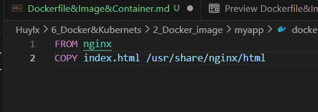

[PLAYING WITH DOCKER](https://training.play-with-docker.com/)

# Docker image

[What is docker image](https://www.geeksforgeeks.org/what-is-docker-images/)

- Docker image là package có thể được execute để chạy app trong một môi trường ảo như docker container. Docker image cho biết: cách khởi tạo, phần mềm chạy như thế nào (là một công cụ để deploy)
- Coi image là một phần mềm, các image có thể sinh ra được nhiều container chứa app được refer từ image với phiên bản giống hoặc khác nhau, đặc biệt là có thể chạy các container này cùng 1 lúc. `Image là source code của docker container` và `mỗi docker container được tạo ra là một phiên bản của docker image`
- Docker image có thể được share giữa các user qua docker registry nhưng docker container thì không thể share
- Dockerfile build lên docker image, từ image sinh được nhiều container. Để thay đổi docker image -> cần chỉnh sửa docker file nhưng sửa container thì chỉ cần tương tác trực tiếp với docker container

# Cấu trúc docker image
- `Base image`: image khởi đầu của dockerfile.
- `Parent image`: là base của image. Có thể gọi parent image trong Dockerfile bằng FROM command
- `Layers`: Docker image có thể sinh ra vô số layers
- `Docker registry`: giúp share docker image

# Dockerfile và syntax

[Docker and syntax](https://www.geeksforgeeks.org/what-is-dockerfile-syntax/)

- Dockerfile là một tập lệnh sử dụng nền tảng Docker để tạo các container từ các image mà nó build lên

> Về cơ bản nó là một tài liệu văn bản chứa tất cả các hướng dẫn mà người dùng có thể sử dụng để tạo image từ command line.

- Các syntax có trong dockerfile:
  - `FROM`: xác định parent image cần tải xuống và sử dụng (bắt buộc sử dụng đầu tiên trong dockerfile) - như là một môi trường để code của project có thể chạy được trên đó 

  _Lên dockerhub để tìm các base image phù hợp_

  [dockerhub](https://hub.docker.com/_/ubuntu)

  - `MAINTAINER`: đặt tên author đã tạo cho dockerfile này

  - `RUN`: Các command được chạy trong lúc container đang chạy trong thời gian thực (install package, build file, getupdate file - 1 trong 3 trường hợp RUN nên dùng)

  - `ADD`: Để copy file và dán vào đường dẫn đích `dest path chính là path của image folder`
    - `ADD <source> <dest>`: Intruction để copy các mục trong file local của máy (viết đường path giống như trong linux và nhớ để ý vị trí nằm trong folder - tùy thuộc vào vị trí đứng sau hay trước file dockerfile) 

    _Viết đường dẫn như này là để đường dẫn có thể linh hoạt mọi nơi chỉ với image_ 

    VD: ADD /learn/test.css
    - `ADD <URL> <dest>`: Intruction để copy file trên URL và đưa vào thư mục trong image (chính là path trong dest) 
    VD: ADD https://randomName

  - `COPY <source> <dest>`: Cũng giống như ADD, để copy file và dán vào đường dẫn đích

  - `ENV`: setup variable cho container

  - `ENTRYPOINT`:

  - `CMD`: 

  - `EXPOSE`: chỉ định port nên được available cho container (nếu không chỉnh sửa gì, default sẽ là TCP)

  - `VOLUME` 

  - `WORKDIR`: đưa user vào file path cụ thể (có tác dụng giống như cd trong linux) VD: RUN npm install sẽ không có tác dụng do ko có file path cụ thể 

  - `USER`

  - `ARG`: setup variable cho image

# docker attach và docker detach
- Attach: Container khi chạy có thể chạy default ở foreground (khi đó log của container đó hiện trực tiếp trên terminal)
- Detach: Container khi chạy có thể chạy ở background (có thể xem log của container trong docker desktop)

# Simple dockerfile

- Format một dockerfile

# Docker container và một số command basic để quản lý các instance container

1. Tạo ra folder riêng để chứa project với `mkdir` và `cd`(tạo và chuyển đến folder chứa app)
2. Dùng `docker build -t myapp .` để build image từ các file trong folder myapp (sử dụng `docker image list` để kiểm tra các image đã được tạo) _Lưu ý phải đưa dockerfile vào trong folder đang ở trong đó_
3. Dùng `docker run -d -p 8080:80 myapp` để chạy image với instance container mới
4. Nếu muốn dừng docker container đang chạy, sử dụng `docker stop <id_container>` (dùng `docker ps` để kiểm tra id của image đang chạy)

> nếu thêm option `-p` vào khi chạy docker container thì sẽ được chọn port cụ thể, còn không docker sẽ tự động lựa chọn port cho container

- Để chạy 1 container có sẵn, dùng `docker start <container_name>`

