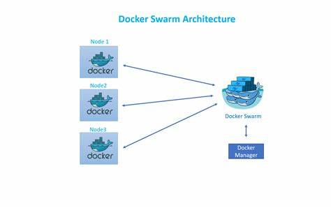
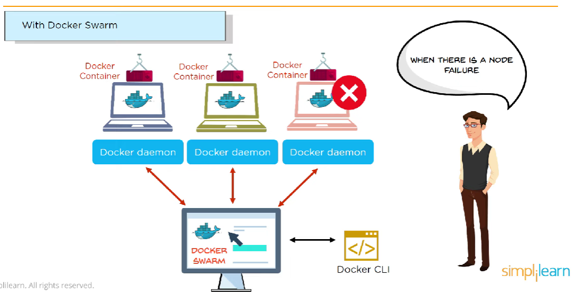

# What is that
- Swarm là tính năng để quản lý các cluster của docker daemons

> bên cạnh dockerfile và docker compose, docker swarm cũng là một công cụ để triển khai

# Use
- Quản lý các docker cluster được tích hợp với docker engine CLI
- Xây dựng thiết kế phi tập trung (tạo node) để xây dựng các node docker nhỏ trong một máy tính vật lý

> Tác dụng, container có thể được node quản lý ra lệnh và chạy trên bất cứ node nào

# node trong docker swarm
- Khi các máy tính tham gia vào swarm mode, mỗi một máy được gọi là node

# cluster trong docker swarm

https://stackoverflow.com/questions/56184052/what-is-cluster-in-docker

- Các node cùng hoạt động swarm docker được gọi là swarm cluster (cụm bao gồm nhiều node)

# khởi tạo và quản lý docker swarm