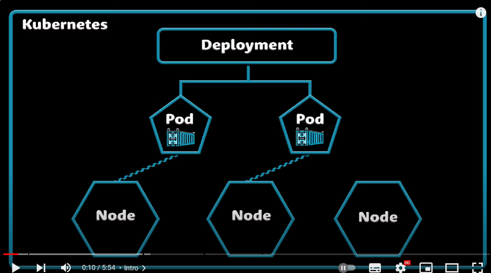

# Kubernetes & Component

[Kubernetes doc](https://cloud.google.com/learn/what-is-kubernetes)

[Tổng hợp về kubernetes](https://youtu.be/X48VuDVv0do?si=Hj4SGxFajvZABjyL)

- Hệ thống mã nguồn mở deploy tự động và quản lý các container
- K8S được dùng để:
  - HA or no downtime
  - scalability hoặc tính performance cao
  - Disaster recover hoặc backup và restore

> Trong K8S có thể có: cluster chứa nhiều node cùng chạy 1 ứng dụng (docker), node chứa nhiều pod bên trong, một pod chứa nhiều container, deployment là một lớp trừu tượng nằm trên pod

> `deployment quản lý 1 replicaset`, `một replicaset quản lý tất cả replica trong một pod`, `một pod chứa các container`

- Trong cluster của k8s có các thành phần chính:
  - `Control plane`: chịu trách nhiệm manage các pod (app này nên hoạt động ở trong pod nào)
  - `Computer machine (node)`: là máy vật lý (hoặc máy ảo), mỗi máy tồn tại trong k8s cluster cần chạy k8s và docker, mỗi máy là một docker host
  - `Pods`: pod là nơi chứa các container cùng nhóm, cùng chung 1 network giúp các container duy trì giao tiếp với nhau

- Mỗi `pod có thể có một hoặc nhiều docker container`
- Mỗi `pod có một IP riêng` (private IP không phải public IP), có thể liên kết với nhau thông qua Virtual network
> Pod và container có tính chất tạm thời, vậy khi pod chết tức là các thông tin khác đi kèm như IP cũng mất theo, đòi hỏi phải duy trì tính nhất quán ngay khi một pod khác quay trở lại, vì vậy `service` trong K8  là cần thiết 

- Service sẽ giữ những thông tin cố định của một pod để đảm bảo tính nhất quán, đây là `internal service` do k8s host. Những `external service` như cung cấp domain name cho các trang web sẽ được `ingress` (một API có trách nhiệm routing các traffic) kết nối đến và `liên kết với internal service`

### Config map và secret
- Config map được sử dụng để giảm bớt các bước trong quá trình deploy
VD: chỉ cần chỉnh sửa URL database trong config map (thông thường thì sẽ phải build lại image - thực hiện pull và push git và các bước khác)

- thông thường các thông tin quan trọng khác liên quan cũng có thể được thay đổi như password truy cập DB, sử dụng `secret` để lưu các config bảo mật

### K8S volume
- `volume` xuất hiện để đảm bảo tính liên tục của DB, trong trường hợp pod chứa DB bị shutdown, volume vẫn có khả năng ghi được data nhận về từ frontend 
> Data này có thể được lưu ở local hoặc remote storage

### K8S replicate
- Trong trường hợp cả app bị gián đoạn do được cập nhật hoặc một server bị lỗi đường truyền, K8S sử dụng tính năng `replication` để copy toàn bộ mọi thứ của cluster đang hoạt động
- Bản sao hoàn chỉnh này sẽ được sử dụng chung kết nối với cùng service đang sử dụng với app hiện tại để duy trì các config có sẵn: IP

# Worker machine trong K8S cluster
### Node process - master và worker

> Có `master` và `worker server` trong mô hình sử dụng K8S

- Có `3 node process` cần phải được cài trong các `worker` (làm các nhiệm vụ liên quan tới đảm bảo cho app hoạt động)
  - `Container runtime`: chịu trách nhiệm load container từ image, quản lý vòng đời của container
  - `Kubelet`: tương tác với cả node và container, kubelet khởi động pod có chứa container trong đó
  - `Kube proxy`: chịu trách nhiệm forward request từ các service tới pod, chẳng hạn: có 2 node, 2 app với 2 DB, khi frontend gửi request data về DB thì request này có thể gửi về 1 trong 2 DB bất kỳ, dùng kube proxy để cố định luồng request tron một node

- Master xử lý các công việc liên quan tới monitor, lên lịch hoạt động của pod, join với node mới, etc (các công việc liên quan tới managing worker). Master có `4 manage process` sau
  - `API server`: như là cluster gateway, tương tác thông qua API server để thực hiện các chỉnh sửa 
  - `Scheduler`: request đến API server để validate, sau đó đến Scheduler để dựng pod
  - `Control manager`: xác định trạng thái thay đổi trong cluster, nếu có dead part nào có ở trong cluster -> control manager sẽ báo lên cho scheduler để khởi động lại các thành phần đó -> báo tiếp lên kubelet trong worker để khởi động lại pod
  - `etcd`: key value store của cluster state (hoặc đây là cluster brain), chứa các thông tin về cluster: cluster có healthy hay không, tài nguyên nào đang có sẵn, cluster state có thay đổi hay không

# K8S và Docker
- K8S và docker khác biệt nhau, Docker cho phép đặt mọi thứ vào trong một cái box, dùng để build image và chạy các container, trong khi K8S dùng để quản lý các container (cụm container)
  - Có thể được dùng mà không cần đến docker
  - Docker không phải là phiên bản thay thế của K8S
