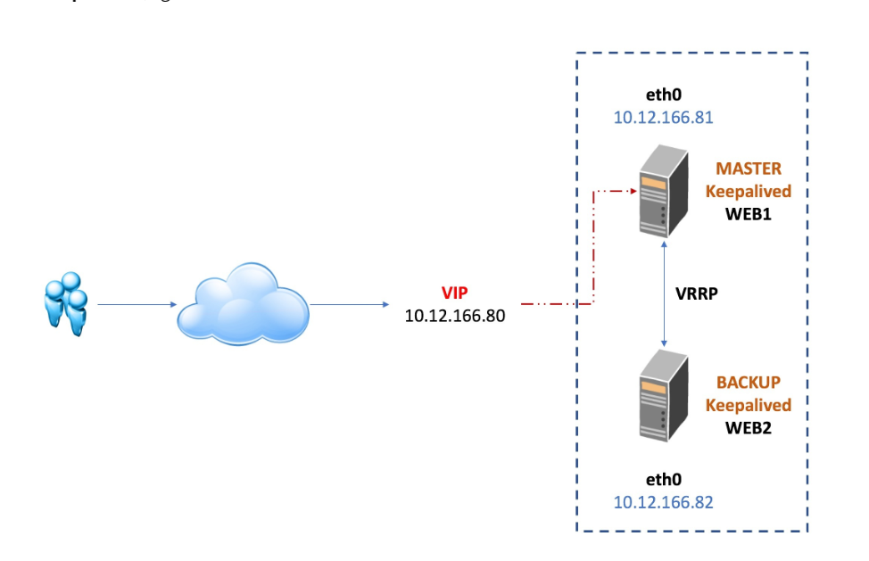

# Keepalived

[Keepalived hoạt động như thế nào?](https://cuongquach.com/keepalived-la-gi-tim-hieu-dich-vu-keepalived-high-availability.html)

- Keepalived gồm các đặc điểm chính sau:
  - Hoạt động theo mô hình Active/Passive (1 máy chủ master và nhiều máy chủ slave luôn trong tình trạng sẵn sàng khi master chết) và `VRRR` (Virtual redundancy routing protocol) là thứ sẽ liên kết giữa master và các máy chủ slave để đảm bảo tính sẵn sàng cao `HA`
  - Cân bằng tải bằng cách kiểm tra health checking để biết tình trạng máy chủ trước khi gửi request đến 

## how it works
> 1. Keepalived gom server vào cụm HA -> tạo `VIP` và `MAC` đi kèm với nó cho cụm này

_chỉ 1 server dùng 1 địa chỉ này tại 1 thời điểm nhất định_

_Các server trong cụm mà sử dụng 1 VIP đó phải liên lạc với nhau thông qua `multicast 224.0.0.18` bằng giao thức `VRRR`, giao thức này được gửi định kỳ để luôn có một master mới đứng ra backup khi cần, việc master sau khi chết mà được phục hồi trở thành master lại hay thành backup sau master hiện tại tùy thuộc vào admin_

_Độ prior rải từ 1-254 default là 100, server nào có prior cao nhất thành master, còn lại là slave_

# Tại sao cần dùng HAProxy và Keepalived chung với nhau
- `Keepalived hoạt động ở tầng 4` (tức chỉ sử dụng các giao thức liên quan với IP) trong khi `HAProxy có thể hoạt động mở rộng ở cả tầng 7` với 1 số: Stickiness, Sampling and converting information, ACLs and conditions, Content switching, Stick-tables, Formated strings, HTTP rewriting and redirection, Server protection, etc.

# model quan sát mô hình thiết lập

[Lưu ý rằng ở đây floating IP khác với VIP trong keepavlived](https://serverfault.com/questions/536360/what-are-the-differences-between-floating-ips-and-virtual-ips)