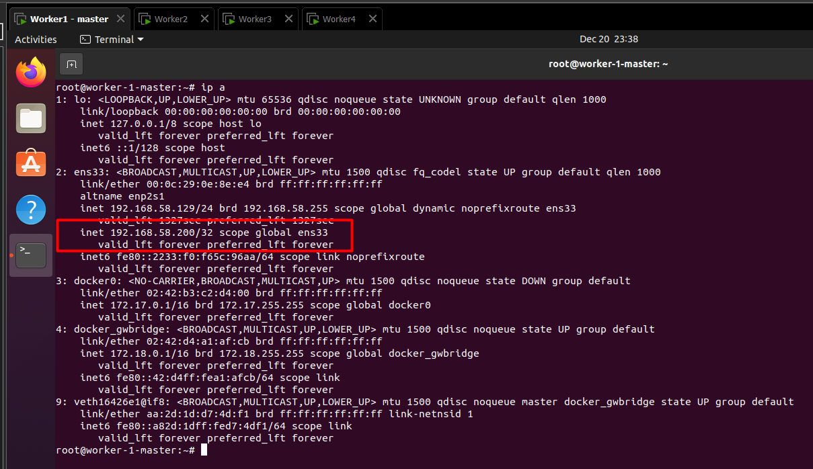

# SCENARIO: 2 host 2 webserver được tạo trên 4 VM (HAProxy + Keepalived) [link hướng dẫn](https://www.learnitguide.net/2021/11/configure-ha-cluster-using-keepalived.html)

---
[HAproxy config tutorial](https://www.haproxy.com/documentation/haproxy-configuration-tutorials/core-concepts/overview/)


# install apache2 - web server

- `sudo apt install apache2` cài đặt web server trên 2 node

# tạo file và chạy html trên các node web server

- `sudo echo "Test Data Web server 1" > /var/www/html/index.html`
- `sudo echo "Test Data Web server 2" > /var/www/html/index.html`

- dùng systemctl để enable và start apache2 để chạy thử file html vừa tạo (làm trên cả 2 web server)
  - `sudo systemctl enable apache2`
  - `sudo systemctl start apache2`

- lên trình duyệt trên máy bất kỳ (máy ảo hoặc máy vật lý) thử gõ 1 trong 2 địa chỉ IP của web server (dùng ifconfig để check IP) để kiểm tra xem web server có hoạt động không:
VD: 192.168.58.131:80

# install HAProxy - cài HAProxy trên 2 node load balancer

[install HAProxy](https://www.haproxy.com/blog/how-to-install-haproxy-on-ubuntu)

- `sudo apt install --no-install-recommends software-properties-common`
- ` sudo add-apt-repository ppa:vbernat/haproxy-2.4 -y`
- `sudo apt install haproxy=2.4.\*`

> `sudo apt update && sudo apt upgrade -y` để cập nhật

# install keepalived - cài keepalived trên 2 node load balancer

[install keepalived](https://www.redhat.com/sysadmin/keepalived-basics)

- `sudo apt  install keepalived -y`

# Config HAProxy trên cả 2 lb
- `vim /etc/haproxy/haproxy.cfg` để vào chế độ chỉnh sửa file config của haproxy
- copy:
```
frontend myweb
    bind *:80
    option tcplog
    mode tcp
    default_backend web-servers
backend web-servers
    mode tcp
    balance roundrobin
    option tcp-check
    server web1 192.168.58.131:80 check fall 3 rise 2
    server web2 192.168.58.132:80 check fall 3 rise 2
```

- `systemctl enable haproxy` và `systemctl start haproxy` sau khi chỉnh sửa

# Config Keepalived trên cả 2 lb

- Trên master node: tạo file mới với `vim /etc/keepalived/keepalived.conf` và thêm nội dung sau:

```
# Define the script used to check if haproxy is still working
vrrp_script chk_haproxy {
    script "killall -0 haproxy"
    interval 2
    weight 2
}
# Configuation for the virtual interface
vrrp_instance VI_1 {
    interface ens33
    state MASTER # set this to BACKUP on the other machine
    priority 101        # set this to 100 on the other machine
    virtual_router_id 51
    smtp_alert          # Activate email notifications
    authentication {
        auth_type AH
        auth_pass 1      # Set this to some secret phrase
    }
# The virtual ip address shared between the two loadbalancers
    virtual_ipaddress {
        192.168.2.100
    }
# Use the script above to check if we should fail over
    track_script {
        chk_haproxy
    }
}

```

- Trên slave node (hoặc backup node): tạo file mới với `vim /etc/keepalived/keepalived.conf` và thêm nội dung sau:

```
# Define the script used to check if haproxy is still working
vrrp_script chk_haproxy {
    script "killall -0 haproxy"
    interval 2
    weight 2
}
# Configuation for the virtual interface
vrrp_instance VI_1 {
    interface ens33
    state BACKUP # set this to MASTER on the other machine
    priority 100        # set this to 101 on the other machine
    virtual_router_id 51
    smtp_alert          # Activate email notifications
    authentication {
        auth_type AH
        auth_pass 1      # Set this to some secret phrase
    }
# The virtual ip address shared between the two loadbalancers
    virtual_ipaddress {
        192.168.2.100
    }
# Use the script above to check if we should fail over
    track_script {
        chk_haproxy
    }
}

```

- ở trên mỗi node sau khi config xong, chạy `systemctl restart keepalived` và `systemctl enable keepalived`

# Kiểm tra mô hình
- Vào địa chỉ VIP để kiểm tra từ VIP có đi được đến web server hay không
- Dùng `ip a` để kiểm tra VIP trong master node



- tắt thử 1 trong 2 load balancer (tắt 1 VM hẳn đi để kiểm tra) - VIP sẽ tự động quay trở lại MASTER cũ nếu được khởi động lại
- tắt thử 1 trong 2 server web

- Để tránh VIP chuyển quay lại node MASTER khi hoạt động lại, thêm `nopreempt` option vào trong file service của keepalived ở cả 2 node MASTER và SLAVE

# Check lỗi haproxy
- `haproxy -f /etc/haproxy/haproxy.cfg -c` hoặc `haproxy -f /etc/haproxy/haproxy.cfg -db`
