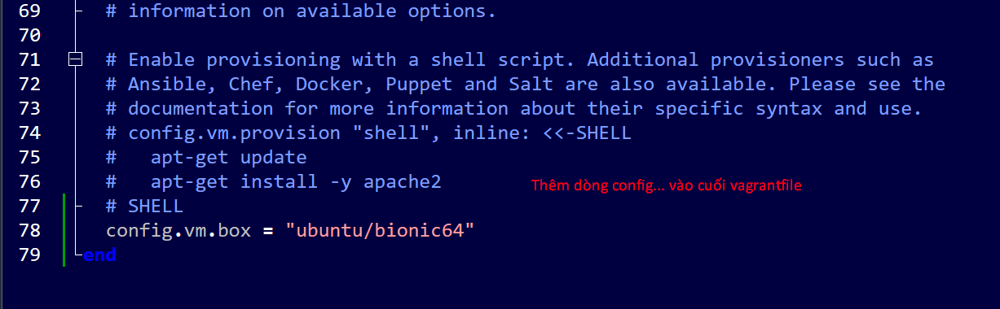

# how vagrant works


# setup for creating VM

> 1. set up for vagrant

```
1. tạo 1 folder riêng
2. cmd
3. vào đường path dẫn đến folder đó và `vagrant init`

```

> 2. kiếm image của một OS về - lên `vagrant box search` để kiếm image về -> copy đoạn config và dán vào vagrantfile để



```
Vagrant.configure("2") do |config|

	config.vm.box = "ubuntu/bionic64"
	config.vm.synced_folder ".", "/vagrant", disabled: true
	config.vm.provider "virtualbox" do |vb|
	v.memory = "1024"
	v.cpu = 1
	v.customize ["modifyvm", :id, "--uartmode1", "disconnected"]
end
	
config.vm.provision "shell", inline: <<-SCRIPT
sudo apt update -y
sudo apt full-upgrade -y
sudo apt-get autoremove -y
sudo systemctl disable apt-daily.service
sudo systemctl disable apt-daily.timer
SCRIPT
end
```

> 3. `vagrant up` để bắt đầu chạy VM (lưu ý nếu để ổ C thì phải mở full quyền để có vagrant có thể ghi file), `vagrant reload` để khởi động lại VM. `vagrant up --no-start` để build mà không chạy VM ngay lập tức
- Sử dụng `vagrant halt` để tắt VM gracefully
- Sử dụng `vagrant suspend` để tạm dừng VM
- Sử dụng `vagrant destroy` để tắt VM forcefully

> 4. `vagrant ssh <vm_name>` để kết nối tới VM cụ thể

> 5. Sau khi vào VM bằng ssh, sử dụng `sudo passwd ubuntu` để thiết lập mật khẩu và truy cập với quyền root
# Vagrant file generator - Webapp tự động generate vagrant config file

[Vagrant file generator online app](https://vagrantfile-generator.vercel.app/)

[Tìm hiểu về vagrant phần 1: works, basic use case, sync, provision, network, ](https://viblo.asia/p/tim-hieu-vagrant-phan-1-1l0rvmDQGyqA)