# SỬ DỤNG CỤM LAB TRONG OPENSTACK -> SSH QUA JUMP SERVER -> SSH VÀO CÁC INSTANCES VM THỰC HÀNH LAB
1. Sử dụng tài khoản admin cấp để đăng nhập vào https://103.160.79.33:9443/?src=connect
2. OpenVPN được kích hoạt và sẽ yêu cầu user nhập mã xác minh => tải `google authentication` trên điện thoại và dùng chính tài khoản được cấp để đăng nhập vào google authentication để nhận được mã xác minh
3. Nhập mã vào xác minh như hình

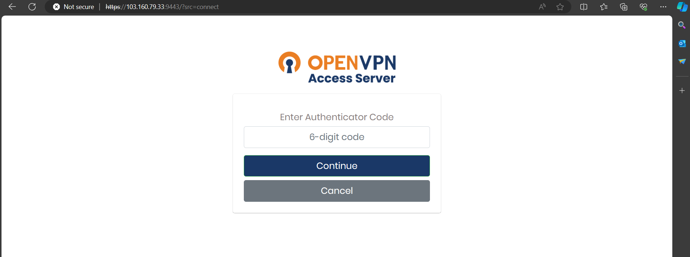

4. Chọn phiên bản OpenVPN để tải về máy

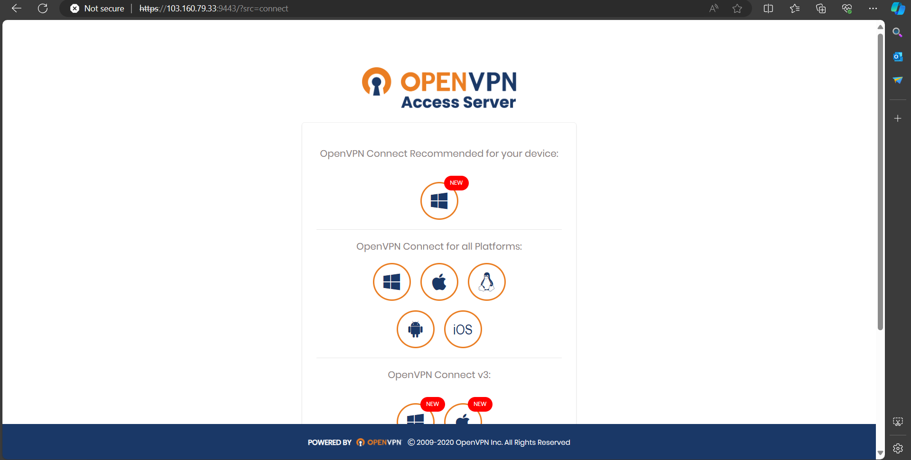

5. Chạy OpenVPN trên máy và tiếp tục đăng nhập vào theo như các bước trên, giao diện sau khi đăng nhập như dưới hình:

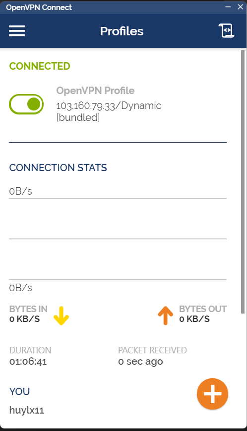

6. Sau khi đăng nhập được vào OpenVPN, đăng nhập vào đường dẫn http://10.11.1.13/ để đăng nhập vào OpenStack

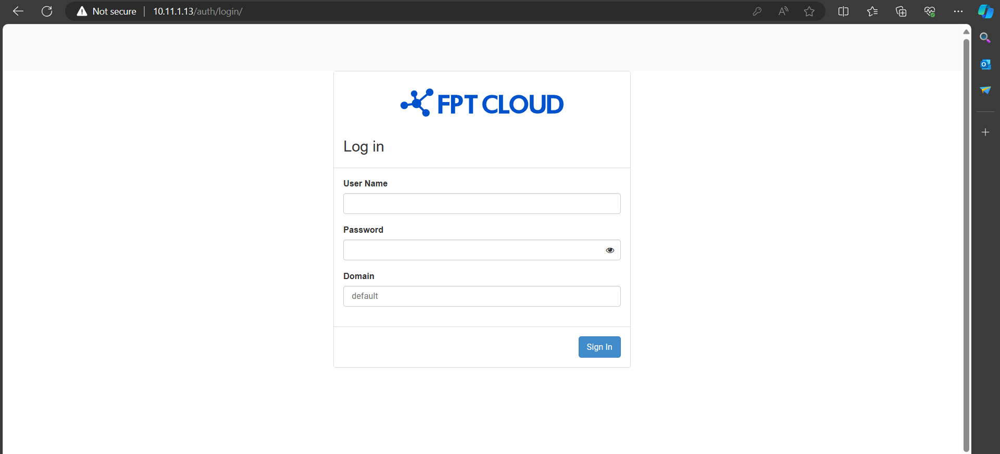

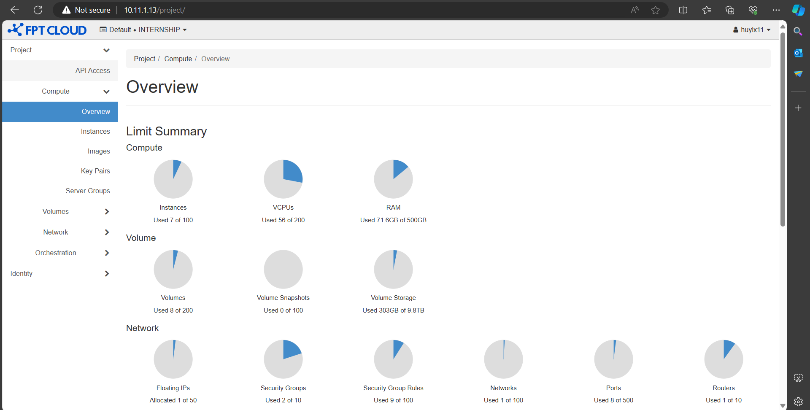

7. Để tạo 1 instance VM, trước hết cần tạo volume cho instance đó. Làm lần lượt theo các bước sau
  ```
   Vào mục Volume
   -> Create volume
   -> Điền các thông tin cần thiết để tạo volume 
   -> Trên dòng có volume vừa được tạo, drop down Edit volume và chọn Launch as instance
   -> Đặt tên instance + Next 
   -> Select boot source chọn là volume + chọn volume vừa tạo + Next 
   -> Chọn lựa chọn phần cứng 8C8G hoặc 4C4G tùy ý + Next
   -> Chọn network là internship private net (dùng network này vì mục tiêu ssh vào jump)
   -> Bỏ network port default + Next
   -> Chọn default ở mục security groups + Next
   -> Bỏ qua phần Key pair + Next
   -> Ở mục Configuration, copy đoạn script sau:

   #cloud-config
   user: root
   password: huy123 # tự thay bằng mật khẩu như mong muốn
   chpasswd: {expire: False}
   ssh_pwauth: True

   -> Phần còn lại bỏ qua
   -> Nhấn launch instance
   -> Sau khi tạo xong instance, ssh vào jump theo cú pháp và sử dụng mật khẩu được cấp để vào jump. Bước còn lại làm tương tự để vào con VM đã tạo

      ssh <username>@<instance_IP_address>
   ```

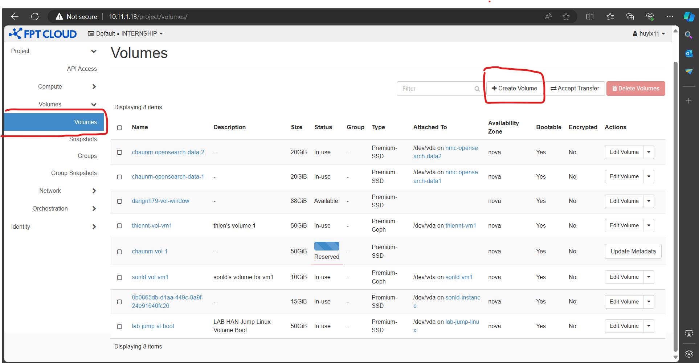

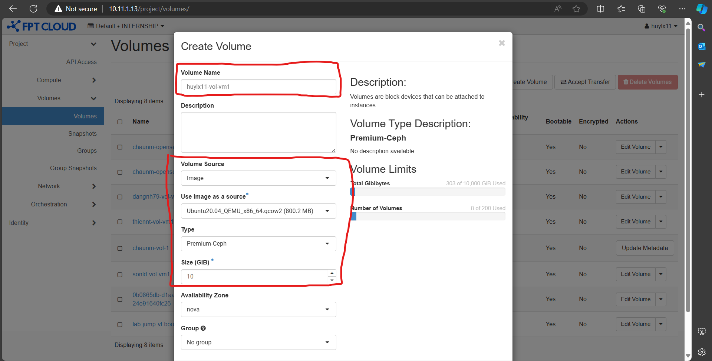

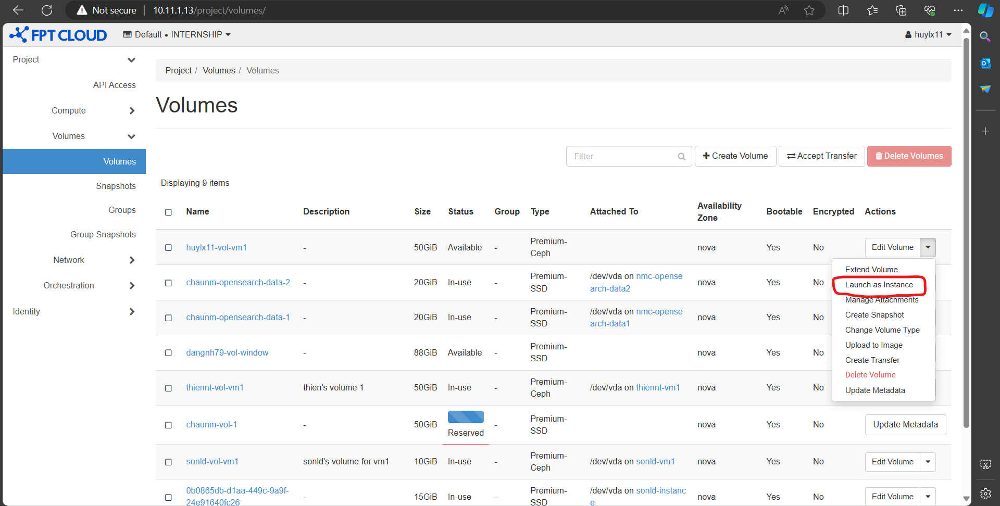

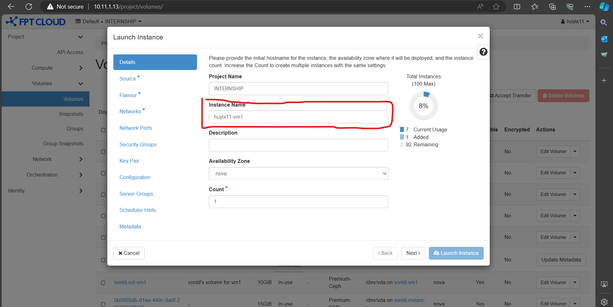

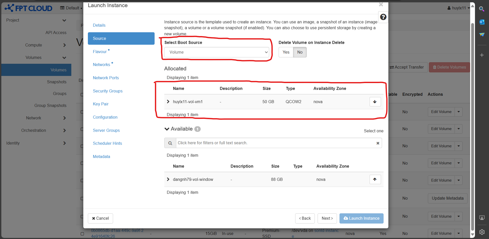

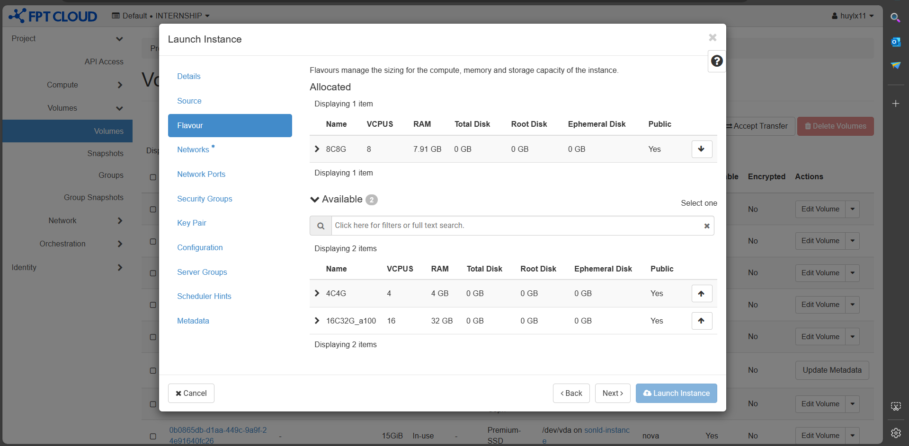

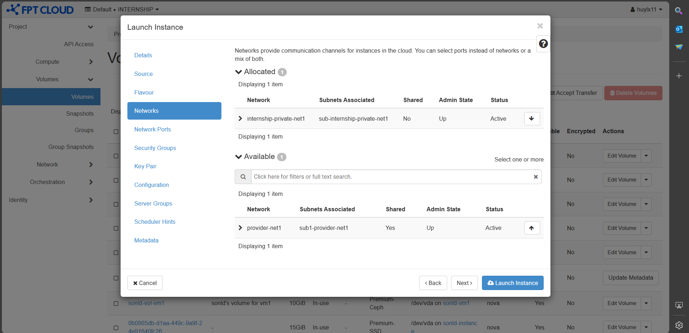

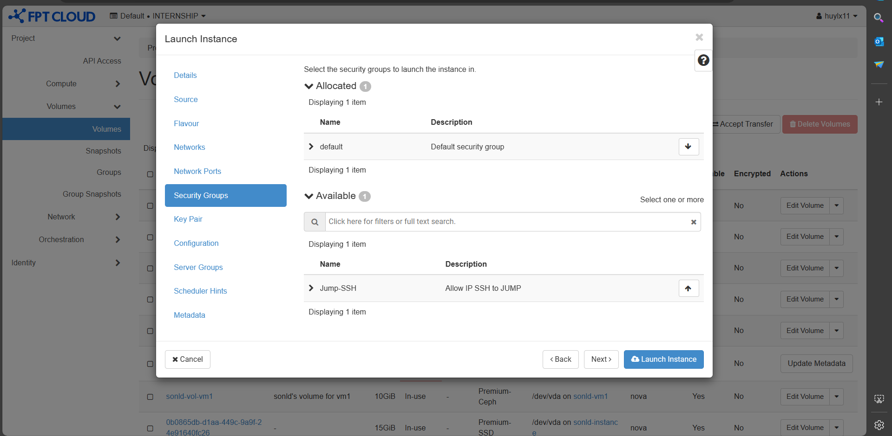

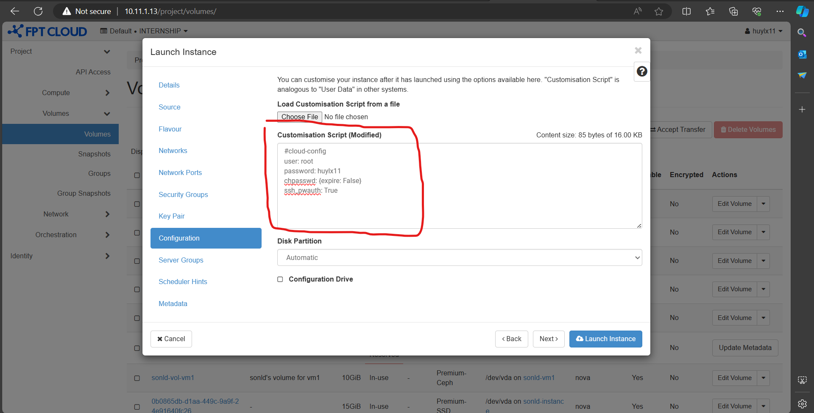

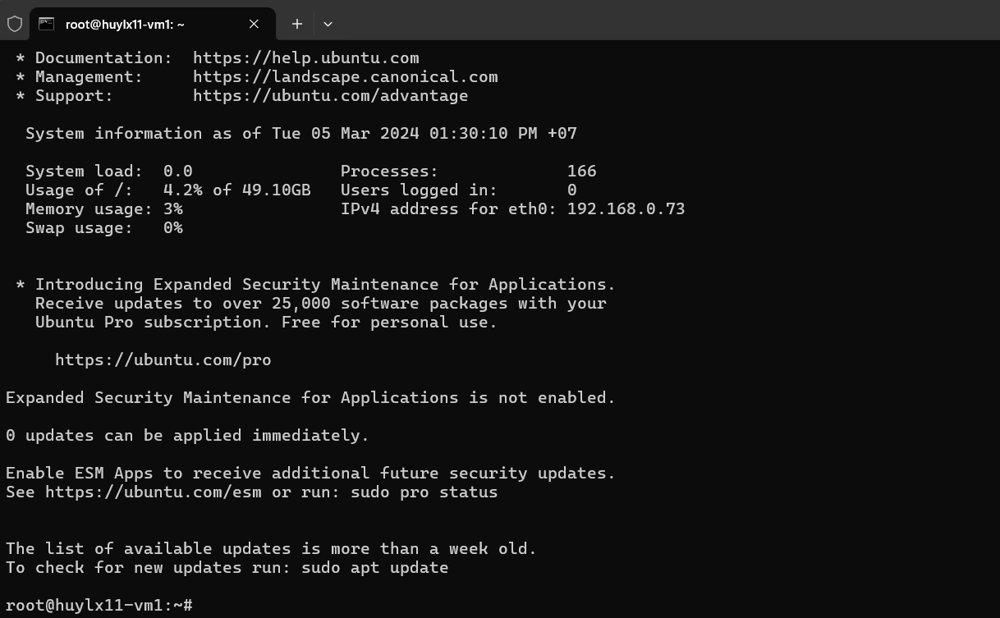